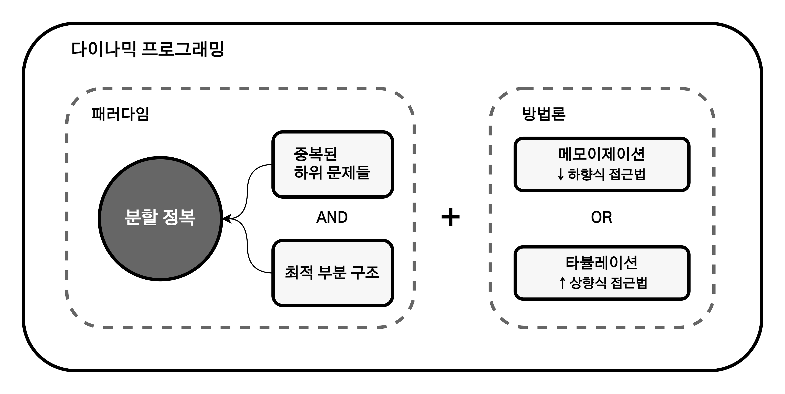
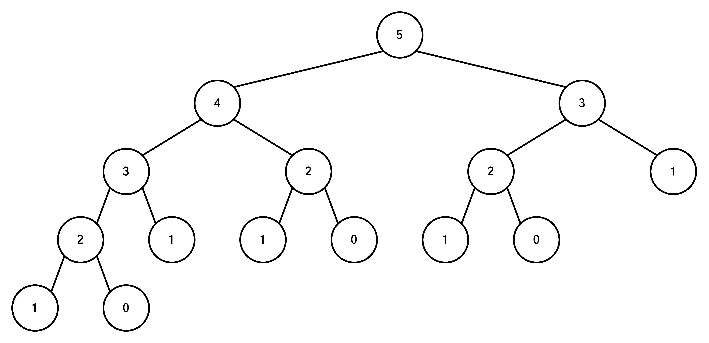

# 동적 계획법(DP, Dynamic Programming) #1

1. [개요](#개요)
2. [접근](#접근)
3. [구현](#구현)
   1. [재귀함수 형태의 피보나치 수열](#재귀함수-형태의-피보나치-수열)
   2. [동적 계획법 형태의 피보나치 수열](#동적-계획법-형태의-피보나치-수열)
      1. [메모이제이션(Memorization)](#메모이제이션memorization)
      1. [타뷸레이션(Tabulation)](#타뷸레이션tabulation)
4. [기초적인 동적 계획법 문제들](#기초적인-동적-계획법-문제들)
5. [참고 자료](#참고-자료)

## 개요

> 특정 범위까지의 값을 구하기 위해서 그것과 다른 범위까지의 값을 이용하여 효율적으로 값을 구하는 알고리즘 설계 기법이다. **동적 계획법**이라고도 불린다.

엄연히 말하면 동적 계획법은 구체적인 알고리즘이라기보단 문제해결 패러다임에 가깝다. 동적 계획법은 '어떤 문제를 풀기 위해 그 문제를 더 작은 문제의 연장선으로 생각하고, 과거에 구한 해를 활용하는' 방식의 알고리즘을 총칭한다. 다르게 말하자면 '하나의 문제는 단 한 번만 풀도록 하는 알고리즘'이라고도 할 수 있다.

## 접근

동적 계획법의 접근 방식은 기본적으로 분할 정복 알고리즘과 유사하다. 이는 동적 계획법을 사용하는 알고리즘이 주어진 문제를 작은 문제로 나누어 각 부분 문제에 대한 답을 계산하고, 계산된 결과를 바탕으로 원래 문제의 답을 산출하기 때문이다.

여기서 분할 정복과의 차이점은 원래의 문제를 부분 문제로 나누는 방식에 있다. 바로 **'메모이제이션(Memoization)'**의 사용 여부이다.

- 동적 계획법 : 주어진 문제를 나눌 때 부분 문제를 최대한 많이 이용하도록 나눈 다음, **주어진 부분 문제의 정답을 한 번만 계산하고 저장(메모이제이션)해둔 뒤 부분 문제를 재이용하는 경우 저장해둔 정답을 바로 산출**.
- 분할 정복 기법 : 주어진 문제를 분할하여 부분 문제를 풀지만, 별도로 **정답을 저장 후 재이용하지 않음**. 따라서 중복되는 부분 문제도 모두 풀이함.

지금까지의 내용을 요약하면 다음과 같다.



> 동적 계획법은 최적 부분 구조(Optimal Substructure)를 지닌 중복된 하위 문제들(Overlapping Subproblems)을 분할 정복으로 풀이하는 문제해결 패러다임이다.

## 구현

동적 계획법은 문제에 따라 구현하는 방법이 모두 조금씩 다르다. 여기서는 동적 계획법의 기본적인 구조에 대해 알아보기 위해서 '피보나치 수열'을 예시로 구현해본다.

### 재귀함수 형태의 피보나치 수열

피보나치 수열은 다음과 같이 재귀함수의 형태(Recursive Form)로 표현된다.

```
f(0) = 1
f(1) = 1
f(n) = f(n-1) + f(n-2) when n > 1
```

이 수학적 정의 자체는 매우 깔끔하지만, 컴퓨터가 실제로 계산하기에는 매우 부적합한 형태이다. 위 정의를 그대로 Java로 구현하면 아래와 같다.

```java
//n <= 45
int fibonacci(int n) {
    if(n <= 1) return 1;
    else return fibonacci(n - 1) + fibonacci(n - 2);
}
```

이 구현에는 문제가 있다. 함수가 호출되면 프로그램 메모리의 스택(Stack)이라는 장소에 데이터가 쌓이게 된다. 그 함수의 실행이 끝났을 때 다시 메모리가 해제되는 방식인데, 이 말인 즉슨 함수가 계속 호출되면 메모리에 함수가 계속해서 적재된다는 것이다. 5번째 피보나치 수열을 구하기 위해서는 다음과 같이 총 15회의 함수 호출이 발생한다.



숫자가 작을 때는 비교적 괜찮지만, 숫자가 조금만 커져도 시간 복잡도와 공간 복잡도가 기하급수적으로 증가(Exponential Explosion)한다. 시간 복잡도는 시간만 들이면 해결할 수 있어도, 공간 복잡도의 경우 스택 오버플로우로 인해 오류가 발생한다.

피보나치 수열은 수열이 1개만 늘어나도 계산량은 2배로 늘어난다. 50번째 피보나치 수열을 계산하려고 하면 1,000,000,000,000,000번이 넘는 계산을 수행해야 하지만, 현실적으로 불가능하다.

### 동적 계획법 형태의 피보나치 수열

동적 계획법에서는 반복 계산을 막기 위해 이전에 계산한 값들을 배열에 저장한다. 대표적으로 메모이제이션(Memorization)과 타뷸레이션(Tabulation)이 있다.

#### 메모이제이션(Memorization)

메모이제이션은 큰 문제부터 시작해서 작은 문제로 분할해 나가면서 푸는 하향식(Top-Down) 접근법이다. `fibonacci(4)`를 구하는 것은 `fibonacci(3)`, `fibonacci(2)`를 구하는 작은 문제로 나눌 수 있다. 나누어진 작은 문제들도 더 작은 문제들로 나눌 수 있으므로, `fibonacci(n)`을 구하는 문제를 풀 수 있다. 구현은 다음과 같다.

```java
int memo[] = new int[N];  //메모이제이션 공간. 0으로 초기화.

int fibonacci(int n) {
    if(n <= 1) return n;  //0, 1번째 피보나치 수
    if(memo != 0) return memo[n]; //기록된 데이터가 있는지 확인(0이 아니라면 기록된 것)
    else return memo[n] = fibonacci(n - 1) + fibonacci(n - 2);  //작은 문제로 분할
}
```

#### 타뷸레이션(Tabulation)

타뷸레이션은 작은 문제부터 시작해서 작은 문제들을 점점 쌓아 큰 문제를 푸는 상향식(Bottom-Up) 접근법이다. `fibonacci(1)`과 `fibonacci(2)`를 풀면 `fibonacci(3)`을 풀 수 있다. 더 큰 문제들도 이미 구한 작은 문제들로 구할 수 있으므로, `fibonacci(n)`을 구하는 문제를 풀 수 있다. 구현은 다음과 같다.

```java
int[] fData = new int[N + 1];
fData[1] = 1;
fData[2] = 1;
int lastPos = 2;  //마지막 계산 지점. fData[2]까지 초기화 되었기에 2로 초기화

int fibonacci(int n) {
    if(fData[n] == 0) { //아직 구하지 않았다면 구한다
      for(int i = lastPos + 1; i <= n; i++) fData[i] = fData[i - 1] + fData[i - 2];
      lastPos = n;
    }

    return fData[n];
}
```

이렇게 구현하면 숫자를 저장하는 공간이 구하려는 N번째 피보나치 숫자만큼 필요한 대신, `O(n)`의 시간복잡도로 문제를 해결할 수 있다.

## 기초적인 동적 계획법 문제들

- 0-1 배낭 문제(0-1 Knapsack Problem)
- 최장 공통 부분 수열(LCS), 최장 증가 부분 수열(LIS), ...
- 부분집합(Subset)

## 참고 자료

- [20. 다이나믹 프로그래밍(Dynamic Programming)](https://blog.naver.com/ndb796/221233570962)
