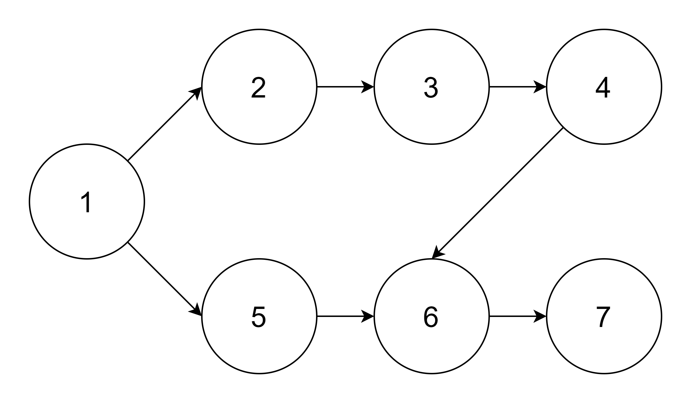
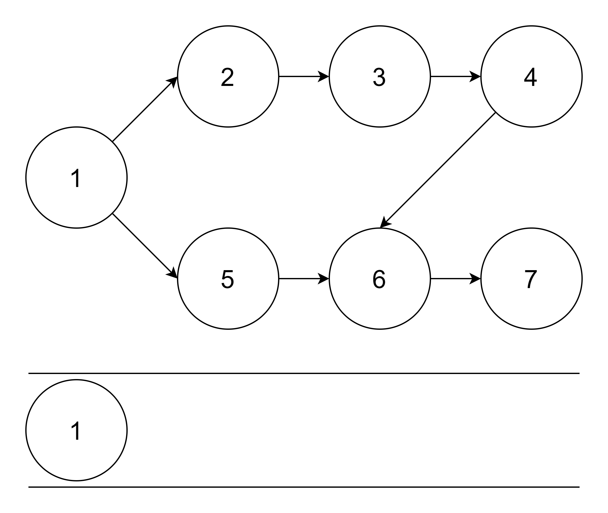
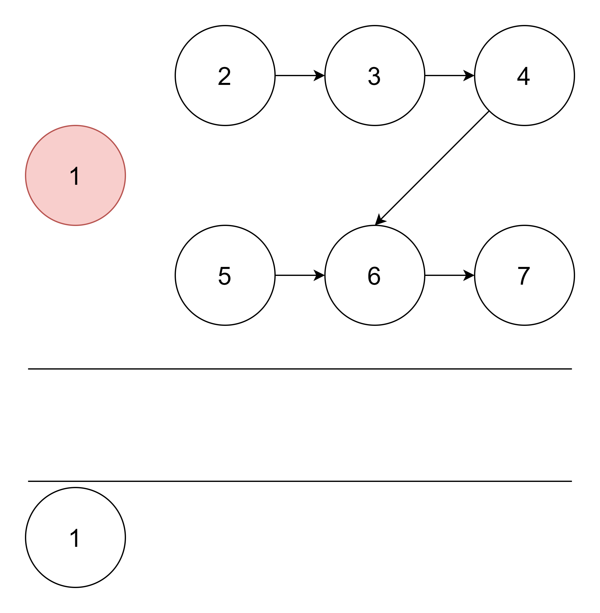
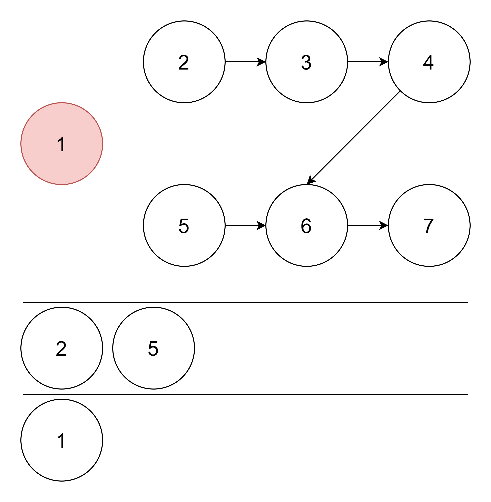
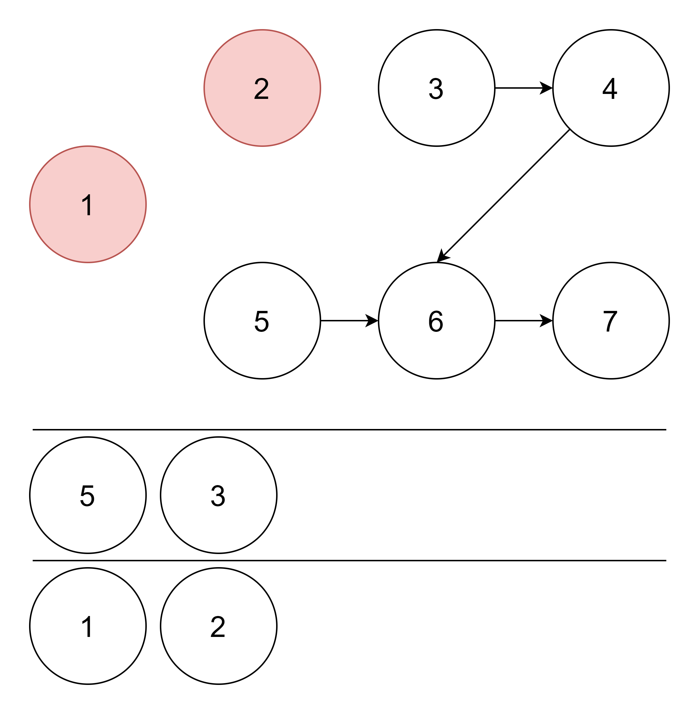
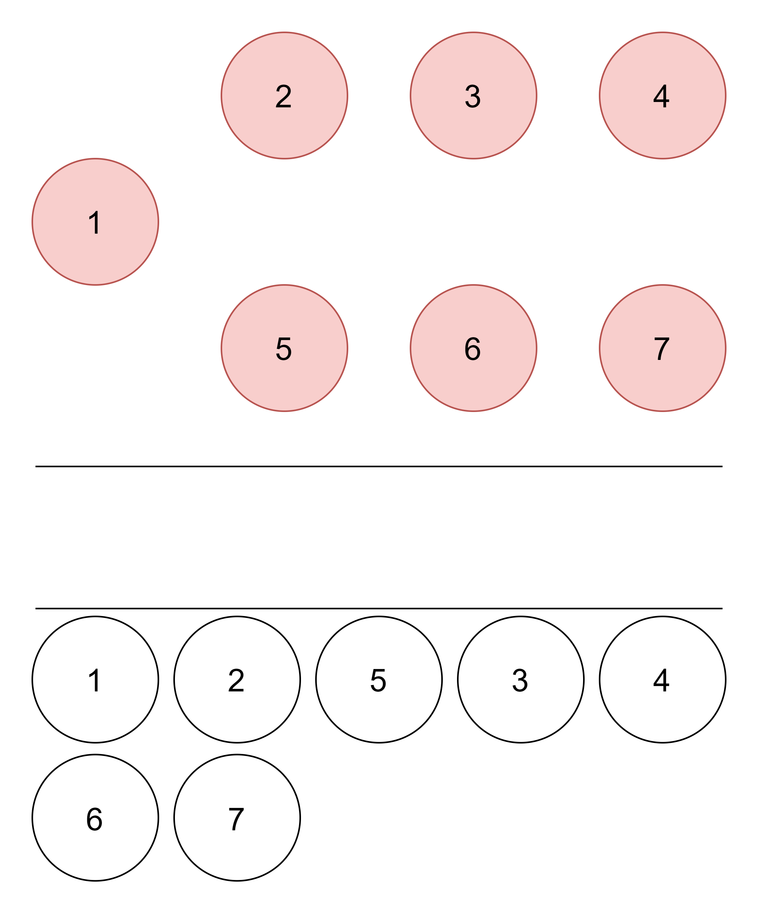

# 위상 정렬(Topological Sort)

## 목차

1. [개요](#개요)
   1. [위상 정렬의 원리](#위상-정렬의-원리)
   2. [큐(Queue)를 이용한 방법](#큐queue를-이용한-방법)
2. [위상 정렬의 구현](#위상-정렬의-구현)

## 개요

위상 정렬(Topological Sort)은 '_순서가 정해져 있는 작업_'을 차례대로 수행해야 하는 경우, 그 순서를 결정하기 위해 사용하는 알고리즘이다.

순서가 정해져 있는 대표적인 작업은 '수강신청', '키 순서대로 줄 서기' 등이 있다.

주어지는 조건들을 하나의 노드로 취급하면, 선행 노드가 다음 노드로 연결되는 형태의 그래프를 그릴 수 있다. 이렇게 완성된 그래프는 DAG(Directed Acyclic Graph, 비순환 방향 그래프)가 되며, 사이클이 발생하지 않는다. **사이클이 발생하는 경우엔 위상 정렬을 수행할 수 없다.** 위상 정렬은 시작점이 존재해야 하는데, 순환이 발생하는 경우엔 시작점을 찾을 수 없기 때문이다.

위상 정렬은 조건이 맞기만 하다면 정렬을 수행하기에, 여러 개의 답이 존재할 수 있다.

### 위상 정렬의 원리

위상 정렬 알고리즘은 아래의 두 가지 해결책을 낸다는 특징이 있다.

1. 현재 그래프의 위상 정렬 가능 여부
2. 위상 정렬이 가능할 때, 그 결과

위상 정렬을 수행하는 알고리즘은 크게 두가지가 존재한다. 스택(Stack)을 이용하는 방법과 큐(Queue)를 이용하는 방법이다. 여기서는 큐를 이용하는 방법을 다룬다.

#### 큐(Queue)를 이용한 방법

1. 진입차수가 0인 정점을 큐에 삽입.
2. 큐에서 원소를 꺼내 연결된 모든 간선을 제거.
3. 간선을 제거한 후 진입차수가 0이 된 정점을 큐에 삽입.
4. 큐가 빌 때까지 2번~3번 과정을 반복. 모든 원소를 방문하기 전에 큐가 빈다면 사이클이 존재하는 것이고, 모든 원소를 방문했다면 큐에서 꺼낸 순서가 위상 정렬의 결과.



|   정점   |  1  |  2  |  3  |  4  |  5  |  6  |  7  |
| :------: | :-: | :-: | :-: | :-: | :-: | :-: | :-: |
| 진입차수 |  0  |  1  |  1  |  1  |  1  |  2  |  1  |

처음에는 각 정점의 진입차수 정보를 기입한다. 이후, 진입차수가 0인 정점을 큐에 삽입한다.



큐에 있는 정점을 빼면서, 빼낸 정점이 가리키는(연결된) 정점들의 진입차수를 낮춰준다. 이 과정을 마치면 아래와 같은 상태가 된다.



|   정점   |  1  |  2  |  3  |  4  |  5  |  6  |  7  |
| :------: | :-: | :-: | :-: | :-: | :-: | :-: | :-: |
| 진입차수 |  0  |  0  |  1  |  1  |  0  |  2  |  1  |

만약 빼낸 정점이 가리키는 정점들 중 진입차수가 0인 정점들을 큐에 넣어준다.



다시 2번~3번 과정을 반복하면 다음과 같다.



|   정점   |  1  |  2  |  3  |  4  |  5  |  6  |  7  |
| :------: | :-: | :-: | :-: | :-: | :-: | :-: | :-: |
| 진입차수 |  0  |  0  |  0  |  1  |  0  |  2  |  1  |

위 과정들 계속 반복하면 최종적으로 아래의 결과를 얻을 수 있다.



|   정점   |  1  |  2  |  3  |  4  |  5  |  6  |  7  |
| :------: | :-: | :-: | :-: | :-: | :-: | :-: | :-: |
| 진입차수 |  0  |  0  |  0  |  0  |  0  |  0  |  0  |

따라서 `1 -> 2 -> 5 -> 3 -> 4 -> 6 -> 7`이 정답이 된다.

## 위상 정렬의 구현

큐를 이용한 방법을 Java로 구현해보면 아래와 같다.

```java
import java.io.BufferedReader;
import java.io.IOException;
import java.io.InputStreamReader;
import java.util.ArrayList;
import java.util.List;
import java.util.LinkedList;
import java.util.Queue;
import java.util.StringTokenizer;

class Main {
    public List<Integer> solution(int n, int m, int[] inDegree, List<ArrayList<Integer>> graph) {
        return topologicalSort(n, inDegree, graph);
    }

    public List<Integer> topologicalSort(int n, int[] inDegree, List<ArrayList<Integer>> graph) {
        ArrayList<Integer> ret = new ArrayList<>();
        Queue<Integer> q = new LinkedList<>();

        //진입 차수가 0인 노드를 큐에 삽입
        for(int i = 1; i <= n; i++) if(inDegree[i] == 0) q.offer(i);

        // 정렬이 완전히 수행되려면 정확히 n개의 노드를 방문해야 함
        for(int i = 1; i <= n; i++) {
            //n개의 노드를 방문하기 전에 큐가 빈다면 사이클이 발생한 것
            if(q.isEmpty()) return new ArrayList<>(List.of(-1));

            int tmp = q.poll();
            ret.add(tmp);
            for(int next : graph.get(tmp)) {
                inDegree[next]--;
                //새롭게 진입차수가 0이 된 노드를 큐에 삽입
                if(inDegree[next] == 0) q.offer(next);
            }
        }

        return ret;
    }

    public static void main(String[] args) throws IOException {
        Main main = new Main();
        BufferedReader br = new BufferedReader(new InputStreamReader(System.in));
        StringTokenizer st1 = new StringTokenizer(br.readLine());
        int n = Integer.parseInt(st1.nextToken());
        int[] inDegree = new int[n + 1];
        ArrayList<ArrayList<Integer>> graph = new ArrayList<>();
        for(int i = 0; i <= n; i++) graph.add(new ArrayList<>());
        int m = Integer.parseInt(st1.nextToken());
        for(int i = 0; i < m; i++) {
            StringTokenizer st2 = new StringTokenizer(br.readLine());
            int first = Integer.parseInt(st2.nextToken());
            int next = Integer.parseInt(st2.nextToken());

            graph.get(first).add(next);
            inDegree[next]++;
        }
        br.close();

        for(int i : main.solution(n, m, inDegree, graph)) System.out.print(i + " ");
    }
}

```

## 참고 서적/문서

- [25. 위상 정렬(Toplogy Sort)](https://blog.naver.com/ndb796/221236874984)
