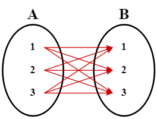
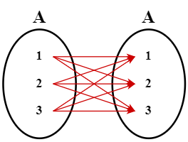

# 조인(Join)

1. [조인이란?](#조인이란)
2. [기본 문법](#기본-문법)
3. [ANSI 조인 vs Oracle 조인](#ansi-조인-vs-oracle-조인)
4. [조인의 종류 - ANSI 기준](#조인의-종류---ansi-기준)
   1. [Inner Join](#inner-join)
   2. [Outer Join](#outer-join)
      1. [Left Outer Join](#left-outer-join)
      2. [Right Outer Join](#right-outer-join)
      3. [Full Outer Join](#full-outer-join)
   3. [Cross Join](#cross-join)
   4. [Self Join](#self-join)
5. [참고 자료](#참고-자료)

## 조인이란?

조인(Join)은 다수의 테이블에 있는 데이터를 서로 연결하여 하나의 결과로 만들어 보여주는 것을 말한다. 조인은 다음과 같은 특징을 갖는다.

- 다수의 테이블에 포진해있는 데이터들을 조합하여 하나의 열로 가져올(SELECT) 때 사용한다.
- 반드시 테이블들 간의 특정 관계(Relation; 연결 관계)가 있어야 한다.

## 기본 문법

조인은 **원본 테이블, 조인 종류, 조인하고자 하는 테이블, 조인 조건** 순으로 적는다.

```sql
SELECT <조회할 칼럼들>
FROM <기준 테이블> A
조인 종류
<조인 대상 테이블> B
ON A.칼럼1 = B.칼럼1
```

위처럼 쿼리문을 작성하면 `테이블A와 테이블B을 칼럼1을 기준으로 하나의 테이블로 데이터들을 합친 후 조회할 칼럼들을 조회`하는 작업이 수행된다.

## ANSI 조인 vs Oracle 조인

SQL은 데이터베이스 관리를 위해 만들어진 프로그래밍 언어이며, 대부분의 DBMS들이 채택하고 있는 언어이다. DBMS 자체의 특수성으로 인해 사용법은 조금씩 다르지만, DB 관리의 본질은 동일하기에 나름대로의 보편성을 가지고 있다.

이를 위해서 미국 국립 표준 협회(American National Standards Institude, ANSI)에서 SQL에 대한 보편적인 문법을 제시하고 있는데, 이것이 ANSI Query(SQL)이다. 조인 역시 ANSI 문법을 사용하는 경우에 대다수이나, 편의에 따라 DBMS 자체 문법을 사용하기도 한다. 대표적으로 Oracle에서 사용하는 Oracle Join이 있다.

## 조인의 종류 - ANSI 기준

조인의 종류는 크게 분류하면 다음 그림과 같다.


이 외에 CROSS JOIN, SELF JOIN 등이 있다.

### Inner Join


- 쉽게 말하면 **교집합**이라고 할 수 있다.
- 기준 테이블과 조인한 테이블의 중복된 값을 보여준다.
- 두 테이블이 모두 가지고 있는 데이터만 검색된다.
- 두 테이블이 1:N 관계로 연결되어야 한다.

```sql
--NO_EMP 칼럼을 기준으로 TABLE_A와 TABLE_B를 INNER JOIN--
SELECT A.NAME, B.AGE
FROM TABLE_A A
INNER JOIN TABLE_B B
ON A.NO_EMP = B.NO_EMP
```

### Outer Join

Outer Join은 Inner Join과 달리 주 테이블(main table)이 무엇인지가 중요하다. **어떤 테이블이 중심이 되느냐에 따라 다시 Left Outer Join, Right Outer Join, Full Outer Join으로 세분화**된다.

#### Left Outer Join


- **기준 테이블의 값 + 테이블과 기준 테이블의 중복된 값**을 보여준다.
- 왼쪽 테이블을 기준으로 조인을 수행한다.
- 결과값은 `TABLE_A`의 모든 데이터와 `TABLE_A`와 `TABLE_B`의 중복되는 데이터가 검색된다.

```sql
--TABLE_A와 NO_EMP 칼럼을 기준으로 TABLE_A와 TABLE_B를 LEFT OUTER JOIN--
SELECT A.NAME, B.AGE
FROM TABLE_A A
LEFT OUTER JOIN TABLE_B B
ON A.NO_EMP = B.NO_EMP
```

#### Right Outer Join


- LEFT OUTER JOIN의 반대이다.
- 오른쪽 테이블을 기준으로 조인을 수행한다.
- 결과값은 `TABLE_B`의 모든 데이터와 `TABLE_A`와 `TABLE_B`의 중복되는 데이터가 검색된다.

```sql
--TABLE_B와 NO_EMP 칼럼을 기준으로 TABLE_A와 TABLE_B를 RIGHT OUTER JOIN--
SELECT A.NAME, B.AGE
FROM TABLE_A A
RIGHT OUTER JOIN TABLE_B B
ON A.NO_EMP = B.NO_EMP
```

#### Full Outer Join


- 쉽게 말하면 **합집합**이라고 할 수 있다.
- `TABLE_A`가 가진 데이터와 `TABLE_B`가 가진 데이터가 **모두 검색**된다.
- 사실상, 기준 테이블이 의미가 없다.

```sql
--NO_EMP 칼럼을 기준으로 TABLE_A와 TABLE_B를 FULL OUTER JOIN--
SELECT A.NAME, B.AGE
FROM TABLE_A A
FULL OUTER JOIN TABLE_B B
ON A.NO_EMP = B.NO_EMP
```

### Cross Join



- **모든 경우의 수를 표현하는 조인**이다.
- 기준 테이블이 `TABLE_A`일 경우, `TABLE_A`의 특정 데이터(ROW)를 `TABLE_B`의 테이블 전체와 조인하는 방식이다.
- 위 그림과 같은 경우 `TABLE_A`에 데이터 3개, `TABLE_B`에 데이터 3개가 있으므로 총 9개가 검색된다.

```sql
--TABLE_A와 TABLE_B를 CROSS JOIN--
SELECT A.NAME, B.AGE
FROM TABLE_A A
CROSS JOIN TABLE_B B
```

### Self Join



- 자기 자신과의 조인이다.
- 하나의 테이블을 여러번 복사한 후 조인하는 경우라고 할 수 있다.
- 자신이 가지고 있는 칼럼을 다양하게 변형시켜 활용하는 경우에 자주 사용된다.

```sql
--TABLE_A를 SELF JOIN--
SELECT A.NAME, B.NAME SUPERIOR
FROM TABLE_A A
SELF JOIN TABLE_A B
```

## 참고 자료

- [[Join] Join의 정의 및 문법](https://tragramming.tistory.com/73?category=877784)
- [[Join] ANSI Join & Oracle Join, Join의 종류](https://tragramming.tistory.com/74)
- [SQL - Join](https://github.com/WooVictory/Ready-For-Tech-Interview/blob/master/Database/SQL%20-%20Join.md)
