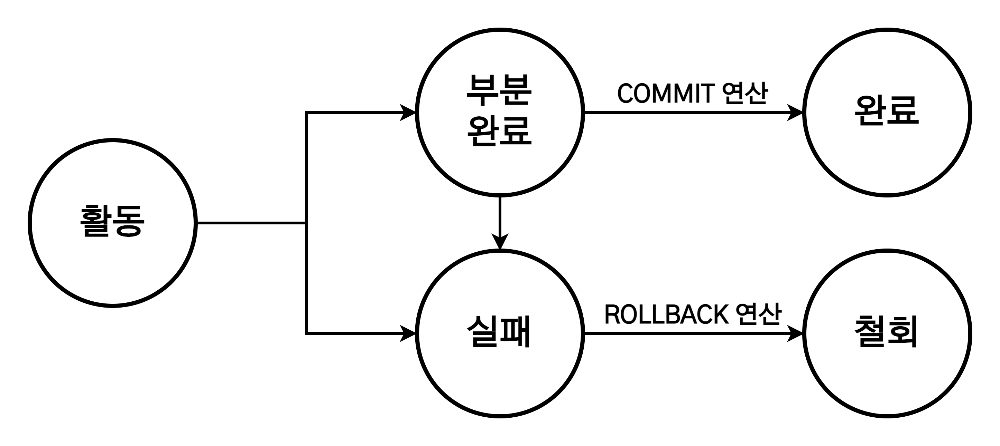

# 회복과 병행 제어

1. [트랜잭션(Transaction)](#트랜잭션transaction)
   1. [트랜잭션의 4가지 특성](#트랜잭션의-4가지-특성)
   2. [트랜잭션의 상태](#트랜잭션의-상태)
2. [장애와 회복](#장애와-회복)
   1. [장애의 유형](#장애의-유형)
   2. [데이터베이스의 저장 연산](#데이터베이스의-저장-연산)
   3. [회복 기법](#회복-기법)
      1. [회복](#회복)
      2. [회복을 위한 연산](#회복을-위한-연산)
   4. [데이터베이스 회복 기법](#데이터베이스-회복-기법)
3. [병행 수행(Concurrency)](#병행-수행concurrency)
   1. [병행 수행의 문제](#병행-수행의-문제)
   2. [트랜잭션 스케줄](#트랜잭션-스케줄)
4. [병행 제어(Concurrency Control, 동시성 제어)](#병행-제어concurrency-control-동시성-제어)
   1. [병행 제어 기법](#병행-제어-기법)
   2. [로킹(Locking) 기법](#로킹locking-기법)
      1. [기본 로킹 규약](#기본-로킹-규약)
      2. [기본 로킹 기법](#기본-로킹-기법)
      3. [2단계 로킹 규약(2PLP)](#2단계-로킹-규약2plp)

## 트랜잭션(Transaction)

DBMS는 데이터베이스가 항상 정확하고 일관된 상태를 유지할 수 있도록 하는데, 그 중심에는 <b>트랜잭션(Transaction)</b>이 있다. 트랙잭션을 관리함으로써 데이터베이스의 회복과 병행 제어가 가능하다.

- 하나의 작업을 수행하는 데 필요한 데이터베이스의 연산을 모아놓은 것으로, 데이터베이스에서 논리적인 작업의 단위이다.
  - 데이터베이스에 장애가 발생했을 때 데이터를 복구하는 작업의 단위.
  - 트랜잭션의 모든 명령문이 완벽하게 처리되거나 하나도 처리되지 않아야 데이터베이스가 모순이 없는 일관된 상태를 유지할 수 있다.
- 데이터베이스의 무결성과 일관성을 보장하려면 필요한 연산들을 하나의 트랜잭션으로 제대로 정의하고 관리해야 한다.
- 일반적으로 데이터베이스를 변경하는 INSERT문, DELETE문, UPDATE문의 실행을 트랜잭션으로 관리한다.

### 트랜잭션의 4가지 특성

트랜잭션이 제대로 작동하려면 다음의 4가지 특성을 만족해야만 한다.

- **원자성(Atomicity)**
  - 트랜잭션을 구성하는 연산들이 모두 정상적으로 실행되거나, 하나도 실행되지 않아야 한다.(All or Nothing)
  - 원자성을 보장하면 트랜잭션을 구성하는 연산 중 일부만 처리한 결과를 데이터베이스에 반영하는 일이 없게 된다.
- **일관성(Consistency)**
  - 트랜잭션이 성공적으로 수행된 후에도 데이터베이스가 일관된 상태를 유지해야 한다.
- **격리성(Isolation, 고립성)**
  - 수행 중인 트랜잭션이 완료될 때까지 트랜잭션이 생성한 중간 연산 결과에 다른 트랜잭션이 접근할 수 없다.
  - 여러 트랜잭션은 독립적으로 작업을 수행하는데, 각 트랜잭션이 서로 충돌하지 않도록 제어하는 것을 <b>병행 제어(Concurrency Control, 동시성 제어)</b>라고 한다.
- **지속성(Durability, 영속성)**
  - 트랜잭션이 성공적으로 완료된 후 반영한 수행 결과는 어떠한 경우에도 손실되지 않고 **영구적**이어야 한다.
  - 시스템에 장애가 발생하더라도 트랜잭션 작업 결과는 없어지지 않고 데이터베이스에 그대로 남아 있어야 한다.

트랜잭션의 특성을 지원하는 DBMS의 기능은 다음과 같다.

| 트랜잭션의 특성 |  DBMS의 기능   |
| :-------------: | :------------: |
|     원자성      |   회복 기능    |
|     일관성      | 병행 제어 기능 |
|     격리성      | 병행 제어 기능 |
|     지속성      |   회복 기능    |

- 트랜잭션의 연산
  - 데이터베이스는 COMMIT, ROLLBACK 연산을 통해 **데이터 무결성을 보장**한다.
  - **COMMIT** 연산 : 트랜잭션이 성공적으로 수행되었음을 선언.(작업 완료)
  - **ROLLBACK** 연산 : 트랜잭션을 수행하는 데 실패했음을 선언.(작업 취소)

### 트랜잭션의 상태

트랜잭션은 다섯 가지 상태(활동 상태, 부분 완료 상태, 완료 상태, 실패 상태, 철회 상태) 중 하나에 속하게 된다.

- **활동 상태**
  - 트랜잭션이 수행되기 시작하여 현재 수행 중인 상태이다.
  - 상황에 따라 부분 완료 상태나 실패 상태가 된다.
- **부분 완료 상태**
  - 트랜잭션의 마지막 연산이 실행된 직후의 상태이다.
  - 이는 트랜잭션의 모든 연산을 처리한 상태이며 아직 최종 결과를 데이터베이스에 반영하지 않은 상태이다.
  - 상황에 따라 완료 상태나 실패 상태가 된다.
- **완료 상태**
  - 트랜잭션이 성공적으로 완료되어 COMMIT 연산을 실행한 상태이다.
  - 트랜잭션이 수행한 최종 결과를 데이터베이스에 반영하고, 데이터베이스가 새로운 일관된 상태가 되면서 트랜잭션이 종료된다.
- **실패 상태**
  - 하드웨어나 소프트웨어의 문제, 트랜잭션 내부의 오류 등 여러 이유로 인해 장애가 발생하여 트랜잭션의 수행이 중단된 상태이다.
  - 트랜잭션을 더는 정상적으로 수행할 수 없을 때 실패 상태가 된다.
- **철회 상태**
  - 트랜잭션을 수행하는 데 실패하여 ROLLBACK 연산을 실행한 상태이다.
  - 트랜잭션의 연산을 모두 취소하고 트랜잭션이 수행되기 전의 데이터베이스 상태로 되돌리면서 트랜잭션이 종료된다.
  - 철회 상태로 종료된 트랜잭션은 상황에 따라 다시 수행되거나 폐기된다.

## 장애와 회복

데이터베이스가 조직의 주요한 데이터를 저장하는 만큼 데이터베이스 관리 시스템의 회복 기능은 매우 중요하다. 회복은 장애가 발생했을 때 데이터베이스를 장애가 발생하기 전의 일관된 상태로 복구시키는 것을 말한다.

> **장애**  
> 시스템이 제대로 동작하지 않는 상태.

### 장애의 유형

- **트랜잭션 장애**
  - 트랜잭션 수행 중 오류가 발생하여 정상적으로 수행을 계속할 수 없는 상태를 의미한다.
  - 원인으로는 트랜잭션의 논리적 오류, 잘못된 데이터 입력, 시스템 자원의 과다 사용 요구, 처리 대상 데이터의 부재 등이 있다.
- **시스템 장애**
  - 하드웨어 결함으로 정상적으로 수행을 계속할 수 없는 상태를 의미한다.
  - 원인으로는 하드웨어 이상으로 메인 메모리에 저장된 정보가 손실되거나 교착 상태가 발생한 경우가 있다.
- **미디어 장애**
  - 디스크 장치의 결합으로 디스크에 저장된 데이터베이스의 일부 혹은 전체가 손상된 상태를 의미한다.
  - 원인으로는 디스크 헤드의 손상이나 고장 등이 있다.

### 데이터베이스의 저장 연산

- 데이터베이스는 기본적으로 비휘발성 저장 장치인 디스크에 상주한다.
  - 트랜잭션이 데이터베이스의 데이터를 처리하려면, 데이터를 디스크에서 휘발성 저장 장치인 메인 메모리로 가져와 이를 처리한 후 그 결과를 다시 디스크로 보내는 작업이 필요하다.
- 디스크와 메인 메모리 간의 데이터 이동은 대개 블록(Block) 단위로 수행한다.
  - 디스크 블록(디스크), 버퍼 블록(메인 메모리)
- 디스크와 메인 메모리 간의 데이터 이동은 `input(X)`(디스크 블록 > 버퍼 블록), `output(X)`(버퍼 블록 > 디스크 블록) 두 연산으로 수행한다.
- 메인 메모리와 응용 프로그램 간의 데이터 이동은 `read(X)`(버퍼 블록 > 변수), `write(X)`(변수 > 버퍼 블록) 두 연산으로 수행한다.

### 회복 기법

#### 회복

회복은 데이터베이스에 장애가 발생했을 때 장애가 발생하기 전의 모순이 없고 일관된 상태로 복구시키는 것이며, DBMS의 회복관리자가 담당한다. 장애가 일어난 데이터베이스를 복구하는 동안에는 데이터베이스에 접근하여 업무를 처리할 수 없으므로, 회복시키는 작업은 빠른 시간 내에 이루어져야 한다.

#### 회복을 위한 연산

- 데이터베이스 회복의 핵심 원리는 **데이터 중복**이다.
  - 데이터를 별도의 장소에 미리 복사해두고, 장애로 문제가 발생했을 때 복사본을 이용해 원래의 상태로 복원하는 것이다.
  - 덤프나 로그 방법을 사용해 데이터를 복사해뒀다가 회복시킬 때 사용한다.
  - > - 덤프(Dump) : 데이터베이스 전체를 다른 저장 장치에 주기적으로 복사하는 방법.
    > - 로그(Log) : 데이터베이스에서 변경 연산이 실행될 때마다 데이터를 변경하기 이전 값과 변경한 이후의 값을 별도의 파일에 기록하는 방법.
- 장애가 발생했을 때, 덤프나 로그 방법으로 데이터베이스를 복구하는 가장 기본적인 방법은 REDO나 UNDO 연산을 실행하는 것이다.
  - > - REDO(재실행) : 가장 최근에 저장한 데이터베이스 복사본을 가져온 후 로그를 이용해 복사본이 만들어진 이후에 실행된 모든 변경 연산을 재실행한다. 장애 발생 직전까지 복구되며, 전반적으로 손상된 경우에 주로 사용한다.
    > - UNDO(취소) : 로그를 이용해 지금까지 실행된 모든 변경 연산을 취소하여 데이터베이스를 복구한다. 변경 중이었거나 이미 변경된 내용만 신뢰성을 잃은 경우에 주로 사용한다.
- REDO와 UNDO를 실행하는 데는 로그가 중요하게 사용된다.
  - 로그를 저장한 파일을 로그 파일이라 하며, 로그 파일은 레코드 단위로 기록된다.

### 데이터베이스 회복 기법

데이터베이스 회복에는 로그 회복 기법, 검사 시점 회복 기법, 미디어 회복 기법이 존재한다.

- **로그 회복 기법**
  - 데이터를 변경한 연산 결과를 데이터베이스에 반영하는 시점에 따라 즉시 갱신 회복 기법과 지연 갱신 회복 기법으로 나뉜다.
  - **즉시 갱신 회복 기법(Immediate Update)**
    - 트랜잭션 수행 중에 데이터를 변경한 연산의 결과를 데이터베이스에 즉시 반영하고 데이터 변경에 대한 내용을 로그 파일에도 기록한다.
    - 데이터베이스 회복 시 로그를 정상적으로 사용하려면, 트랜잭션에서 데이터 변경 연산이 실행되었을 때 로그 파일에 로그 레코드를 먼저 기록한 후 데이터베이스 변경 연산을 반영해야 한다.
    - 로그 파일에 기록된 내용을 참조하여, 장애 발생 시점에 따라 REDO나 UNDO 연산을 실행하여 데이터베이스를 복구한다.
    - > COMMIT 이전 > UNDO 연산 / COMMIT 이후 > REDO 연산
  - **지연 갱신 회복 기법(Deferred Update)**
    - 트랜잭션이 수행되는 동안에는 데이터 변경 연산의 결과를 데이터베이스 즉시 반영하지 않고 로그 파일에만 기록해두었다가, 트랜잭션이 부분 완료된 후에 로그에 기록된 내용을 이용해 데이터베이스에 한 번에 반영한다.
    - 트랜잭션이 수행되는 동안 장애가 발생할 경우 로그에 기록된 내용을 버리기만 하면 된다.
    - UNDO 연산은 필요 없고 REDO 연산만 필요하므로 로그 레코드에 변경 이전 값을 기록할 필요가 없다.
- **검사 시점 회복 기법**
  - 로그 회복 기법과 같은 방법으로 로그 기록을 이용하되, 일정 시간 간격으로 검사 시점(Check Point)를 제작, 장애가 발생하면 가장 최근 검사 시점 이후의 트랙잭션만 회복 작업을 수행한다.
  - 회복 작업의 범위가 검사 시점으로 정해지므로 데이터베이스 회복 시간이 단축된다는 장점이 있다.
  - 검사 시점을 표시하는 `<checkpoint L>` 형식의 레코드를 기록하고, 이를 이용해 회복 작업의 범위가 정해지면 즉시 갱신 회복 기법이나 지연 갱신 회복 기법을 이용해 회복 작업을 수행한다.
  - > **검사 시점 회복 기법의 등장 배경**
    >
    > 로그 회복 기법은 로그 전체를 분석하여 로그에 기록된 모든 트랜잭션을 대상으로 적용할 회복 연산을 결정한다. 데이터베이스 회복에 많은 시간이 걸리고 REDO를 수행할 필요가 없는 트랜잭션에도 REDO를 실행하는 일이 발생하는데, 이런 비효율성을 해결하기 위해 제안된 방법이 검사 시점 회복 기법이다.
- **미디어 회복 기법**
  - 데이터베이스는 디스크에 저장되는데, 디스크 헤더의 고장과 같은 원인으로 장애가 발생할 수 있다. 이에 대비한 회복 기법이 미디어 회복 기법이다.
  - 전체 데이터베이스의 내용을 일정 주기마다 다른 안전한 저장 장치에 복사해두는 덤프를 이용한다. 장애가 발생하면 가장 최근에 복사해둔 덤프를 이용해 복구한다.
  - 전체 데이터베이스를 다른 저장 장치에 복사하는 것은 비용이 많이 들고, 복사하는 동안 트랜잭션 수행이 중단되기에 CPU가 낭비된다는 단점이 존재한다.

## 병행 수행(Concurrency)

병행 수행이란 **여러 개의 트랜잭션이 동시에 수행되는 것**을 말한다. 인터리빙(Interleaving; 번갈아가며 조금씩 처리를 수행) 방식으로 진행된다.

병행 수행되는 트랜잭션들이 동시에 같은 데이터에 접근하여 변경 연산을 실행하려고 하면 예상치 못한 결과가 발생할 수 있다. 따라서 병행 수행을 하더라도 각 트랜잭션이 다른 트랜잭션의 방해를 받지 않고 정확한 수행 겨로가를 얻을 수 있도록 제어해야 한다.

### 병행 수행의 문제

병행 수행을 특별한 제어 없이 진행하면 갱신 분실, 모순성, 연쇄 복귀의 문제가 발생할 수 있다.

- **갱신 분실(Lost Update, 갱신 손실)**
  - 하나의 트랜잭션이 수행한 데이터 변경 연산의 결과를 다른 트랜잭션이 덮어써 변경 연산이 무효화되는 것을 의미한다.
- **모순성(Inconsistency)**
  - 하나의 트랜잭션이 여러 개의 데이터 변경 연산을 수행할 때 일관성 없는 상태의 데이터베이스에서 데이터를 가져와 연산을 실행함으로써 모순된 결과가 발생하는 것을 의미한다.
- **연쇄 복귀(Cascading Rollback)**
  - 트랜잭션이 완료되기 전에 장애가 발생하여 ROLLBACK 연산을 수행하면, 이 트랜잭션이 장애 발생 전에 변경한 데이터를 가져가 사용한 다른 트랜잭션에도 ROLLBACK 연산을 연쇄적으로 실행해야 한다는 것을 의미한다.

### 트랜잭션 스케줄

트랜잭션 스케줄은 **트랜잭션에 포함되어 있는 연산들을 수행하는 순서**를 의미한다.

트랜잭션이 인터리빙 방식으로 진행되는데 이는 트랜잭션에 있는 연산을 실행하는 순서에 따라 트랜잭션의 수행 결과가 달라지기도 하고, 병행 수행에 따른 문제가 발생하기도 하기에 트랜잭션 스케줄이 필요하다.

트랜잭션 스케줄의 유형은 다음과 같다.

- **직렬 스케줄**
  - 인터리빙 방식을 이용하지 않고 **각 트랜잭션별로 연산을 순차적으로 실행**한다.
  - 직렬 스케줄의 수행 순서에 따라 최종 수행 결과가 달라질 수 있다.
  - 모든 트랜잭션이 완료될 때까지 다른 트랜잭션의 방해를 받지 않고 독립적으로 수행하므로 모순이 없는 정확한 결과를 얻을 수 있다.
  - 트랜잭션을 독립적으로 수행하기 때문에 병행 수행이라 할 수 없고, 일반적으로 잘 사용하지 않는다.
- **비직렬 스케줄**
  - 인터리빙 방식을 이용하여 **트랜잭션들을 병행하여 수행**한다.
  - 트랜잭션이 돌아가면서 연산을 실행하고 여러 트랜잭션을 병행 수행하기에 최종 수행 결과의 정확성을 보장할 수 없다.
  - 어떤 비직렬 스케줄을 선택하여 트랜잭션들을 수행하느냐가 중요하다.
- **직렬 가능 스케줄**
  - 직렬 스케줄과 같이 **정확한 결과를 생성하는 비직렬 스케줄**이다.
  - 비직렬 스케줄 중에서 결과가 동일한 직렬 스케줄이 없는 것은 결과의 정확성을 보장할 수 없기에 직렬 가능 스케줄이 아니다.
  - 직렬 가능 스케줄인지 여부를 판단하는 일은 쉽지 않기에, 대부분의 DBMS에서는 직렬 가능성을 보장하는 **병행 제어 기법을 사용**한다.

## 병행 제어(Concurrency Control, 동시성 제어)

병행 제어란 여러 개의 트랜잭션이 병행 수행되더라도, 문제 없이 정확한 수행 결과를 얻을 수 있도록 트랜잭션의 수행을 제어하는 것이다.

### 병행 제어 기법

병행 제어 기법은 모든 트랜잭션이 원리를 따르면 직렬 가능성이 보장되는 규약의 정의하고 트랜잭션들이 이 규약을 따르도록 하는 것이다. 여러 트랜잭션을 병행 수행하면서도 정확한 결과를 얻을 수 있는 직렬 가능성을 보장받기 위해 사용한다.

여러 병행 제어 기법들 중 로킹 기법이 가장 많이 사용된다.

### 로킹(Locking) 기법

병행 수행되는 트랜잭션들이 동일한 데이터에 동시에 접근하지 못하도록 lock과 unlock이라는 연산을 이용해 제어한다. 트랜잭션 간 상호 배제를 통해 직렬 가능성을 보장하는 방법이다.

- 사용하는 연산
  - lock : 데이터에 대한 독점권 보장
  - unlock : 데이터에 대한 독점권 포기

#### 기본 로킹 규약

- 반드시 read 또는 write 연산을 실행하기 전에 lock 연산을 실행해야 한다.
- 다른 트랜잭션이 이미 lock 연산을 실행한 데이터는 다시 lock 연산이 실행될 수 없다.
- 모든 연산을 수행하고 나면 unlock 연산을 실행해서 독점권을 반납해야 한다.

> lock 연산은 다양한 크기의 데이터를 대상으로 실행할 수 있다.  
> 전체 데이터베이스에 lock 연산을 실행하면 제어가 간단하지만 하나의 트랜잭션만 수행되므로 병행 수행이라 할 수 없다. 속성에 lock 연산을 하면 많은 수의 트랜잭션이 병행 수행할 수 있지만 제어가 복잡하다.  
> 즉, 시스템에 따라 적절한 로킹 단위를 선택하는 것이 중요하다.

#### 기본 로킹 기법

- 병행 수행을 제어하는 기법으로, 엄격한 제약으로 어떤 순간이든 데이터 독점은 하나의 트랜잭션만 가능하다.
- write는 엄격해야 하고, read는 동시에 실행해도 문제가 없다. -> 공용, 전용 lock
  - 공용 lock : read는 가능하지만 write는 불가능하다.(데이터에 대한 사용권을 여러 트랜잭션이 지님)
  - 전용 lock : read, write 모두 가능하며, 다른 트랜잭션은 접근이 불가능하다.

하지만 이러한 기본 로킹 규약만으로는 트랜잭션 스케줄의 직렬 가능성을 완벽히 보장할 수 없다.

#### 2단계 로킹 규약(2PLP)

- 트랜잭션 스케줄의 모든 트랜잭션이 2단계 로킹 규약을 준수하면 해당 스케줄은 직렬 가능성이 보장된다.
  - 확장 단계(lock만 가능), 축소 단계(unlock만 가능)으로 나누어 실행된다.
- <b>교착 상태(Deadlock)</b>가 발생할 수 있다.
  - 교착상태는 예방 기법, 회피 기법, 탐지/회복 기법을 통해 해결해야 한다.
    - 예방 기법 : 각 트랜잭션이 실행되기 전에 필요한 모든 데이터를 locking 하는 방법이다. 다만 lcoking 해야할 데이터의 양이 많다면 사실상 모든 데이터를 locking 한 것과 동일하여 트랜잭션의 병행성을 보장하지 못할 수도 있다.
    - 회피 기법 : 자원을 할당할 때 타임스탬프(Timestamp)를 사용하여 데드락이 발생하지 않도록 회피하는 방법이다.
    - 탐지/회복 기법 : 트랜잭션이 실행되기 전에는 아무런 검사도 하지 않다가, 데드락이 발생하면 이를 감지하고 회복시키는 방법이다.

## 참고 자료

- [[데이터베이스 개론 10장] 회복과 병행 제어](https://velog.io/@mh_go/%EB%8D%B0%EC%9D%B4%ED%84%B0%EB%B2%A0%EC%9D%B4%EC%8A%A4-%EA%B0%9C%EB%A1%A0-10%EC%9E%A5-%ED%9A%8C%EB%B3%B5%EA%B3%BC-%EB%B3%91%ED%96%89-%EC%A0%9C%EC%96%B4#%EC%9E%A5%EC%95%A0%EC%9D%98-%EC%9C%A0%ED%98%95)
- [DB 트랜잭션(Transaction)](https://gyoogle.dev/blog/computer-science/data-base/Transaction.html)
