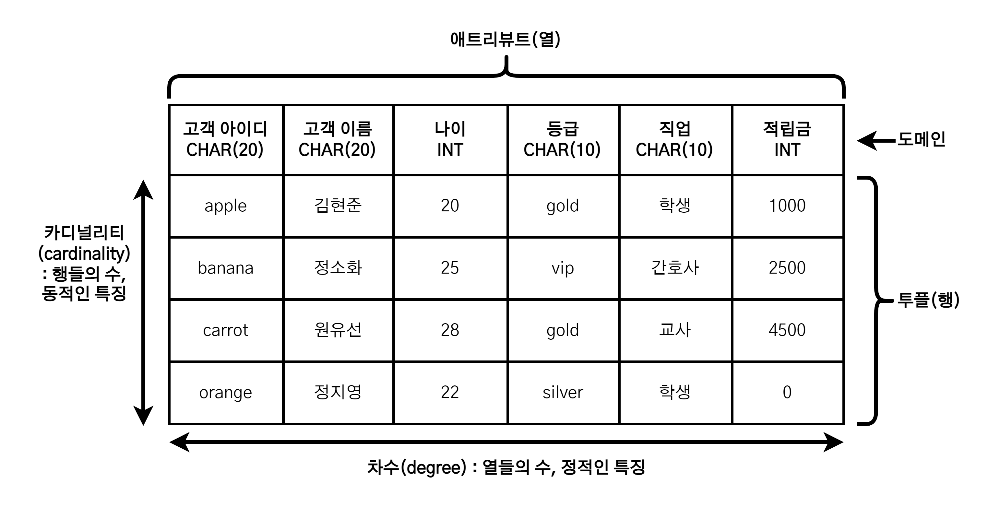
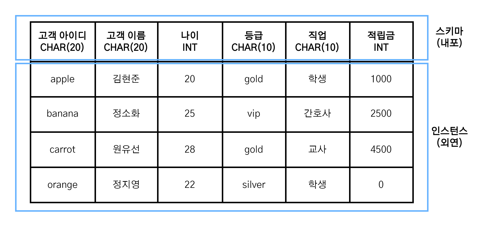

# 관계 데이터 모델

1. [관계 데이터 모델이란?](#관계-데이터-모델이란)
2. [관계 데이터 모델의 기본 용어](#관계-데이터-모델의-기본-용어)
   1. [릴레이션](#릴레이션)
   2. [애트리뷰트](#애트리뷰트)
   3. [투플](#투플)
   4. [도메인](#도메인)
   5. [차수](#차수)
   6. [카디널리티](#카디널리티)
   7. [널 값](#널-값)
3. [릴레이션과 데이터베이스의 구성](#릴레이션과-데이터베이스의-구성)
   1. [릴레이션 스키마(relation schema)](#릴레이션-스키마relation-schema)
   2. [릴레이션 인스턴스(relation instance)](#릴레이션-인스턴스relation-instance)
4. [릴리이션의 특징](#릴리이션의-특징)
5. [키의 종류](#키의-종류)
   1. [키(key)](#키key)
   2. [슈퍼키](#슈퍼키)
   3. [후보키](#후보키)
   4. [기본키](#기본키)
   5. [대체키](#대체키)
   6. [외래키](#외래키)
6. [관계 데이터 모델의 제약](#관계-데이터-모델의-제약)
   1. [무결성](#무결성)
   2. [무결성 제약조건의 주요 목적](#무결성-제약조건의-주요-목적)
      1. [개체 무결성 제약조건(entity integrity constraint)](#개체-무결성-제약조건entity-integrity-constraint))
      2. [참조 무결성 제약조건(referential integrity constraint)](#참조-무결성-제약조건referential-integrity-constraint)
7. [참고 자료](#참고-자료)

## 관계 데이터 모델이란?

관계 데이터 모델은 논리적 데이터 모델 중 가장 인기있는 모델으로, 하나의 개체에 관한 데이터를 릴레이션 하나에 담아 데이터베이스에 저장한다.

## 관계 데이터 모델의 기본 용어

### 릴레이션

- 릴레이션은 2차원의 테이블을 의미한다.
- 릴레이션은 관계 데이터 모델에서 사용하기 위해 테이블에 특별한 제약을 추가한 것이다.
- [특정 조건](#릴리이션의-특징)을 충족하는 테이블만이 릴레이션이 될 수 있다. 따라서 모든 릴레이션은 테이블이지만, 모든 테이블이 릴레이션인 것은 아니다.

### 애트리뷰트

- 릴레이션의 열을 속성 또는 <b>애트리뷰트(attribute)</b>라고 부른다.
- 각 속성은 서로 다른 이름을 통해 구별된다.

### 투플

- 릴레이션의 행을 <b>투플(tuple)</b>이라고 부른다.

### 도메인

- 하나의 애트리뷰트가 가질 수 있는 모든 값들의 집합을 해당 애트리뷰트의 <b>도메인(domain)</b>이라고 한다.
  - 관계 데이터 모델에서는 더이상 분해할 수 없는 원자 값만을 애트리뷰트 값으로 사용한다.(도메인은 특정 애트리뷰트가 가질 수 있는 모든 원자 값의 모임)
- 도메인을 정의해두면 사용자가 속성 값을 입력하거나 수정할 때 데이터베이스 시스템이 적합성을 판단하여 해당 값 이외의 값은 허용하지 않음으로써 항상 올바른 값만 유지한다는 장점이 있다.
  - 프로그래밍 언어에서 데이터 타입과 변수의 관계로 비유할 수 있다.
  - (데이터 타입-도메인), (변수-속성)

### 차수

- 하나의 릴레이션에서 애트리뷰트의 전체 개수를 릴레이션의 <b>차수(degree)</b>라고 한다.
- 모든 릴레이션은 최소 1 이상의 차수를 유지해야 한다.
- 릴레이션의 차수는 일반적으로 자주 바뀌지 않는다는 **정적인 특징**을 갖는다.
  - 릴레이션이 생성된 후 새로운 애트리뷰트가 추가되거나 기존의 애트리뷰트가 삭제되는 경우에만 릴레이션의 차수가 변한다.

### 카디널리티

- 하나의 릴레이션에서 투플의 전체 개수를 릴레이션의 <b>카디널리티(cardinality)</b>라고 한다.
- 투플이 없는 릴레이션이 존재할 수도 있고, 새로운 투플이 삽입되거나 기존의 투플이 삭제될 수 있으므로, 릴레이션의 카디널리티는 일반적으로 자주 변한다는 **동적인 특징**을 갖는다.

### 널 값

- 릴레이션에 있는 특정 투플의 속성 값을 모르거나, 적합한 값이 없는 경우에는 <b>널(null)</b>이라는 특별한 값을 사용할 수 있다.
- 널 값은 특정 속성에 해당되는 값이 없음을 나타냄으로 숫자 0이나 공백 문자와는 다르다.
  - '알려지지 않음' 혹은 '적용할 수 없음'을 의미한다.

> **용어들의 대응 관계**
>
> | 공식적인 용어 | 자주 사용되는 용어 | 파일 시스템의 용어 |
> | :-----------: | :----------------: | :----------------: |
> |   릴레이션    |       테이블       |        파일        |
> |     투플      |     행/레코드      |       레코드       |
> |  애트리뷰트   |         열         |        필드        |

## 릴레이션과 데이터베이스의 구성

관계 데이터 모델에서 릴레이션은 릴레이션 스키마와 릴레이션 인스턴스로 구성된다.

### 릴레이션 스키마(relation schema)

- 릴레이션의 이름과 릴레이션에 포함된 모든 애트리뷰트의 이름으로 정의하는 릴레이션의 **논리적 구조**이다.
  - 릴레이션 스키마는 데이터베이스 관리 시스템이 내부적으로 데이터 정의어를 이용해 정의한다.
  - 일반적으로 `릴레이션이름(애트리뷰트1, 애트리뷰트2, ..., 애트리뷰트N)`과 같은 형태로 표현하며, 기본 키 애트리뷰트에는 밑줄 표시를 한다.
  - 릴레이션 스키마를 보면 릴레이션의 상세 내용은 숨기면서 릴레이션의 이름이 무엇이고, 어떤 애트리뷰트로 구성되어 있는지 전체 구조를 쉽게 파악할 수 있다.
- 릴레이션 스키마는 <b>릴레이션 내포(relation intenstion)</b>이라고도 부른다.

### 릴레이션 인스턴스(relation instance)

- 어느 한 시점에 들어 있는 **투플들의 집합**이다.
  - 릴레이션 인스턴스에 포함된 투플은 릴레이션 스키마에서 정의한 각 속성에 대응하는 실제 값으로 구성되어 있다.
  - 릴레이션 인스턴스를 보면 현재 릴레이션의 실제 내용을 쉽게 파악할 수 있다.
  - 데이터베이스 관리 시스템이 내부적으로는 데이터 조작어를 이용해 릴레이션 인스턴스의 투플을 검색하거나, 새로운 투플 삽입과 기존 투플 삭제 및 수정을 진행한다.
- 릴레이션 인스턴스는 간단히 릴레이션이라 부르거나 <b>릴레이션 외연(relation extention)</b>이라고도 부른다.

## 릴리이션의 특징

1. **투플의 유일성** : 하나의 릴레이션에는 동일한 투플이 존재할 수 없다.
   - 모든 투플에는 다른 투플과 구별되는 유일한 특성이 있어야 한다.
     - key를 활용한 유일성 판단
2. **투플의 무순서** : 하나의 릴레이션에서 투플 사이의 순서는 무의미하다.
   - 데이터베이스 위치가 아닌 내용으로 검색되므로 투플의 순서는 중요하지 않다.
   - 삽입 순서에 따라 저장되지만, 효율적인 처리를 위해 투플의 순서를 임의로 변경하기도 한다.
3. **애트리뷰트의 무순서** : 하나의 릴레이션에서 애트리뷰트 사이의 순서는 무의미하다.
   - 속성 값은 릴레이션에서 위치가 아닌 애트리뷰트의 이름으로 접근한다.
4. **애트리뷰트의 원자성** : 애트리뷰트 값으로 원자 값만 사용할 수 있다.
   - 하나의 애트리뷰트는 여러 개의 값, 즉 다중 값을 가질 수 없다.
   - 현실에서는 존재할 수 있으나 관계 데이터 모델은 복잡한 개념을 배제하고 릴레이션을 단순한 구조로 정의하고자 하는 특징으로 인해 다중 값을 허용하지 않는다.

## 키의 종류

### 키(key)

- 릴레이션에 포함된 **투플들을 유일하게 구별해주는 역할을 하는 하나 이상의 애트리뷰트들의 모임**이다.
  - 관계 데이터 모델에서 중요한 제약조건을 정의하고 투플을 처리하는 데 중요한 역할을 수행한다.
- 슈퍼키(super key), 후보키(candidate key), 기본키(primary key), 대체키(alternate key), 외래키(foreign key)가 존재한다.

### 슈퍼키

- 슈퍼키는 **유일성(uniqueness)의 특성을 만족하는 애트리뷰트 또는 애트리뷰트들의 집합**이다.

> **유일성**
>
> 유일성은 키가 갖춰야 하는 기본 특성으로, 하나의 릴레이션에서 키로 지정된 애트리뷰트 값은 투플마다 달라야 한다. 즉, 키 값이 같은 투플은 존재할 수 없다.

### 후보키

- 후보키는 **유일성과 최소성(minimality)을 만족하는 애트리뷰트 또는 애트리뷰트들의 집합**이다.

> **최소성**
>
> 최소성은 꼭 필요한 최소한의 애트리뷰트들로만 키를 구성하는 특성이며, 하나의 애트리뷰트로 구성된 키는 최소성을 만족한다.

> **최소성을 만족하는 슈퍼키 = 후보키**
>
> 후보키가 되기 위해 만족해야 하는 유일성과 최소성의 특성은 새로운 투플이 삽입되거나, 기존 투플의 애트리뷰트 값이 바뀌어도 **유지**되어야 한다.  
> 현재의 릴레이션 내용, 즉 릴레이션 인스턴스만 보고 유일성과 최소성을 판단해서는 안된다. 데이터베이스가 사용될 현실 세계의 환경까지 염두에 두고 애트리뷰트의 본래 의미를 정확히 이해한 후 슈퍼키와 후보키를 선별해야 한다.

### 기본키

- 데이터베이스 설계자나 관리자가 **여러 후보키 중에서 기본적으로 사용할 키를 선택한 것**이다.
  - 후보키가 여러 개일 경우, 데이터베이스 사용 환경을 고려하여 적합한 것을 기본키로 선택한다.
- **기본키 선택 고려 사항**
  - 널 값을 가질 수 있는 애트리뷰트가 포함된 후보키는 부적합하다.
  - 값이 자주 변경될 수 있는 애트리뷰트가 포함된 후보키는 부적합하다.
  - 단순한 후보키를 선택해야 한다.

### 대체키

- **기본키로 선정되지 않은 후보키**이다.

### 외래키

- 어떤 릴레이션에 소속된 애트리뷰트 또는 애트리뷰트 집합이 다른 릴레이션의 기본키가 되는 키다.
  - **다른 릴레이션의 기본키를 참조하는 애트리뷰트의 집합**이다.
  - 외래키는 릴레이션들 사이의 관계를 올바르게 표현하기 위해 필요하다.
- 참조하는 릴레이션과 참조되는 릴레이션이 같을 수도 있다.(자기 참조)
- **외래키는 기본키를 참조하지만, 기본키가 아니기 때문에 널 값을 가질 수 있고, 서로 다른 투플이 같은 값을 가질 수 있다.**

> **외래키 사용시 주의점**
>
> 외래키가 되는 애트리뷰트와 기본키가 되는 애트리뷰트의 이름은 달라도 되지만, **외래키 애트리뷰트의 도메인과 기본키 애트리뷰트의 도메인은 반드시 같아야 한다.** 도메인이 같아야 연관성 있는 투플을 찾기 위한 비교 연산이 가능하다.  
> 외래키가 참조되는 릴레이션의 기본키가 아닌 다른 키를 참조할 경우 투플을 유일하게 특정짓기 어렵기 때문에 관련 있는 투플을 검색하지 못할 수도 있다.

## 관계 데이터 모델의 제약

관계 데이터 모델에서 정의하고 있는 기본 제약 사항은 키와 관련한 <b>무결성 제약조건(intergrity constraint)</b>이다.

### 무결성

- 데이터 무결성은 데이터에 결함이 없는 상태, 즉 **데이터가 정확하고 유효하게 유지된 상태**를 의미한다.

### 무결성 제약조건의 주요 목적

- 데이터베이스에 저장된 데이터의 무결성을 보장하고, 데이터베이스의 상태를 일관되게 유지하는 것이다.
  - 무결성 제약조건은 데이터베이스가 어떤 상태나 시점에서도 반드시 지켜야 하는 중요한 규칙이다.

#### 개체 무결성 제약조건(entity integrity constraint)

- 기본키를 구성하는 모든 애트리뷰트는 널 값을 가지면 안된다는 규칙이다.
  - 기본키를 구성하는 속성 전체 또는 일부가 널 값이 되면 투플의 유일성을 판단할 수 없어 기본키의 본래 목적을 상실하게 된다.

> **개체 무결성 제약조건을 만족시키려면?**
>
> 새로운 투플이 삽입되는 연산과 기존 투플의 기본키 애트리뷰트 값이 변경되는 여산이 발생할 때, 기본키에 널 값이 포함되는 상황에서는 연산의 수행을 거부해야 개체 무결성 제약조건을 만족시킬 수 있다.  
> 이는 DBMS가 자동으로 수행하기에 사용자는 새로운 릴레이션을 생성할 때 기본키를 어떤 애트리뷰트들로 구성할 것인지 전달하기만 하면 된다.

#### 참조 무결성 제약조건(referential integrity constraint)

- 외래키는 참조할 수 없는 값을 가질 수 없다는 규칙이다.
  - 외래키가 자신이 참조하는 릴레이션의 기본키와 상관 없는 값을 가지게 되면 두 릴레이션을 연관시킬 수 없으므로 외래키 본래의 의미를 잃는다.
  - 단, 외래키는 참조 가능한 값을 가져야 하지만 널 값을 가진다고 해서 참조 무결성 제약조건을 위반한 것으로 판단해서는 안된다.
- 참조되는 `릴레이션 A`에서 `투플 a`가 삭제될 경우, 연관된 `투플 b`가 참조하는 `릴레이션 B`에 남아 있다면 아래 세가지 방법 중 하나를 이용하여 참조 무결성 제약조건을 만족시켜야 한다.
  - 해당 `투플 a`를 삭제하는 연산을 수행하지 않는다.
  - 연관된 `투플 b`를 함께 삭제한다.
  - `투플 b`를 null 값이나 기본 값으로 지정한다.

> **참조 무결성 제약조건을 만족시키려면?**
>
> 데이터베이스 상태가 빈번하게 변경되는 경우 참조 무결성 제약조건을 만족시키기 어렵지만, 이는 DBMS에서 자동으로 수행한다.  
> 사용자는 어떤 속성들이 외래키이고 어떤 릴레이션의 기본키를 참조하면 되는지를 전달하고, 위반할 경우 어떻게 처리해야 하는지만 설명하면 된다.

## 참고 자료

- 홍의경, 『MS SQL Server 기반 데이터베이스 배움터 개정 3판』, (주)생능출판사(2017)
- [[데이터베이스 개론 5장] 관계 데이터 모델](https://velog.io/@mh_go/%EB%8D%B0%EC%9D%B4%ED%84%B0%EB%B2%A0%EC%9D%B4%EC%8A%A4-%EA%B0%9C%EB%A1%A0-5%EC%9E%A5-%EA%B4%80%EA%B3%84-%EB%8D%B0%EC%9D%B4%ED%84%B0-%EB%AA%A8%EB%8D%B8#%EA%B4%80%EA%B3%84-%EB%8D%B0%EC%9D%B4%ED%84%B0-%EB%AA%A8%EB%8D%B8)
- [데이터베이스 기본 용어](https://github.com/WooVictory/Ready-For-Tech-Interview/blob/master/Database/%EB%8D%B0%EC%9D%B4%ED%84%B0%EB%B2%A0%EC%9D%B4%EC%8A%A4%20%EA%B8%B0%EB%B3%B8%20%EC%9A%A9%EC%96%B4.md)
