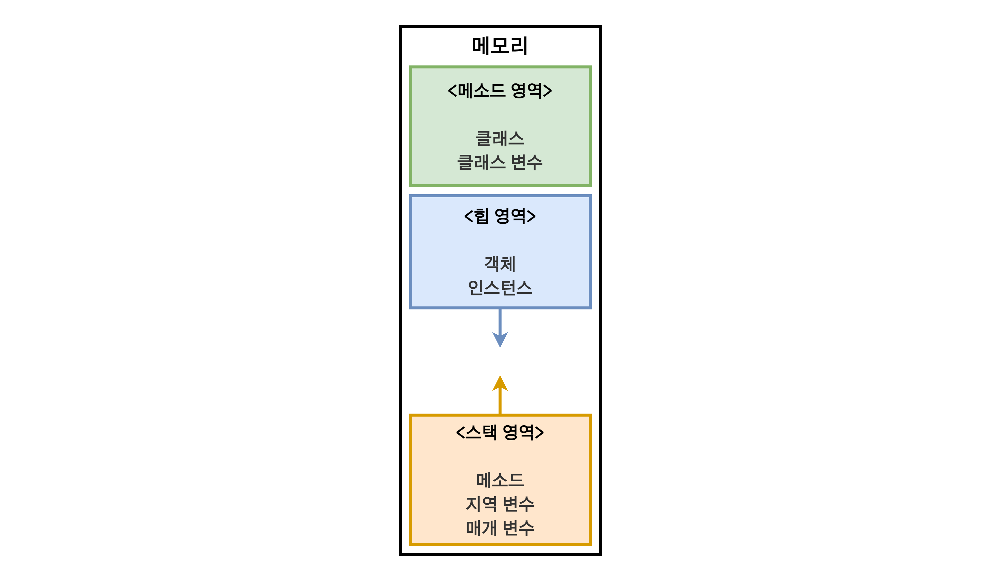
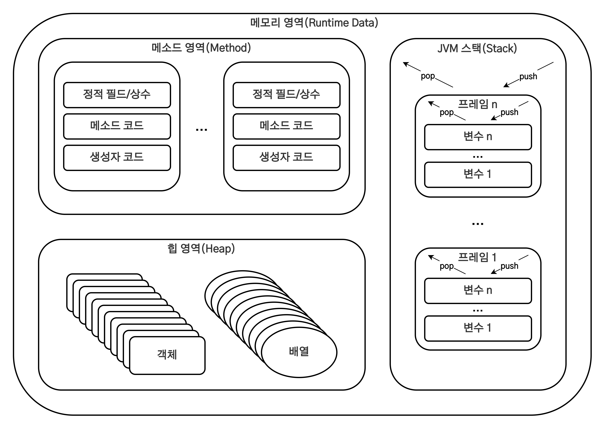

# 자바 메모리 관리

1. [개요](#개요)
2. [자바 메모리 구조](#자바-메모리-구조)
3. [멀티 스레드에서의 메모리 사용](#멀티-스레드에서의-메모리-사용)
4. [스택(Stack)과 힙(Heap)에 대한 이해](#스택stack과-힙heap에-대한-이해)
5. [참고 자료](#참고-자료)

## 개요

자바뿐만 아니라 모든 프로그램이 구동되기 위해서는 프로그램 구동시 운영체제로부터 메모리(RAM) 공간을 할당받아야 한다. 이러한 메모리는 무제한이 아니라 한정되어 있다. 그렇기에 한정된 메모리를 최대한 효율적으로 사용한느 프로그램을 작성해야 하고 프로그램을 잘못 작성하면 속도가 매우 저하되거나 갑작스럽게 종료되는 등의 여러 문제가 발생할 수 있다.

자바로 만들어진 프로그램은 [JVM](./JVM.md)을 통해 실행되고 이 JVM은 프로그램을 동작할 때 OS로부터 메모리를 할당한다.

> JVM에 관련된 자세한 내용은 [JVM](./JVM.md)을 참고

## 자바 메모리 구조



|        구분         | 설명                                                                                                                                                                                                                                                    |
| :-----------------: | ------------------------------------------------------------------------------------------------------------------------------------------------------------------------------------------------------------------------------------------------------- |
| 메소드(Method) 영역 | Static 영역이라고도 하며, 전역 변수와 정적 멤버변수(static 변수)가 저장되는 영역이다.                                                                                                                                                                   |
|    힙(Heap) 영역    | 자바 프로그램에서 사용되는 모든 인스턴스 변수(객체)들이 저장되는 영역으로, 자바에서는 `new`를 사용하여 객체를 생성하면 힙 영역에 저장된다. 힙 영역은 메모리 공간이 동적으로 할당되고 해제되며 메모리의 낮은 주소에서부터 높은 주소로 할당이 이루어진다. |
|  스택(Stack) 영역   | 지역 변수, 인자값, 리턴값이 저장되는 영역으로, 메소드 안에서 사용되는 기본형 변수들이 값과 함께 저장되고 Heap 영역에 생성된 객체들을 참조하는 주소값이 할당된다.                                                                                        |

## 멀티 스레드에서의 메모리 사용



멀티 스레드에서 메모리 영역을 살펴보면 메모리 영역과 힙 영역은 모든 스레드가 같이 공유하는데 반해, 스택의 경우엔 각 스레드별로 하나씩 생성된다.

이러한 특성으로 각 스레드마다 스택 메모리는 다른 스레드에서 접근이 불가능한 반면 메소드 영역과 힙 영역은 모든 스레드에서 접근이 가능하고 프로그램의 시작부터 종료까지 메모리에 남아 프로그램이 실행되고 있다면 어디서든지 사용이 가능하다.

이것이 전역 변수가 어디서든 접근할 수 있고, 힙 영역의 객체를 주기적으로 삭제해주어야 하는 이유가 된다.

## 스택(Stack)과 힙(Heap)에 대한 이해

먼저 힙 영역에는 모든 Obejct 타입(Integer, String 등)이 생성된다. 그리고 힙 영역에 할당된 Object 타입의 참조를 위한 값들이 스택 영역에 할당된다. 또한 스택에는 기본 타입 변수들(int, double 등)이 실제 값과 함께 저장된다.

```java
class Employee {
    String name;
    Integer salary;
    Integer sales;
    Integer bonus;

    public Employee(String name, Integer salary, Integer sales) {
        this.name = name;
        this.salary = salary;
        this.sales = sales;
    }
}

public class Test {
    static int BONUS_PERCENTAGE = 10;

    static int getBonusPercentage(int salary) {
        int percentage = salary * BONUS_PERCENTAGE / 100;
        return percentage;
    }

    static int findEmployeeBonus(int salary, int noOfSales) {
        int bonusPercentage = getBonusPercentage(salary);
        int bonus = bonusPercentage * noOfSales;
        return bonus;
    }

    public static void main(String[] args) {
        Employee john = new Employee("John", 5000, 5);
        john.bonus = findEmployeeBonus(john.salary, john.sales);
        System.out.println(john.bonus);
    }
}
```

위와 같은 코드가 존재한다면 아래 영상과 같이 스택과 힙에 데이터들이 적재된다.

<table>
  <tr>
    <td><iframe title="'코딩팩토리'에서 업로드한 동영상" width="640" height="360" src="https://play-tv.kakao.com/embed/player/cliplink/426964287?service=player_share" allowfullscreen frameborder="0" scrolling="no" allow="autoplay; fullscreen; encrypted-media"></iframe></td>
  </tr>
  <tr>
    <td>코드 실행에 따른 자바 메모리 상태의 변화</td>
  </tr>
</table>

- 모든 함수 호출은 스레드의 스택 메모리에 프레임 블록으로 추가된다.
- 인수 및 반환 값을 포함한 모든 지역 변수는 스택의 함수 프레임 블록 내에 저장된다.
- 같은 모든 기본 요형 int은 스택에 직접 저장된다.
- Employee, Integer와 같은 모든 객체 유형 String은 힙에서 생성되며, 스택 포인터를 사용하여 스택에서 참조된다.
- 현재 함수에서 호출된 함수는 스택의 맨 위에 푸시(Push)된다.
- 함수가 반환되면 해당 프레임이 스택에서 제거된다.
- 메인 프로세스가 완료되면 힙의 객체는 스택에서 더 이상 포인터를 갖지 않고 고아가 된다.
- 명시적으로 복사본을 만들지 않는 한 다른 개체 내의 모든 개체 참조는 포인터를 사용하여 수행된다.

## 참고 자료

- [[Java] 메모리 구조 메소드(Method), 스택(Stack), 힙(Heap) 영역에 대하여](https://coding-factory.tistory.com/830)
