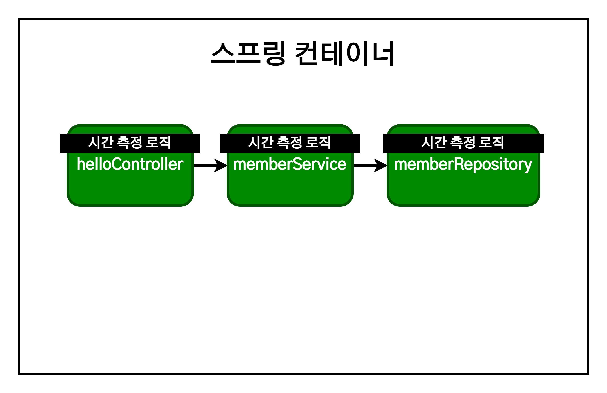
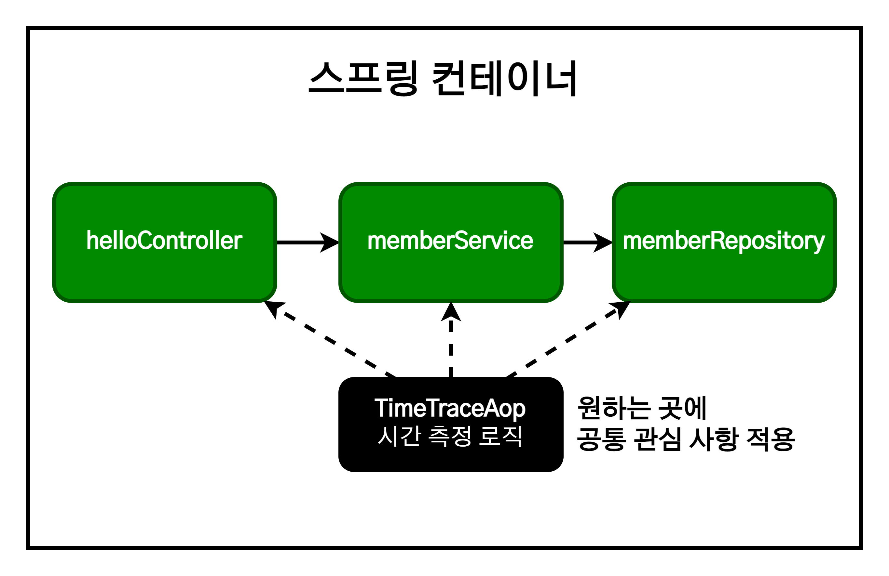
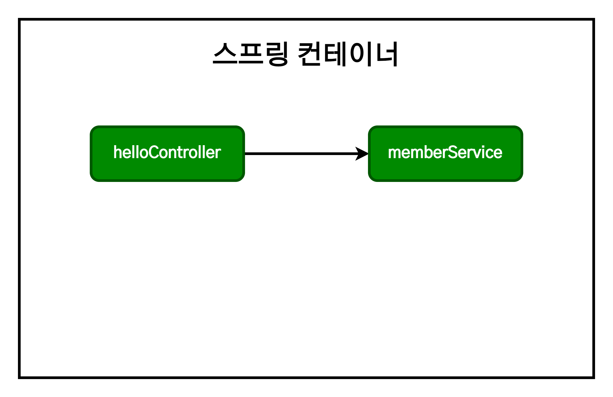
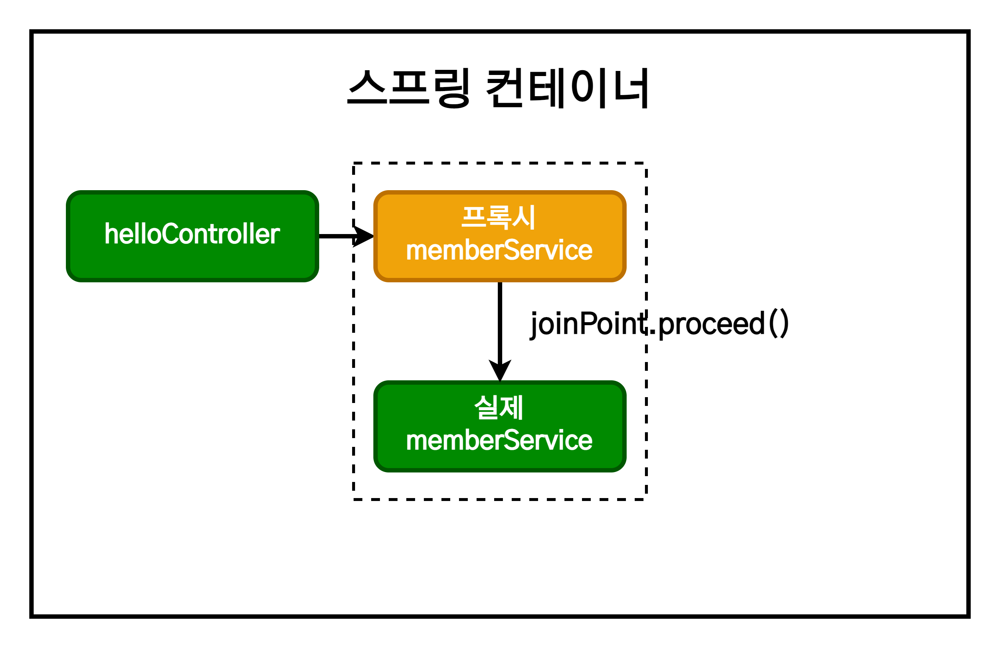
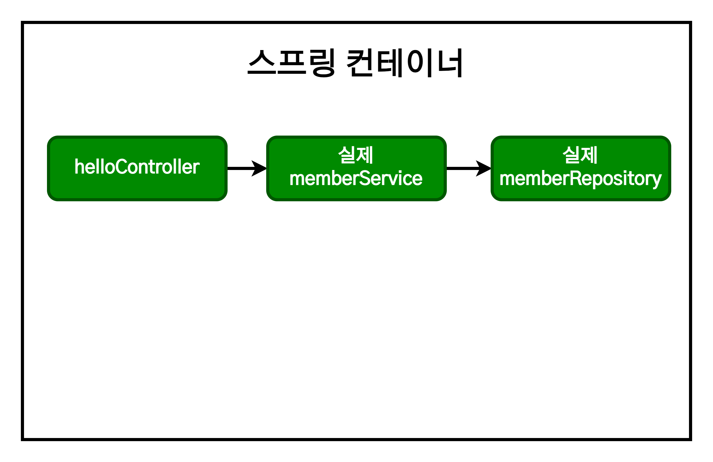
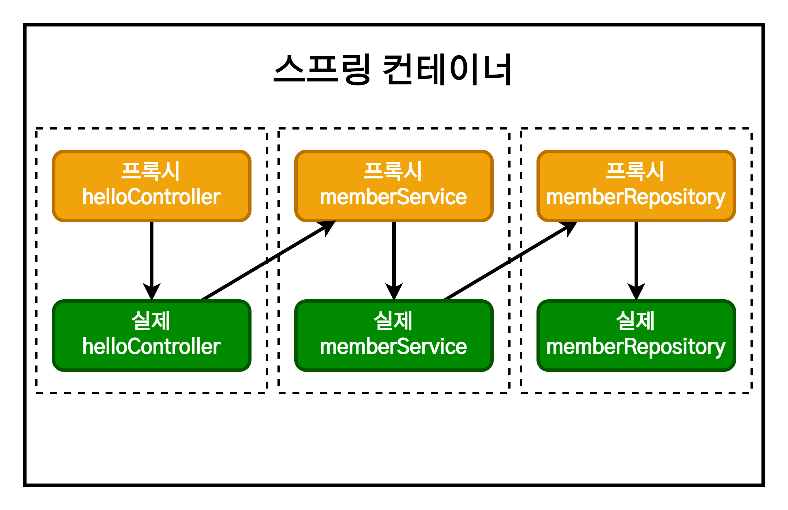

# 스프링 입문 - AOP

1. [AOP가 필요한 상황](#aop가-필요한-상황)
2. [AOP 적용](#aop-적용)
   1. [스프링의 AOP 동작 방식 설명](#스프링의-aop-동작-방식-설명)

## AOP가 필요한 상황

- 모든 메소드의 호출 시간을 측정하고 싶다면?
- 공통 관심 사항(cross-cutting concern) vs 핵심 관심 사항(core concern)
- 회원 가입 시간, 회원 조회 시간을 측정하고 싶다면?



MemberService 회원 조회 기능의 시간 측정을 추가해보면 다음과 같다.

```java
package hello.hellospring.service;

@Transactional
public class MemberService {
    private MemberRepository memberRipository;

    public MemberService(MemberRepository memberRipository) {
        this.memberRipository = memberRipository;
    }

    /**
     * 회원가입
    */
    public Long join(Member member) {
        long start = System.currentTimeMillis();

        try {
            validateDuplicateMember(member);  //중복 회원 검증
            memberRepository.save(member);

            return member.getId();
        } finally {
            long finish = System.currentTimeMillis();
            long timeMs = finish - start;
            System.out.println("join = " + timeMs + "ms");
        }
    }

    private void validateDuplicateMember(Member member) {
        memberRepository.findByName(member,getName())
            .ifPresent(m -> {
                throw new IllegalStateException("이미 존재하는 회원입니다.");
            });
    }

    /**
     * 전체 회원 조회
    */
    public List<Member> findMembers() {
        long start = System.currentTimeMillis();

        try {
            return memberRepository.findAll();
        } finally {
            long finish = System.currentTimeMillis();
            long timeMs = finish - start;
            System.out.println("findMembers = " + timeMs + "ms");
        }
    }
}
```

이 코드에는 여러 문제점들이 있다.

- 회원가입, 회원 조회에 시간을 측정하는 기능은 핵심 관심 사항이 아니다.
- 시간을 측정하는 로직은 공통 관심 사항이다.
- 시간을 측정하는 로직과 핵심 비즈니스의 로직이 섞여서 유지보수가 어렵다.
- 시간을 측정하는 로직을 별도의 공통 로직으로 만들기 매우 어렵다.
- 시간을 측정하는 로직을 변경할 때 모든 로직을 찾아가면서 변경해야 한다.

## AOP 적용

- AOP : Aspect Oriented Programming
- 공통 관심 사항(cross-cutting concern) vs 핵심 관심 사항(core concern) 분리



시간 측정 AOP를 등록해보면 다음과 같다.

```java
package hello.hellospring.aop;

import org.aspectj.lang.ProceedingJoinPoint;
import org.aspectj.lang.annotation.Around;
import org.aspectj.lang.annotation.Aspect;
import org.springframework.stereotype.Component;

@Component
@Aspect
public class TimeTraceAop {

    @Around("execution(* hello.hellospring..*(..))")
    public Object execute(ProceedingJoinPoint joinPoint) throws Throwable {
        long start = System.currentTimeMillis();

        System.out.println("START: " + joinPoint.toString());

        try {
            return joinPoint.proceed();
        } finally {
            long finish = System.currentTimeMillis();
            long timeMs = finish - start;

            System.out.println("END: " + joinPoint.toString() + " " + timeMs + "ms");
        }
    }
}
```

AOP가 작동하려면 스프링 컨테이너에 빈으로 등록되어야 한다. `@Component` 어노테이션으로 등록해도 되나, AOP 같은 경우는 SpringConfig에 직접 등록해서 사용하는 것이 좋다. 스프링 설정 파일에서 직접 등록하면 다음과 같다.

```java
public class SpringConfig {
    private final MemberRepository memberRepository;

    @Autowired
    public SpringConfig(MemberRepository memberRepository) {
      this.memberRepository = memberRepository;
    }

    @Bean
    public MemberService memberService() {
        return new MemberService(memberRepository);
    }

    @Bean
    public TimeTraceAop timeTraceAop() {
        return new TimeTraecAop();
    }
}
```

이제 이전에 겪던 문제점들이 해결됐다.

- 회원가입, 회원 조회 등 핵심 관심 사항과 시간을 측정하는 공통 관심 사항이 분리됐다.
- 시간을 측정하는 로직을 별도의 공통 로직으로 구현했다.
- 핵심 관심 사항을 깔끔하게 유지할 수 있다.
- 변경이 필요하다면 이 로직만 변경하면 된다.
- 원하는 적용 대상을 선택할 수 있다.

### 스프링의 AOP 동작 방식 설명

AOP 적용 전 의존관계는 다음과 같다.



AOP를 적용 후 의존관계는 다음과 같다.



AOP 적용 전 전체 그림은 다음과 같다.



AOP 적용 후 전체 그림은 다음과 같다.



- 실제 Proxy가 주입되는지 콘솔에 출력해서 확인하려면 다음과 같이 작성하면 된다.

```java
@Controller
public class MemberController {
    private MemberService memberService;

    @Autowired
    public MemberController(MemberService memberService) {
        this.memberService = memberService;
        System.out.println("memberService = " + memberService.getClass());
        // memberService = class hello.hellospring.service.MemberService$$EnhancerBySpringCGLIB$$de89008
    }
}
```
