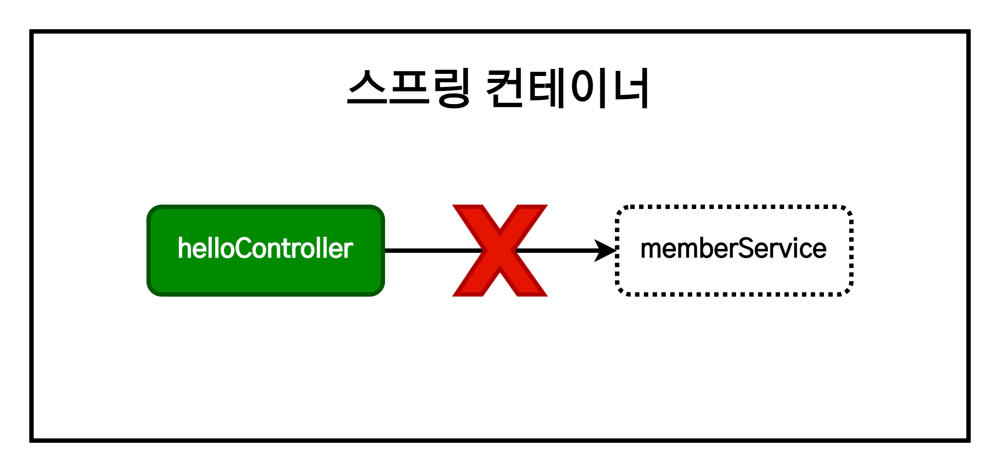
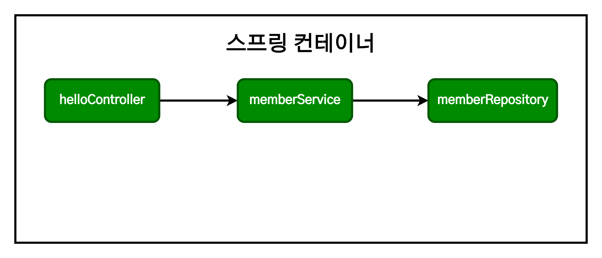

# 스프링 입문 - 스프링 빈과 의존관계

1. [스프링 빈을 등록하고, 의존관계 설정하기](#스프링-빈을-등록하고-의존관계-설정하기)
2. [스프링 빈을 등록하는 2가지 방법](#스프링-빈을-등록하는-2가지-방법)
   1. [컴포넌트 스캔과 자동 의존관계 설정](#컴포넌트-스캔과-자동-의존관계-설정)
   2. [자바 코드로 직접 스프링 빈 등록하기](#자바-코드로-직접-스프링-빈-등록하기)

## 스프링 빈을 등록하고, 의존관계 설정하기


스프링은 `@Controller` 어노테이션을 인식하고 서버 동작시 해당 컨트롤러 객체를 생성한 후 관리한다. 이를 '스프링 컨테이너에서 스프링 빈이 관리된다'고 표현한다.

회원 컨트롤러가 회원 서비스와 회원 리포지토리를 사용할 수 있도록 의존관계를 준비하자.

```java
//MemberController.java
@Controller
public class MemberController {
    private final MemberService memberService;

    @Autowired
    public MemberController(MemberService memberService) {
        this.memberService=memberService;
    }
}
```

- 불필요한 객체 생성을 방지하기 위해서 스프링은 `@Controller` 어노테이션이 작성된 `MemberController` 객체를 생성한 후, 스프링 컨테이너에 등록하여 처음 생성한 객체를 공용으로 사용하도록 한다.
- 생성자에 `@Autowired` 어노테이션이 있다면 스프링이 연관된 객체를 스프링 컨테이너에서 찾아서 넣어준다. 이렇게 **객체 의존 관계를 외부에서 넣어주는 것을 DI(Dependency Injection), 의존성 주입이라 한다.**
- 이전 테스트에서는 개발자가 직접 주입했고, 여기서는 `@Autowired`에 의해 스프링이 주입해준다.

그러나 이 상태로는 오류가 발생한다.

```
Consider defining a bean of type 'hello.hellospring.service.MemberService' in your configuration.
```

원인은 **`memberService`가 스프링 빈으로 등록되어 있지 않기 때문**이다.



> **참고**  
> `helloController`는 스프링이 제공하는 컨트롤러이기 때문에 스프링 빈이 자동 등록된다.  
> `@Controller` 어노테이션이 있다면 자동 등록된다.

스프링 빈으로 등록되지 않은 상태는 단순한 자바 코드일 뿐이다. 따라서 `@Service` 어노테이션을 사용하여 스프링 빈으로 등록해야 한다.

## 스프링 빈을 등록하는 2가지 방법

- 컴포넌트 스캔과 자동 의존관계 설정
- 자바 코드로 직접 스프링 빈 등록하기

### 컴포넌트 스캔과 자동 의존관계 설정

- `@Component` 어노테이션이 있으면 스프링 빈이 자동 등록된다.
- `@Cotroller` 컨트롤러가 스프링 빈으로 자동 등록된 이유도 컴포넌트 스캔 때문이다.

- `@Component`를 포함하는 다음 어노테이션도 스프링 빈으로 자동 등록된다.
  - `@Controller`
  - `@Service`
  - `@Repository`

```java
//MemberService.java
@Service
public class MemberService {
    private final MemberRepository memberRepository;

    @Autowired
    public MemberService(MemberRepository memberRepository) {
        this.memberRepository=memberRepository;
    }
...
```

- `@Service` 어노테이션이 `MemberService`를 스프링 빈으로 등록한다.
- 생성자를 호출할 때, `@Autowired` 어노테이션을 통해 스프링 컨테이너에 이미 존재하는 `memberRepository`를 주입한다. 여기서는 구현체인 `MemoryMemberRepository`가 `MemberService`에 주입된다.

> **참고**  
> 생성자에 `@Autowired`를 사용하면 객체 생성 시점에 스프링 컨테이너에서 해당 스프링 빈을 찾아서 주입한다. 생성자가 1개만 있으면 `@Autowired`는 생략할 수 있다.

```java
//MemoryMemberRepository.java
@Repository
public class MemoryMemberRepository implements MemberRepository {}
```

- `@Repository` 어노테이션이 `MemoryMemberRepository`를 스프링 빈으로 등록한다.

위 과정을 모두 마치면 다음과 같은 상태가 된다.



- `memberService`와 `memberRepository`가 스프링 컨테이너에 스프링 빈으로 등록되었다.

Controller를 통해 외부 요청을 받고, Service에서 비즈니스 로직을 처리하고, Repository를 이용해서 데이터를 저장하는 것이 정형화된 패턴이다.

> **참고**  
> 스프링은 스프링 컨테이너에 스프링 빈을 등록할 때, 기본으로 싱글톤으로 등록한다.(단일 객체만 생성 후 공유하는 방식) 따라서 같은 스프링 빈이면 모두 같은 인스턴스다. 설정으로 싱글톤을 사용하지 않도록 할 수 있지만, 특별한 경우를 제외하면 대부분 싱글톤을 사용한다.

### 자바 코드로 직접 스프링 빈 등록하기

기존의 `@Service`, `@Repository`, `@Autowired` 어노테이션을 제거하고 스프링 빈을 등록해본다.

```java
package hello.hellospring;

import hello.hellospring.repository.MemberRepository;
import hello.hellospring.repository.MemoryMemberRepository;
import hello.hellospring.service.MemberService;
import org.springframework.context.annotation.Bean;
import org.springframework.context.annotation.Configuration;

@Configuration
public class SpringConfig {

    @Bean
    public MemberService memberService(){
        return new MemberService(memberRepository());
    }

    @Bean
    public MemberRepository memberRepository(){
        return new MemoryMemberRepository();
    }
}
```

- 스프링 서버가 동작할 때, `@Configuration`를 읽고 `@Bean` 어노테이션이 등록된 객체를 생성 후 스프링 빈으로 등록한다.

> **참고**
>
> - XML로 설정하는 방식도 있으나 최근에는 잘 사용되지 않는다.
> - DI에는 필드 주입, setter 주입, 생성자 주입의 3가지 방법이 있다. 의존관계가 실행중에 동적으로 변하는 경우는 거의 없으므로 **생성자 주입을 권장**한다.
> - 실무에서는 주로 **정형화된 컨트롤러, 서비스, 리포지토리 같은 코드는 컴포넌트 스캔을 사용**한다. 그리고 **정형화되지 않거나, 상황에 따라 구현 클래스를 변경해야 하면 설정을 통해 스프링 빈으로 등록**한다.

> **주의**  
> `@Autowired`를 통한 DI는 `helloController`, `memberService` 등과 같이 **스프링이 관리하는 객체에서만 동작한다. 스프링 빈으로 등록하지 않고 내가 직접 생성한 객체에서는 동작하지 않는다.**
