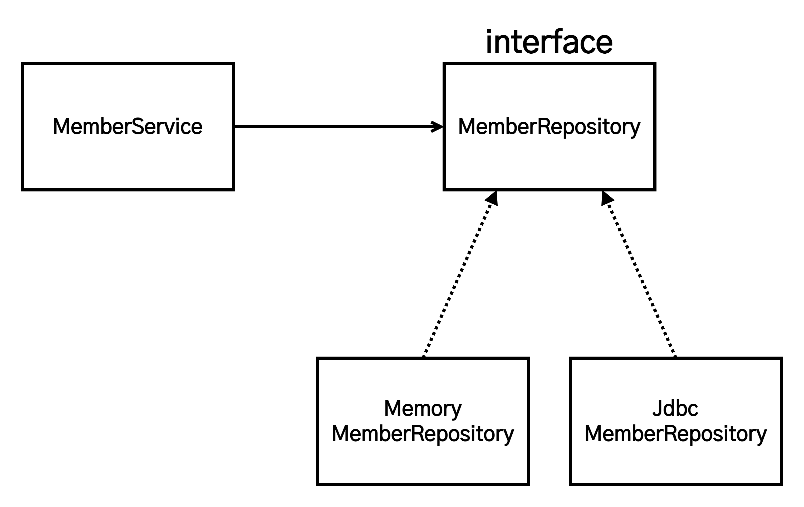
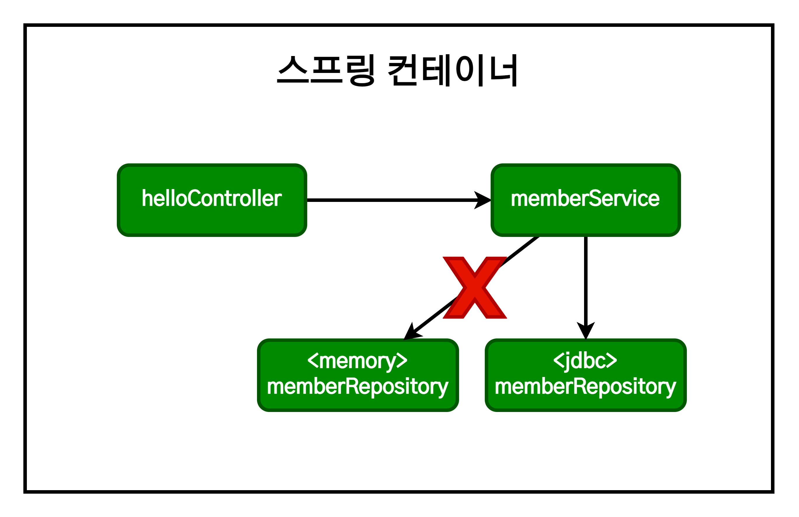
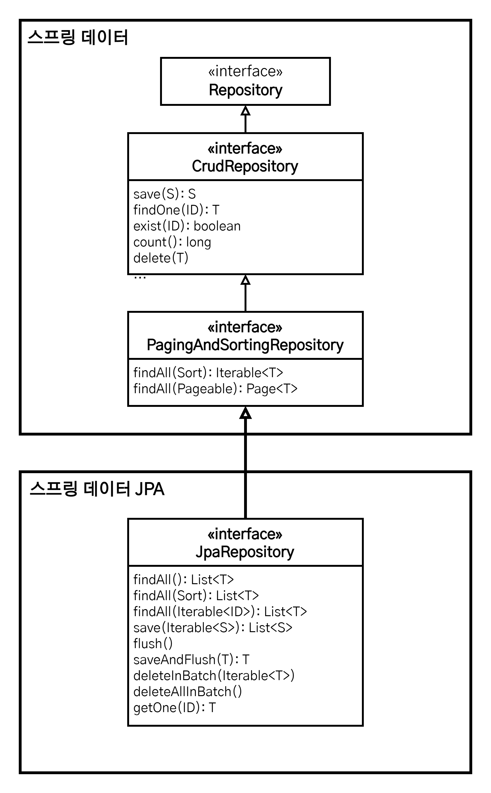

# 스프링 입문 - 스프링 DB 접근 기술

1. [H2 데이터베이스 설치](#h2-데이터베이스-설치)
   1. [테이블 생성하기](#테이블-생성하기)
2. [순수 JDBC](#순수-jdbc)
   1. [환경 설정](#환경-설정)
   2. [Jdbc 리포지토리 구현](#jdbc-리포지토리-구현)
3. [스프링 통합 테스트](#스프링-통합-테스트)
4. [스프링 JdbcTemplate](#스프링-jdbctemplate)
5. [JPA](#jpa)
6. [스프링 데이터 JPA](#스프링-데이터-jpa)

## H2 데이터베이스 설치

H2 데이터베이스는 개발이나 테스트 용도로 가볍고 편리하게 사용할 수 있는 DB로, 웹 화면을 제공한다. [공식 사이트](https://www.h2database.com)의 All Platforms를 기준으로 진행.

- H2 데이터베이스 버전은 스프링 부트의 버전에 맞춘다. [아카이브 다운로드](https://www.h2database.com/html/download-archive.html)
- 권한 주기(리눅스) : `chmod 755 h2.sh`
- 실행 : `./h2.sh`, `.\h2\bin\h2.bat`(윈도우)
- 데이터베이스 파일 생성 방법
  - `jdbc:h2:~/test` (최초 한번)
  - `~/test.mv.db`, `C:\Users\사용자명\test.mv.db`(윈도우) 파일 생성 확인
  - 이후부터는 `jdbc:h2:tcp://localhost/~/test` 이렇게 접속
    - 파일에 직접 접근하지 않고 소켓을 통해 접근 -> 여러 장소에서 접근 가능.

### 테이블 생성하기

테이블 관리를 위해 프로젝트 루트에 `sql/ddl.sql` 파일을 생성 후 관리한다.

```sql
drop table if exists member CASCADE;
create table member
(
    id bigint generated by default as identity,
    name varchar(255),
    primary key (id)
);
```

H2 데이터베이스에 접근해서 `member` 테이블을 생성한다.

## 순수 JDBC

### 환경 설정

`build.gradle` 파일에 jdbc, h2 데이터베이스 관련 라이브러리를 추가한다.

```
implementation 'org.springframework.boot:spring-boot-starter-jdbc'
runtimeOnly 'com.h2database:h2'
```

`resources/application.properties`에 스프링 부트 데이터베이스 연결 설정(접속 정보)을 추가한다.

```
spring.datasource.url=jdbc:h2:tcp://localhost/~/test
spring.datasource.driver-class-name=org.h2.Driver
```

### Jdbc 리포지토리 구현

> **주의!**  
> 이렇게 직접 JDBC API로 코딩하는 것은 15년 전 이야기이다. 따라서 고대 개발자들이 이렇게 고생했다는 것만 인식하고, 참고 수준으로만 활용하되 실제로 사용하는 것은 지양하도록 한다.

<details>
<summary><strong>[Jdbc 회원 리포지토리 코드 보기/숨기기]</strong></summary>
<div markdown="1">

```java
//Jdbc 회원 리포지토리
package hello.hellospring.repository

import hello.hellospring.domain.Member;
import org.springframework.jdbc.datasource.DataSourceUtils;

import javax.sql.DataSource;
import java.sql.*;
import java.util.ArrayList;
import java.util.List;
import java.util.Optional;

public class JdbcMemberRepository implements MemberRepository {

    private final DataSource = dataSource;

    @Autowired
    public JdbcMemberRepository(DataSource dataSource) {
        this.dataSource = dataSource;
    }

    @Override
    public Member save(Member member) {
        String sql = "insert into member(name) values(?)";

        Connection conn = null;
        PreparedStatement pstmt = null;
        ResultSet rs = null;

        try {
            conn = getConnection();
            pstmt = conn.prepareStatement(sql, Statement.RETURN_GENERATED_KEYS);

            pstmt.setString(1, member.getName());

            pstmt.excuteUpdate();
            rs = pstmt.getGeneratedKeys();

            if(rs.next()) {
                member.setId(rs.getLong(1));
            } else {
                throw new SQLException("id 조회 실패");
            }

            return member;
        } catch(Exception e) {
            throw new IllegalStateException(e);
        } finally {
            close(conn, pstmt, rs);
        }
    }

    @Override
    public Optional<Member> findById(Long id) {
        String sql = "select * from member where id = ?";

        Connection conn = null;
        PreparedStatement pstmt = null;
        ResultSet rs = null;

        try {
            conn = getConnection();
            pstmt = conn.prepareStatement(sql);
            pstmt.setLong(1, id);

            pstmt.excuteUpdate();

            if(rs.next()) {
                Member member = new Member();
                member.setId(rs.getLong("id"));
                memer.setName(rs.getString("name"));

                return Optional.of(member);
            } else {
                return Optional.empty();
            }
        } catch(Exception e) {
            throw new IllegalStateException(e);
        } finally {
            close(conn, pstmt, rs);
        }
    }

    @Override
    public List<Member> findAll() {
        String sql = "select * from member";

        Connection conn = null;
        PreparedStatement pstmt = null;
        ResultSet rs = null;

        try {
            conn = getConnection();
            pstmt = conn.prepareStatement(sql);

            pstmt.excuteUpdate();

            List<Member> members = new ArrayList<>();

            while(rs.next()) {
                Member member = new Member();
                member.setId(rs.getLong("id"));
                memer.setName(rs.getString("name"));
                members.add(member);
            }

            return members;
        } catch(Exception e) {
            throw new IllegalStateException(e);
        } finally {
            close(conn, pstmt, rs);
        }
    }

    @Override
    public Optional<Member> findByName(String name) {
        String sql = "select * from member where name = ?";

        Connection conn = null;
        PreparedStatement pstmt = null;
        ResultSet rs = null;

        try {
            conn = dataSource.getConnection();
            pstmt = conn.prepareStatement(sql);
            pstmt.setString(1, name);

            pstmt.excuteUpdate();

            if(rs.next()) {
                Member member = new Member();
                member.setId(rs.getLong("id"));
                memer.setName(rs.getString("name"));

                return Optional.of(member);
            } else {
                return Optional.empty();
            }
        } catch(Exception e) {
            throw new IllegalStateException(e);
        } finally {
            close(conn, pstmt, rs);
        }
    }

    private Connection getConnection() {
        return DataSourceUtils.getConnection(dataSource);
    }

    private void close(Connection conn, PreparedStatement pstmt, ResultSet rs) {
        try {
            if(rs != null) {
                rs.close();
            }
        } catch(SQLException e) {
            e.printStackTrace();
        }

        try {
            if(pstmt != null) {
                pstmt.close();
            }
        } catch(SQLException e) {
            e.printStackTrace();
        }

        try {
            if(conn != null) {
                close(conn);
            }
        } catch(SQLException e) {
            e.printStackTrace();
        }
    }

    private void close(Connection conn) throw SQLException {
        DataSourceUtils.releaseConnection(conn, dataSource);
    }
}
```

</details>

구현한 클래스를 스프링 설정에서 적용하려면 구현체 클래스를 교체하면 된다.

```java
// SpringConfig.java
@Configuration
public class SpringConfig {

    private DataSource dataSource;

    @Autowired
    public SpringConfig(DataSource dataSource) {
        this.dataSource = dataSource;
    }

    @Bean
    public MemberService memberService() {
        return new MemberService(memberRepository());
    }

    @Bean
    public MemberRepository memberRepository() {
        // return new MemoryMemberRepository();
        return new JdbcMemberRepository(dataSource);
    }
}
```

`DataSource`는 데이터베이스 커넥션을 획득할 때 사용하는 객체다. 스프링 부트는 데이터베이스 커넥션 정보를 바탕으로 `DataSource`를 생성하고 스프링 빈으로 만들어둔다. 그래서 DI를 받을 수 있다.

구현 클래스를 도식으로 살펴보면 다음과 같다.



스프링 컨테이너에서 바뀐 설정을 살펴보면 다음과 같다.



- 개방-폐쇄 원칙(OCP, Open-Close Principle)
  - 확장에는 열려있고, 수정, 변경에는 닫혀있다.
- 스프링의 DI(Dependencies Injection)을 사용하면, **기존 코드를 전혀 손대지 않고, 설정만으로 구현 클래스를 변경**할 수 있다.
- 데이터를 DB에 저장하므로 스프링 서버를 재실행해도 데이터가 안전하게 저장된다.

## 스프링 통합 테스트

스프링 컨테이너와 DB까지 연결한 통합 테스트를 진행한다.

```java
package hello.hellospring.service;

import ...

@SpringBootTest //스프링 테스트를 진행할 시 사용
@Transactional  //테스트 실행시 트랜잭션을 먼저 수행하고 DB에 쿼리를 넣은 후, Commit 하지 않고 Rollack 시킴.
class MemberServiceIntegrationTest {

    @Autowired MemberService memberService;
    @Autowired MemberRepository memberRepository;

    @Test
    void 회원가입() throws Exception {
        //given
        Member member = new Member();
        member.setName("spring");

        //when
        Long saveId = memberService.join(member);

        //then
        Member findMember = memberService.findOne(saveId).get();
        assertThat(member.getName()).isEqualTo(findMember.getName());
    }

    @Test
    void 중복_회원_예외() throws Exception {
        //given
        Member member1 = new Member();
        member1.setName("spring");

        Member member2 = new Member();
        member2.setName("spring");

        //when
        memberService.join(member1);
        IllegalStateException e = assertThrows(IllegalStateException.class, () -> memberService.join(member2)); //예외가 발생해야 한다.

        assertThat(e.getMessage()).isEqualTo("이미 존재하는 회원입니다.");
    }
}
```

- `@SpringBootTest` : 스프링 컨테이너와 테스트를 함께 실행한다.
- `@Transactional` : 테스트 케이스에 이 어노테이션이 있으면, 테스트 시작 전에 트랜젝션을 시작하고, 테스트 완료 후에 항상 롤백한다. 이렇게 하면 DB에 데이터가 남지 않으므로 다음 테스트에 영향을 주지 않는다.

- 단위 테스트 : 순수한 자바 코드로 최소한의 단위로 진행하는 테스트.
- 통합 테스트 : 스프링 컨테이너, DB와 연동한 테스트.
- 단위 테스트가 더 좋은 테스트일 확률이 높다. 단일 기능의 오류를 점검하기 가장 좋기 떄문, 통합 테스트에서 문제가 발생시 문제 원인 파악에 시간이 오래 걸린다.

테스트 코드를 잘 짜는 것이 매우 중요하다. 개발자의 실력의 척도라고 봐도 무방하다.

## 스프링 JdbcTemplate

- 순수 Jdbc와 동일한 환경설정을 하면 된다.
- 스프링 JdbcTemplate과 MyBatis 같은 라이브러리는 JDBC API에서 본 반복 코드를 대부분 제거해준다. 하지만 SQL은 직접 작성해야 한다.

<details>
<summary><strong>[스프링 JdbcTemplate 회원 리포지토리 코드 보기/숨기기]</strong></summary>
<div markdown="1">

```java
//JdbcTemplate 회원 리포지토리
package hello.hellospring.repository

import ...

public class JdbcTemplateMemberRepository implements MemberRepository {

    private final JdbcTemplate;

    //@Autowired
    //생성자가 오직 하나일 경우 @Autowired 어노테이션 생략 가능
    public JdbcTemplateMemberRepository(DataSource dataSource) {
        jdbcTemplate = new JdbcTemplate(dataSource);
    }

    @Override
    public Member save(Member member) {
        SimpleJdbcInsert jdbcInsert = new SimpleJdbcInsert(jdbcTemplate);
        jdbcInsert.withTableName("member").usingGeneratedKeyColumns("id");

        Map<String, Object> parameters = new HashMap<>();
        parameters.put("name", member.getName());

        Number key = jdbcInsert.excuteAndReturnKey(new MapSqlParameterSource(parameters));
        member.setId(key.longValue());

        return member;
    }

    @Override
    public Optional<Member> findById(Long id) {
        List<Member> result = jdbcTemplate.query("select * from member where id = ?", memberRowMapper, id);

        return result.stream().findAny();
    }

    @Override
    public Optional<Member> findByName(String name) {
        List<Member> result = jdbcTemplate.query("select * from member where name = ?", memberRowMapper, name);

        return result.stream().findAny();
    }

    @Override
    public List<Member> findAll() {
        return jdbcTemplate.query("select * from member", memberRowMapper());
    }

    private RowMapper<Member> memberRowMapper() {
        //return new RowMapper<Member>() {
        return (rs, rowNum) -> { //람다식으로 축약 가능
            @Override
            public Member mapRow(ResultSet rs, int rowNum) throws SQLException {
                Member member = new Member();
                member.setID(rs.getLong("id"));
                member.setName(rs.getString("name"));

                return member;
            }
        }
    }
}
```

```java
// SpringConfig.java
@Configuration
public class SpringConfig {

    private DataSource dataSource;

    @Autowired
    public SpringConfig(DataSource dataSource) {
        this.dataSource = dataSource;
    }

    @Bean
    public MemberService memberService() {
        return new MemberService(memberRepository());
    }

    @Bean
    public MemberRepository memberRepository() {
        // return new MemoryMemberRepository();
        // return new JdbcMemberRepository(dataSource);
        return new JdbcTemplateMemberRepository(dataSource);
    }
}
```

</details>

## JPA

- JPA는 기존의 반복 코드는 물론이고, 기본적인 SQL도 JPA가 직접 만들어서 실행해준다.
- JPA를 사용하면, SQL과 데이터 중심의 설계에서 객체 중심의 설계로 패러다임을 전활할 수 있다.
- JPA를 사용하면 개발 생산성을 크게 높일 수 있다.

`build.gradle` 파일에 JPA, h2 데이터베이스 관련 라이브러리를 추가한다.

```
dependencies {
	implementation 'org.springframework.boot:spring-boot-starter-thymeleaf'
	implementation 'org.springframework.boot:spring-boot-starter-web'
	// implementation 'org.springframework.boot:spring-boot-starter-jdbc'
  implementation 'org.springframework.boot:spring-boot-starter-data-jpa'
	runtimeOnly 'com.h2database:h2'
	testImplementation 'org.springframework.boot:spring-boot-starter-test'
}
```

`spring-boot-starter-data-jpa`는 내부에 jdbc 관련 라이브러리를 포함한다. 따라서 jdbc는 제거해도 된다.

`resources/application.properties`에 JAP 설정을 추가한다.

```
spring.datasource.url=jdbc:h2:tcp://localhost/~/test
spring.datasource.driver-class-name=org.h2.Driver
spring.jpa.show-sql=true
spring.jpa.hibernate.ddl-auto=none
```

- `show-sql` : JPA가 생성하는 SQL을 출력한다.
- `ddl-auto` : JPA는 테이블을 자동으로 생성하는 기능을 제공하는데 `none`을 사용하면 해당 해당 기능이 비활성화된다.
  - `create`를 사용하면 엔티티 정보를 바탕으로 테이블도 직접 생성해준다.

<details>
<summary><strong>[스프링 Jpa 회원 리포지토리 코드 보기/숨기기]</strong></summary>
<div markdown="1">

JPA 엔티티 매핑은 다음과 같이 진행한다.

```java
package hello.hellospring.domain

import ...

@Entity
public class Member {
    @Id @GeneratedValue(strategy = GenerationType.IDENTITY)
    private Long id;

    @Column(name = "name") //객체의 변수명과 테이블의 컬럼명이 다른 경우 매핑하기 위해 사용.
    private String name;

    public Long getId() {
        return id;
    }

    public void setId(Long id) {
        this.id = id;
    }

    public String getName() {
        return name;
    }

    public void setName(String name) {
        this.name = name;
    }
}
```

```java
//Jpa 회원 리포지토리
package hello.hellospring.repository

import ...

@Transactional //JPA는 트랜젝션이 필요하므로, @Transactional 어노테이션이 필요하다.
public class JpaMemberRepository implements MemberRepository {

    private final EntityManager em;

    @Autowired
    public JpaeMemberRepository(EntityManager em) {
        this.em = em;
    }

    @Override
    public Member save(Member member) {
        em.persist(member);

        return member;
    }

    @Override
    public Optional<Member> findById(Long id) {
        Member member = em.find(Member.class, id);

        return Optional.ofNummalbe(member);
    }

    @Override
    public Optional<Member> findByName(String name) {
        List<Member> result = em.createQuery("select m from Memer as m where m.name = :name", Member.class)
        .setParameter("name", name)
        .getResultList();

        return result.stream().findAny();
    }

    @Override
    public List<Member> findAll() {
        List<Member> result = em.createQuery("select m from Memer as m", Member.class).getResultList();  //JPQL, PK(기본키) 기반이 아닌 경우 쿼리를 직접 작성

        return result;
    }

    private RowMapper<Member> memberRowMapper() {
        //return new RowMapper<Member>() {
        return (rs, rowNum) -> { //람다식으로 축약 가능
            @Override
            public Member mapRow(ResultSet rs, int rowNum) throws SQLException {
                Member member = new Member();
                member.setID(rs.getLong("id"));
                member.setName(rs.getString("name"));

                return member;
            }
        }
    }
}
```

서비스 계층에 트랜잭션을 추가한다.

```java
import org.springframework.trasaction.annotaion.Transactional;

@Transactional
public class MemberService {}
```

- `org.springframework.trasaction.annotaion.Transactional`을 사용한다.
- 스프링은 해당 클래스의 메서드를 실행할 때 트랜젝션을 시작하고, 메서드가 정상 종료되면 트랜젝션을 커밋한다. 만약 런타임 예외가 발생하면 롤백한다.
- **JPA를 통한 모든 데이터 변경은 트랜잭션 안에서 실행해야 한다.**

JPA를 사용하도록 스프링 설정을 변경한다.

```java
// SpringConfig.java
@Configuration
public class SpringConfig {

    @PersistenceContext //스프링이 DI를 수행해주므로, 없어도 무방함. 원래는 작성해야 한다.
    EntityManager em;

    @Autowired
    public SpringConfig(EntityManager em) {
        this.em = em;
    }

    @Bean
    public MemberService memberService() {
        return new MemberService(memberRepository());
    }

    @Bean
    public MemberRepository memberRepository() {
        // return new MemoryMemberRepository();
        // return new JdbcMemberRepository(dataSource);
        // return new JdbcTemplateMemberRepository(dataSource);
        return new JpaMemberRepository(em);
    }
}
```

> **참고**  
> JPA도 스프링만큼 성숙한 기술이고, 학습해야 할 분량도 방대하다. 여러 강의와 책을 참고하여 공부해야 한다.

</details>

## 스프링 데이터 JPA

스프링 부트와 JPA만 사용해도 개발 생산성이 정말 많이 증가하고, 개발해야할 코드도 확연히 줄어든다. 여기에 스프링 데이터 JPA를 사용하면, 기존의 한계를 넘어 마치 마법처럼, **리포지토리에 구현 클래스 없이 인터페이스만으로 개발을 완료할 수 있다.** 그리고 **반복 개발해온 기본 CRUD 기능도 스프링 데이터 JPA가 모두 제공**한다.

스프링 부트와 JPA라는 기반 위에, 스프링 JPA라는 환성적인 프레임워크를 더하면 개발 코드들이 확연하게 줄어든다. 따라서 개발자는 핵심 비즈니스 로직을 개발하는데 집중할 수 있다.

실무에서 관계형 데이터베이스를 사용한다면 스프링 데이터 JPA는 이제 선택이 아니라 필수이다.

> **주의**  
> **스프링 데이터 JPA는 JPA를 편리하게 사용하도록 도와주는 기술이다. 따라서 JPA를 먼저 학습한 후에 스프링 데이터 JPA를 학습해야 한다.**

기존 JPA 설정을 그대로 사용한다.

스프링 데이터 JPA 회원 리포지토리는 다음과 같이 작성한다.

```java
package hello.hellospring.repository

import ...

public interface SpringDataJpaMemberRepository extends JpaRepository<Memer/*key*/, Long/*id, 식별자(pk)*/>, MemberReporitory {
    //JPQL => select m from Member m where m.name = ?
    //아래의 메서드처럼 작성하면 자동으로 위의 쿼리가 작성된다. 일종의 이름규칙.
    @Override
    Optional<Member> findByName(String name);

    //JPQL => select m from Member m where m.id = ? and m.name = ?
    @Override
    Optional<Member> findByIdAndName(Long id, String name);
}
```

스프링 데이터 JPA 회원 리포지토리를 사용하도록 스프링 설정을 변경한다.

```java
public class SpringConfig {

    private final MemberRepository memberRepository;

    @Autowired
    public SpringConfig(MemberRepository memberRepository) {
      this.memberRepository = memberRepository;
    }

    @Bean
    public MemberService memberService() {
        return new MemberService(memberRepository);
    }
}
```

- 스프링 데이터 JPA가 `SpringDataJpaMemberRepository`를 스프링 빈으로 자동 등록해준다.

스프링 데이터 JPA 제공 클래스를 살펴보면 다음 그림과 같다.



> **스프링 데이터 JPA 제공 기능**
>
> - 인터페이스를 통한 기본적인 CRUD
> - `findByName()`, `findByEmail()` 등 메서드 이름만으로 조회 기능 제공
> - 페이징 기능 자동 제공

> **참고**  
> 실무에서는 JPA와 스프링 데이터 JPA를 기본으로 사용하고, 복잡한 동적 쿼리는 Querydsl이라는 라이브러리를 사용하면 된다. Querysql을 사용하면 쿼리도 자바 코드로 안전하게 작성할 수 있고, 동적 쿼리도 편리하게 작성할 수 있다.  
> 이 조합으로 해결하기 어려운 쿼리는 JPA가 제공하는 네이티브 쿼리를 사용하거나, 앞서 사용한 스프링 JdbcTemplate를 사용하면 된다.
