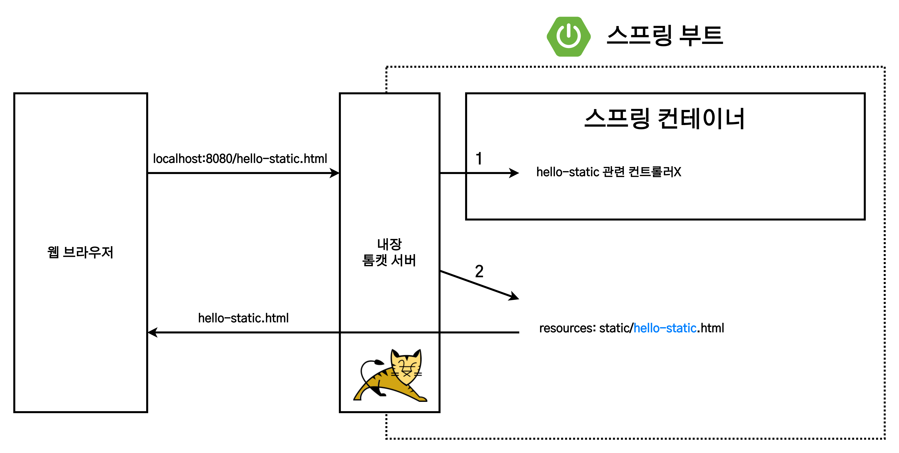
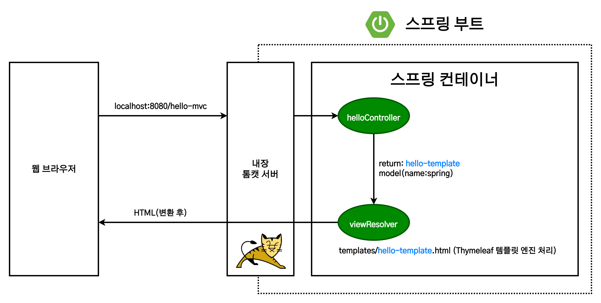
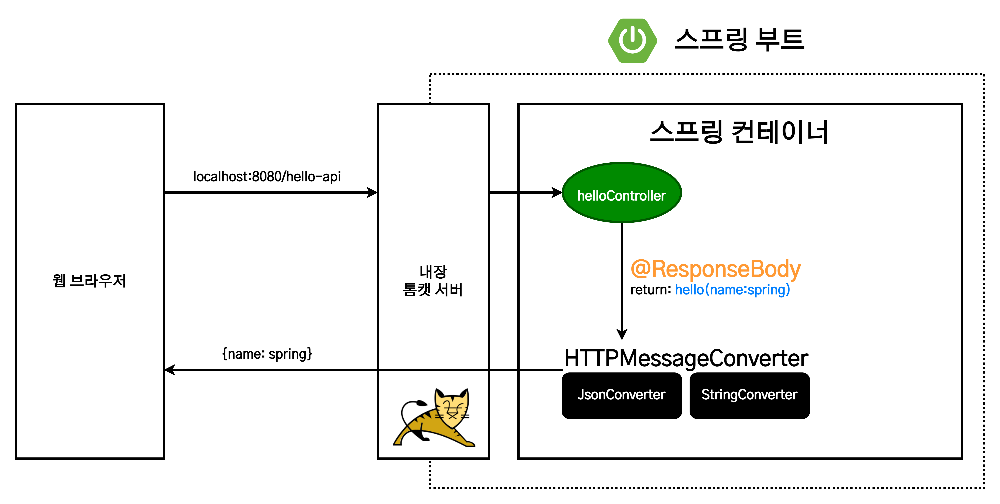

# 스프링 입문 : 스프링 웹 개발 기초

1. [정적 컨텐츠](#정적-컨텐츠)
2. [MVC와 템플릿 엔진](#mvc와-템플릿-엔진)
3. [API](#api)

웹 개발의 형식은 크게 정적 컨텐츠, MVC와 템플릿 엔진, API의 세가지 방법으로 구분할 수 있다.

## 정적 컨텐츠

- 서버에서 파일을 별다른 처리 없이 그대로 웹 브라우저에 반환하는 것을 의미한다. [스프링 부트 정적 컨텐츠 기능 메뉴얼](https://docs.spring.io/spring-boot/docs/2.3.1.RELEASE/reference/html/spring-boot-features.html#boot-features-spring-mvc-static-content)
- 스프링 부트는 기본값으로 `/static`(또는 `/public`, `/resources`, `/META-INF/resources`)에서 찾아서 제공한다.

```html
<!--resources/static/hello-static.html-->
<!DOCTYPE html>
<html lang="ko">
  <head>
    <title>static content</title>
    <meta http-equiv="Content-Type" content="text/html; charset=UTF-8" />
  </head>
  <body>
    정적 컨텐츠입니다.
  </body>
</html>
```

정적 컨텐츠의 동작 원리는 다음과 같다.



1. 웹브라우저의 `localhost:8080/hello-static.html` URL 요청을 톰캣 서버에서 받는다.
2. 톰캣 서버는 `hello-static.html` 파일에 대한 요청을 스프링에게 넘긴다.
3. 스프링은 컨트롤러에서 `hello-static`이 존재하는지 확인한다.(컨트롤러가 더 높은 우선순위를 가진다.)
4. 매핑된 컨트롤러를 찾지 못했다면, `resources/static` 디렉터리에서 `hello-static.html` 파일을 찾는다.
5. 파일이 서버 내에 존재한다면 반환한다.

## MVC와 템플릿 엔진

- 최근 자주 사용되는 방식으로, HTML을 서버 내 프로그래밍을 통해 동적으로 바꾸어 전달하는 것을 의미한다.
- MVC

  - 모델(Model) : 화면에 표시할 데이터를 화면에 전달.
  - 뷰(View) : 화면 작업을 처리.
  - 컨트롤러(Controller) : 비즈니스 로직과 서버 내 작업을 처리.

```java
//java/hello/hellospring/controller/HelloController.java
@Controller
public class HelloController {

  @GetMapping("hello-mvc")
  public String helloMvc(@RequestParam("name") String name, Model model) {
    model.addAttribute("name", name);
    return "hello-template";
  }
}
```

- `@RequestParam` : 외부에서 파라미터를 받을 때 사용한다. 기본값으로 `required = true` 옵션을 가지고 있기에 파라미터를 받지 못하면 오류가 발생한다.

```html
<!--resources/tmplate/hello-template.html-->
<html xmlns:th="http://www.thymeleaf.org">
  <body>
    <p th:text="'hello ' + ${name}">hello! empty</p>
  </body>
</html>
```

- 서버를 동작하지 않고 파일을 열면 hello! empty가 출력된다.
- 템플릿 엔진이 작동하면 `'hello ' + ${name}`의 결과물이 기존 내용과 치환되어 출력된다.

MVC, 템플릿 엔진의 동작 원리는 다음과 같다.



1. 웹브라우저의 `localhost:8080/hello-mvc?name=spring` URL 요청을 톰캣 서버에서 받는다.
2. 톰캣 서버는 `/hello-mvc?name=spring` URL에 대한 요청을 스프링에게 넘긴다.
3. 스프링은 전달된 URL와 매칭되는 컨트롤러 메소드를 실행한다.
4. 스프링은 `Model`에 `name: "spring"` 의 키:값 쌍을 가지는 데이터를 담는다.
5. 스프링은 렌더링 할 파일명을 리턴한다. (`resources/template/hello-template.html`으로 이동해서 렌더링)  
   viewResolver는 표시할 뷰를 찾은 후 템플릿 엔진에게 전달한다.
6. 템플릿 엔진은 렌더링 후 **변환을 마친** HTML을 웹 브라우저에 반환한다.

## API

- JSON, XML 등의 데이터 구조 포맷으로 클라이언트에게 데이터만 전달하는 것을 의미한다.
- API가 데이터만 전달하면 화면은 클라이언트가 담당해서 표시하는 방식으로 활용한다.
- 서버간의 통신에서는 화면 구현이 필요하지 않아서 주로 사용한다.
- `@ResponseBody` : HTTP의 응답 Body 영역에 리턴하는 데이터를 직접 넣을 경우 사용한다. 뷰 없이 요청한 데이터 자체만 전달된다.

### `@ResponseBody` 문자열 반환

```java
@Controller
public class HelloController {

  @GetMapping("hello-string")
  @ResponseBody
  public String helloString(@RequestParam("name") String name) {
      return "hello " + name;
  }
}
```

이 경우 함께 넘기는 파라미터를 포함하여 "hello spring!"과 같은 문자열이 그대로 출력된다.

### `@ResponseBody` 객체 반환

```java
@Controller
public class HelloController {

  @GetMapping("hello-api")
  @ResponseBody
  public Hello helloApi(@RequestParam("name") String name) {
      Hello hello = new Hello();
      hello.setName(name);
      return hello;
  }

  static class Hello {
    private String name;

    public String getName() {
        return name;
    }

    public void setName(String name) {
        this.name = name;
    }
  }
}
```

`@ResponseBody`를 사용하고, 객체를 반환하면 객체가 `key:value` 형식의 데이터인 JSON으로 변환된다.

API의 동작 원리는 다음과 같다.



1. 웹브라우저의 `localhost:8080/hello-api?name=spring` URL 요청을 톰캣 서버에서 받는다.
2. 톰캣 서버는 `/hello-api?name=spring` URL에 대한 요청을 스프링에게 넘긴다.
3. 스프링은 전달된 URL와 매칭되는 컨트롤러 메소드를 실행한다.
4. 스프링은 메소드가 `@ResponseBody` 어노테이션이 적용된 것을 확인한다.
5. 스프링은 데이터를 HTTP의 Body 영역에 담아 직접 반환한다.
   - `viewResolver` 대신 `HttpMessageConverter`가 동작한다.
   - 기본 문자처리 : `StringHttpMessageConverter`
   - 기본 객체처리 : `MappingJackson2HttpMessageConverter`
   - byte 처리 등등 기타 여러 `HttpMessageConverter`가 기본으로 등록되어 있다.
6. 요청한 웹 브라우저나 서버에 데이터를 반환한다.

> **참고**  
> 클라이언트의 HTTP Accept 헤더와 서버의 컨트롤러 반환 타입 정보 둘을 조합해서 `HttpMessageConverter`가 선택된다.
