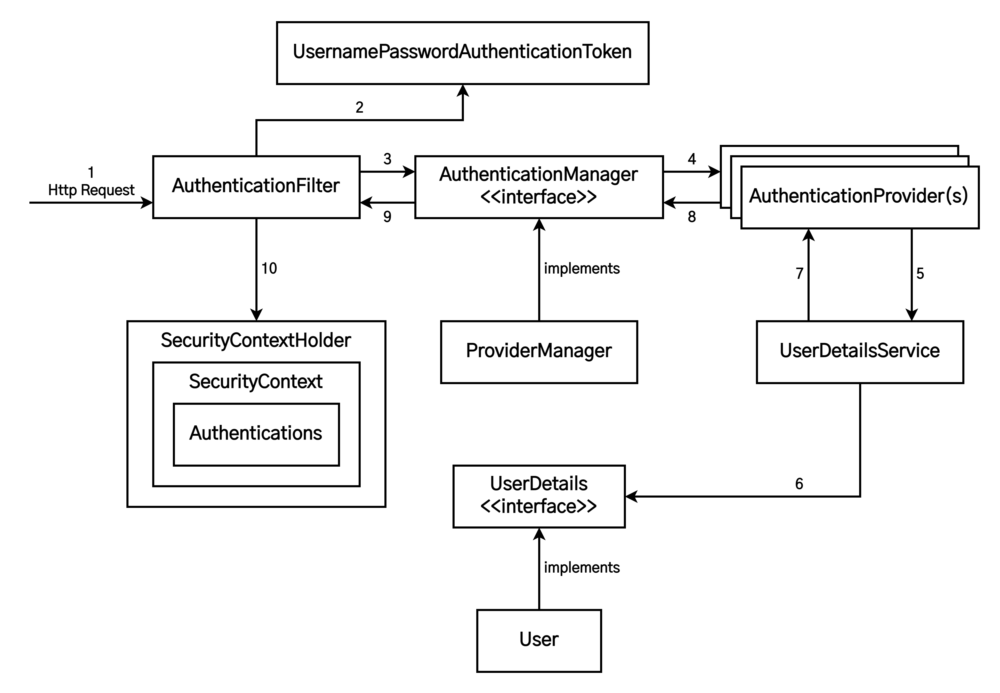

# 스프링 시큐리티란?

1. [스프링 시큐리티(Spring Security)란?](#스프링-시큐리티spring-security란)
2. [스프링 시큐리티의 특징과 구조](#스프링-시큐리티의-특징과-구조)
3. [스프링 시큐리티 동작 과정](#스프링-시큐리티의-동작-과정)
   1. [Filter](#filter)
   2. [DelegatingFilterPorxy](#delegatingfilterproxy)
   3. [FilterChainProxy](#filterchainproxy)
   4. [SecurityFilterChain](#securityfilterchain)
   5. [FilterChainProxy를 굳이 사용하는 이유](#filterchainproxy를-굳이-사용하는-이유)
   6. [Security Filters 순서](#security-filters-순서)
4. [스프링 시큐리티 에외 발생 과정](#스프링-시큐리티-예외-발생-과정)
5. [스프링 시큐리티 로그인 인증 구조](#스프링-시큐리티-로그인-인증-구조)
   1. [AbstractAuthenticationProcessingFilter](#abstractauthenticationprocessingfilter)
   2. [UsernamePasswordAuthenticationFilter](#usernamepasswordauthenticationfilter)
      1. [UsernamePasswordAuthenticationFilter 구동 과정](#usernamepasswordauthenticationfilter-구동-과정)
      2. [UsernamePasswordAuthenticationFilter의 구체적인 인증 과정](#usernamepasswordauthenticationfilter의-구체적인-인증-과정)
   3. [Servlet Authentication Architecture](#servlet-authentication-architecture)
      1. [SecurityContextHolder](#securitycontextholder)
      2. [SecurityContext](#securitycontext)
      3. [Authentication](#authentication)
6. [WebSecurityConfigurerAdapter](#websecurityconfigureradapter)
7. [참고 자료](#참고-자료)

## 스프링 시큐리티(Spring Security)란?

> Spring Security is a framework that provides authentication, authorization, and protection against common attacks. With first class support for securing both imperative and reactive applications, it is the de-facto standard for securing Spring-based applications.
>
> [스프링 시큐리티 공식 문서](https://docs.spring.io/spring-security/reference/index.html) 개요

스프링 시큐리티는 스프링 기반의 애플리케이션 보안(인증, 권한, 인가 등)을 담당하는 스프링 하위 프레임워크이다. 즉, <b>인증(Authenticate, 누구인지)</b>과 <b>인가(Authorize, 무엇을 할 수 있는지)</b>를 담당하는 프레임워크를 말한다.

스프링 시큐리티가 제공하는 기능은 크게 2가지로 나눌 수 있다.

1. 인증과 인가
2. 일반적인 해킹 공격으로부터의 보호(CSRF, 세션 고정 등)

스프링 시큐리티에서는 주로 서블릿 필터(Filter)와 이들로 구성된 필터체인, 그리고 필터체인들로 구성된 위임 모델을 사용한다. 보안과 관련해서 체계적으로 많은 옵션을 제공해주기 때문에 개발자 입장에서는 보안 관련 로직을 일일이 작성하지 않아도 된다는 장점이 있다.

> **ℹ️ 보안 용어**
>
> - **접근 주체(Principal)** : 보호된 리소스에 접근하는 대상
> - **인증(Authentication)** : 보호된 리소스에 접근한 대상에 대해 이 사용자가 누구인지, 애플리케이션의 작업을 수행해도 되는 주체인지 확인하는 과정(Ex. Form 기반 Login)
> - **인가(Authorize)** : 해당 리소스에 대해 접근 가능한 권한을 가지고 있는지 확인하는 과정(After Authentication, 인증 이후)
> - **권한** : 어떠한 리소스에 대한 접근 제한, 모든 리소스는 접근 제어 권한이 걸려있다. 즉, 인가 과정에서 해당 리소스에 대한 제한된 최소한의 권한을 가졌는지 확인

## 스프링 시큐리티의 특징과 구조

- 보안과 관련하여 체계적으로 많은 옵션을 제공하여 편리하게 사용할 수 있음
- **Filter 기반**으로 동작하여 MVC와 분리하여 관리 및 동작
- 어노테이션을 통한 간단한 설정
- 스프링 시큐리티는 기본적으로 세션&쿠키 방식으로 인증
- <b>인증 관리자(Authentication Manager)</b>와 <b>접근 결정 관리자(Access Decision Manager)</b>를 통해 사용자의 리소스 접근을 관리
- 인증 관리자는 `UserNamePasswordAuthenticationFilter`, 접근 관리자는 `FilterSecurityIntercepter`가 수행

## 스프링 시큐리티의 동작 과정

<table style="margin-left: auto; margin-right: auto; text-align: center;">
<tr>
<td></td>
</tr>
<tr>
<td>FilterChain</td>
</tr>
</table>

스프링 시큐리티는 요청이 들어오면 Servelt FilterChain을 자동으로 구성하고 이를 거치도록 한다. FilterChain은 상단의 이미지처럼 여러 filter를 chain 형태로 묶어놓은 것을 말한다.

### Filter

**Filter는 J2EE 표준 스펙 기능으로, 디스패처 서블릿에 요청이 전달되기 전후에 URL 패턴에 맞는 모든 요청에 대해 필터링을 할 수 있는 기능을 제공한다.** 즉, 스프링 컨테이너에서 제공되는 기능이 아니라 톰캣과 같은 웹 컨테이너에 의해 관리된다.

Filter는 전역적으로 동작해야 하는 보안 검사(CSRF, XSS 방어 등)를 수행하여 올바른 요청이 아닌 경우 차단을 한다. 그러면 요청이 스프링 컨테이너까지 전달되지 못해 안정성을 더욱 높일 수 있다. 이러한 강력한 기능 때문에 스프링 시큐리티는 filter를 이용한다.

과거에는 Filter는 서블릿 기술이기에 스프링 빈으로 등록할 수 없었다.(오래된 문서나 도서에서는 filter는 빈으로 관리할 수 없다고 기술한다.) 이 때 필터를 사용하려면 `DelegatingFilterProxy`라는 기술이 필요하다.

### DelegatingFilterProxy

<table style="margin-left: auto; margin-right: auto; text-align: center;">
<tr>
<td></td>
</tr>
<tr>
<td>DelegatingFilterProxy</td>
</tr>
</table>

filter는 서블릿 기술이기에 스프링 컨테이너 밖에서 동작한다. 그래서 과거에는 스프링으로 filter를 통제할 수 없었다. 하지만 `DelegatingFilterProxy` 기술이 등장한 이후 스프링 빈으로 filter를 등록하여 사용할 수 있게 되었다.

### FilterChainProxy

<table style="margin-left: auto; margin-right: auto; text-align: center;">
<tr>
<td></td>
</tr>
<tr>
<td>FilterChainProxy</td>
</tr>
</table>

스프링 시큐리티는 `DelegatingFilterProxy`에 의해 빈으로 등록된 `FilterChainProxy`를 활용해 `SecurityFilterChain`에 있는 filter들을 사용할 수 있다. 즉, proxy를 2번 활용하여 `SecurityFilterChain` 안에 있는 filter들을 활용할 수 있게 하는 것이다.

요약하면 `DelegatingFilterProxy` → `FilterChainProxy` → `SecurityFilterChain`의 순서로 접근하면 최종적으로 스프링 필터들을 사용할 수 있게 된다.

### SecurityFilterChain

<table style="margin-left: auto; margin-right: auto; text-align: center;">
<tr>
<td></td>
</tr>
<tr>
<td>SecurityFilterChain</td>
</tr>
</table>

`SecurityFilterChain`은 `FilterChainProxy`에서의 요청에 대해 호출해야하는 스프링 보안 필터를 결정하는데 사용된다.

### FilterChainProxy를 굳이 사용하는 이유

여기서 의문이 들 수도 있다. `DelegatingFilterProxy`로 빈을 필터로 등록할 수 있는데 왜 굳이 `FilterChainProxy`를 사용해 프록시를 다시 한 번 더 사용해서 등록해야 할까? 왜냐하면 `FilterChainProxy`를 사용해서 얻을 수 있는 장점이 있기 때문이다.

1. **모든 스프링 시큐리티의 서블릿 이용에 대한 시작점을 제공한다.** 덕분에 문제가 생기면 `FilterChainProxy`에 디버깅 포인트를 잡아서 빠르게 오류를 수정할 수 있다.
2. **스프링 시큐리티의 중심점으로 잡음으로서 선택이 아닌 필수 작업들을 누락없이 실행할 수 있다.** 예를 들어, 메모리 낭비를 방지해 `SecurityContext`를 지우거나 Http Firewall을 적용하여 특정 공격으로부터 애플리케이션을 보호한다.
3. **`SecurityFilterChain`의 호출 시기를 유연하게 조절할 수 있다.** 원래 서블릿 컨테이너는 URL에 따라서만 호출 여부를 결정할 수 있다. 하지만 `FilterChainProxy를` 사용하면 `RequestMatcher` 인터페이스를 활용하여 `HttpServletRequest`의 조건을 걸어 호출이 가능하다.
4. **`FilterChainProxy`는 어떤 `SecurityFilterChain`을 사용할지 결정하는데 쓰일 수도 있다.** 즉, 하나의 애플리케이션 안에서 여러 인증 방식(Session, JWT)을 사용하는데에 설정을 완전히 분리할 수 있는 환경을 만들어준다.

<table style="margin-left: auto; margin-right: auto; text-align: center;">
<tr>
<td></td>
</tr>
<tr>
<td>Multiple SecurityFilterChain</td>
</tr>
</table>

### Security Filters 순서

[공식 문서](https://docs.spring.io/spring-security/reference/servlet/architecture.html#servlet-security-filters)에서는 `SecurityFilterChain` 안에 있는 필터의 순서는 중요하지만, 일반적으로 그 순서에 대해 알 필요는 없다고 설명한다. 다만, 자주 사용되는 필터들과 그 역할에 대해서는 알아둘 필요가 있다. 물론, 순서도 대략적으로 파악하고 있다면 더욱 좋을 것이다.

| 필터                                   | 설명                                                                                                                                                                                                                                                                                                                                           |
| -------------------------------------- | ---------------------------------------------------------------------------------------------------------------------------------------------------------------------------------------------------------------------------------------------------------------------------------------------------------------------------------------------- |
| `SecurityContextPersistanceFilter`       | `SecurityContextRepository`에서 `SecutiryContext`를 가져오거나 저장하는 역할을 한다.                                                                                                                                                                                                                                                               |
| `LogoutFilter`                           | 설정된 로그아웃 URL로 오는 요청을 감시하며, 매칭되는 요청이 있다면 해당 사용자를 로그아웃 처리한다.                                                                                                                                                                                                                                            |
| `(UsernamePassword)AuthenticationFilter` | 아이디와 비밀번호를 사용하는 form 기반 인증에 사용하기 위해 설정된 로그인 URL로 오는 요청을 감시하며, 요청이 있으면 사용자 인증을 진행한다.                                                                                                                                                                                                    |
| `DefaultLoginPageGeneratingFilter`       | form 기반 또는 OpenID 기반 인증에 사용하기 위해 설정된 URL에 대한 요청을 감시하고, 로그인 form 기능을 수행하는 데 필요한 HTML을 생성한다.                                                                                                                                                                                                      |
| `BasicAuthenticationFilter`              | HTTP 기본 인증 헤더를 감시하고 이를 처리한다.                                                                                                                                                                                                                                                                                                  |
| `RequestCacheAwareFilter`                | 로그인 성공 이후, 인증 요청에 의해 가로채어진 원래 요청 정보를 재구성하는데 사용된다. <ul><li>`SecurityContextHolderAwareRequestFilter` : `HttpServletRequest`를 `HttpServletRequestWrapper`를 상속하는 하위 클래스(`SecurityContextHolderAwareRequestWrapper`)로 감싸서 필터 체인상 하단에 위치한 요청 프로세서에 추가 컨텍스트를 제공한다.</li></ul> |
| `AnonymousAuthenticationFilter`          | 이 필터가 호출되는 시점까지 사용자 정보가 인증되지 않았다면 요청 관련 인증 토큰에서 사용자가 익명 사용자로 나타난다.                                                                                                                                                                                                                           |
| `SessionManagementFilter`                | 인증된 주체를 바탕으로 세션 트래킹을 처리해 단일 주체와 관련한 모든 세션들이 추적(트래킹)되도록 돕는다.                                                                                                                                                                                                                                        |
| `ExceptionTranslationFilter`             | 보호된 요청을 처리하는 중에 발생할 수 있는 예외를 위임하거나 라우팅(전달)한다.                                                                                                                                                                                                                                                                 |
| `FilterSecurityInterceptor`              | 권한 부여와 관련한 결정을 `AccessDecisionManager`에게 위임해 권한 부여 결정 및 접근 제어 결정을 쉽게 만들어준다.                                                                                                                                                                                                                                 |

## 스프링 시큐리티 예외 발생 과정

스프링 시큐리티는 `AccessDeniedException`과 `AuthenticationException`을 HTTP Response로 바꾸기 위해 `ExceptionTranslationFilter`라는 필터를 활용한다. 물론 `ExceptionTranslationFilter`는 `SecurityFilterChain`에 포함된 필터들 중 하나다.

이 과정은 다음과 같은 과정으로 이루어진다.

<table style="margin-left: auto; margin-right: auto; text-align: center;">
<tr>
<td></td>
</tr>
<tr>
<td>ExceptionTranslationFilter</td>
</tr>
</table>

1. 먼저 `ExceptionTranslationFilter`는 `FilterChain.doFilter(request, response)`를 호출하여 다음 필터로 바로 넘어가도록 한다.
2. 만약 유저가 인증되지 않았거나 `AuthenticationException`이 발생하면 인증(Authentication)을 시작한다.
   - `SecurityContextHolder`가 비워진다.
   - `HttpServletRequest`는 `RequestCache`에 저장된다. 유저가 성공적으로 인증되면 `RequestCache`는 원래 요청을 재수행하는 데 사용된다.
   - `AuthenticationEntryPoint`는 클라이언트에서 자격 증명을 요청하는 데 사용된다. 예를 들어, 로그인 페이지로 리디렉션하거나 `WWW-Authenticate` 헤더를 전송한다.
3. 인증이 실패하면 `AccessDeniedException`이 발생하고, 액세스가 거부된다. 액세스 거부 처리를 위해 `AccessDeniedHandler`가 호출된다.

이를 코드로 살펴보면 다음과 같다.

```java
try {
	filterChain.doFilter(request, response);    //1
} catch (AccessDeniedException | AuthenticationException ex) {
	if (!authenticated || ex instanceof AuthenticationException) {
		startAuthentication();  //2
	} else {
		accessDenied(); //3
	}
}
```

위에서 설명한 내용과 동일하다. 다음 필터로 넘어가도록 할 때 예외가 발생하면 인증을 시작하고, 인증에 실패한다면 예외를 핸들링하는 로직이 실행된다. 즉, 예외가 발생하지 않으면 `ExceptionTranslationFilter`는 그냥 통과된다.

## 스프링 시큐리티 로그인 인증 구조

[동작 과정](#스프링-시큐리티의-동작-과정)에서 설명한 것처럼 인증은 filter에 의해서 수행되고 `DelegatingFilterProxy`로 등록된 `FilterChainProxy` 빈을 이용한 `SecurityFilterChain`으로 진행된다. 아래 그림과 같다.

<table style="margin-left: auto; margin-right: auto; text-align: center;">
<tr>
<td></td>
</tr>
<tr>
<td>SecurityFilterChain</td>
</tr>
</table>

### AbstractAuthenticationProcessingFilter

`SecurityFilterChain` 안에는 스프링 시큐리티에서 제공하는 여러가지 filter들이 있다고 상술했다. 이때 `Authentication`(로그인)을 담당하는 필터는 `AbstractAuthenticationProcessingFilter`이다.

이 필터는 추상 클래스로 로그인에 필요한 공통적인 로직을 가지고 있는 필터이다.

<table style="margin-left: auto; margin-right: auto; text-align: center;">
<tr>
<td></td>
</tr>
<tr>
<td>AbstractAuthenticationProcessingFilter</td>
</tr>
</table>

1. 사용자가 로그인 정보(자격 증명)을 제출하면 `AbstractAuthenticationProcessingFilter`는 인증될 `HttpServletRequest`에게서 `Authentication`을 생성한다. 예를 들어, `UsernamePasswordAuthenticationFilter`는 `HttpServletRequest`에 제출된 유저 이름과 암호에서 `UsernamePasswordAuthenticationToken`을 생성한다.
2. 그런 다음 `Authentication`이 `AuthenticationManager`로 전달되어 인증된다.
3. 인증에 실패한 경우
   - `SecurityContextHolder`가 비워진다.
   - `RememberMeServices.loginFail`가 호출된다. remember me가 설정되지 않은 경우 작동하지 않는다.
   - `AuthenticationFailureHandler `가 호출된다.
4. 인증에 성공한 경우
   - `SessionAuthenticationStrategy`를 통해 새 로그인이 통보(신규 Session이 생성)된다.
   - `Authentication`이 `SecurityContextHolder`에 설정된다. 추후 `SecurityContextPersistence`는 `SecurityContext`를 `HttpSession`에 저장한다.
   - `RememberMeServices.loginSuccess`가 호출된다. remember me가 설정되지 않은 경우 작동하지 않는다.
   - `ApplicationEventPublisher`가 `InteractiveAuthenticationSuccessEvent`를 발행한다.
   - `AuthenticationSuccessHandler`가 호출된다.

`AbstractAuthenticationProcessingFilter`는 추상 클래스이기 때문에 `SecurityFilterChain` 안에 직접 들어갈 수 없고, 이를 상속받은 filter들이 속해 있다.

이 문서에서는 username과 password를 form 태그로 전달해서 로그인하는 `UsernamePasswordAuthenticationFilter`를 통해 로그인 과정을 살펴본다. 구체적인 설명은 [이곳](#usernamepasswordauthenticationfilter)을 참고.

### UsernamePasswordAuthenticationFilter

`UsernamePasswordAuthenticationFilter`는 `AbstractAuthenticationProcessingFilter`를 상속받은 클래스로 `SecurityFilterChain` 안에 들어있다. `AbstractAuthenticationProcessingFilter`에서 username과 password를 form 태그 기반으로 받는 로직과 `UsernamePasswordAuthenticationToken`을 발행하는 로직이 추가되어 상속받았다고 생각하면 된다.

이제 `UsernamePasswordAuthenticationFilter`가 구동되는 전체적인 과정에 대해 살펴보자.

#### UsernamePasswordAuthenticationFilter 구동 과정

<table style="margin-left: auto; margin-right: auto; text-align: center;">
<tr>
<td></td>
</tr>
<tr>
<td>Authenticating Username and Password</td>
</tr>
</table>

1. username과 password를 담고 있는 form 태그가 `HttpServletRequest`에 제출되면 `UsernamePasswordAuthenticationFilter`는 `UsernamePasswordAuthenticationToken`을 생성한다. `UsernamePasswordAuthenticationToken`은 `HttpServletRequest`의 username, password로부터 추출된 `Autentication`의 일종이다.
2. 그 다음, `UsernamePasswordAuthenticationToken`은 `AuthenticationManager`로 전달되어 인증 과정을 거친다. `AuthenticationManager`의 세부 정보는 유저 정보가 저장되는 방식에 따라 달라진다.
3. 인증에 실패한 경우
   - `SecurityContextHolder`가 비워진다.
   - `RememberMeServices.loginFail`이 호출된다. remember me가 설정되지 않은 경우 작동하지 않는다.
   - `AuthenticationFailureHandler`가 호출된다.
4. 인증에 성공한 경우
   - `SessionAuthenticationStrategy`를 통해 새 로그인이 통보(신규 Session이 생성)된다.
   - `Authentication`이 `SecurityContextHolder`에 설정된다.
   - `RememberMeServices.loginSuccess`가 호출된다. remember me가 설정되지 않은 경우 작동하지 않는다.
   - `ApplicationEventPublisher`가 `InteractiveAuthenticationSuccessEvent`를 발행한다.
   - `AuthenticationSuccessHandler`가 호출된다. 일반적으로 `SimpleUrlAuthenticationSuccessHandler`이다.
     - 로그인 성공 시 커스텀 로직을 작성하는 경우 이 핸들러를 커스터마이징하면 된다. 예를 들어, 최근 로그인 날짜를 DB에 갱신하는 로직 등이 있다.

여기까지는 전체적인 로그인 과정이다. 이제 구체적으로 어떻게 진행되는지 살펴보자.

#### UsernamePasswordAuthenticationFilter의 구체적인 인증 과정

|  |
| :----------------------------------------------------: |
|            스프링 시큐리티의 인증 아키텍처             |

위 그림은 `UsernamePasswordAuthenticationFilter`의 구동 과정에서 활용되는 class들을 보여주는 그림이다.

1. **HTTP 요청(HttpServletRequest) 수신 및 `AuthenticationFilter` 통과**
   - 스프링 시큐리티는 일련의(연결된) 필터들을 가지고 있다. 요청(request)은 인증(Authentication)과 인가(Authorization)를 위해 이 필터들을 통과하게 된다.
   - 이 필터를 통과하는 과정은, 해당 요청과 관련된 인증 필터(인증 매커니즘/모델에 기반한 관련 인증 필터)를 찾을 때까지 지속된다.
2. **사용자 자격 증명을 기반으로 `AuthenticationToken` 발급**
   - 인증 요청(request)이 관련 `AuthenticationFilter`(구현체 - `UsernamePasswordAuthenticationFilter`)에 의해 수신되면 수신된 요청에서 username과 password를 추출한다.
   - 추출된 사용자 자격 증명(credentials)을 기반으로 인증 개체를 만들게 되는데, 이를 `UsernamePasswordAuthenticationToken`이라고 한다.
3. **`AuthenticationManager`를 위해 생성된 `AuthenticationToken` 위임**
   - 만들어진 `UsernamePasswordAuthenticationToken`는 `AuthenticationManager`의 인증 메서드를 호출하는 데 사용된다. 여기서 `AuthenticationManager`는 단순한 **인터페이스**이며, 실제 구현체는 `ProviderManager`이다.
   - `ProviderManager`에는 사용자 요청을 인증하는 데 필요한 `AuthenticationProvdier` 목록이 있다. `ProviderManager`는 제공된 `AuthenticationProvdier`를 살펴보고 전달된 인증 개체(`UsernamePasswordAuthenticationToken`)를 기반으로 사용자 인증을 시도한다.
4. **실제 인증을 할 `AuthenticationProvider`에게 인증 객체(`UsernamePasswordAuthenticationToken`)를 다시 전달**
   - 프레임워크와 함께 제공되는 `AuthenticationProvider`의 일부는 다음과 같다.
     - `CasAuthenticationProvider`
     - `JaasAuthenticationProvider`
     - `DaoAuthenticationProvider`
     - `OpenIDAuthenticationProvider`
     - `RememberMeAuthenticationProvider`
     - `LdapAuthenticationProvider`
5. **특정 `AuthenticationProvider`으로 인증 시도**
   - `AuthenticationProvider`는 제공된 인증 개체로 사용자를 인증한다.
   - `AuthenticationManager.authenticate`가 호출되며 `AuthenticationProvider` 안에 있는 `authenticate` 로직이 호출된다. **이때 실제 인증이 진행된다.**
   - 아래는 `AuthenticationProvider`를 구현한 구현체이다.
     ```java
     @Component
     public class CustomAuthenticationProvider implements AuthenticationProvider {
       private final CustomUserDetailsService userDetailsService;
       private final SamplePasswordEncoder passwordEncoder;

       public CustomAuthenticationProvider(CustomUserDetailsService userDetailsService, SamplePasswordEncoder passwordEncoder) {
           this.userDetailsService = userDetailsService;
           this.passwordEncoder = passwordEncoder;
       }

       @Override
       public Authentication authenticate(Authentication authentication) throws AuthenticationException {
           String username = authentication.getName();
           String password = (String) authentication.getCredentials();

           UserDetails user = userDetailsService.loadUserByUsername(username);
           if (user == null) {
               throw new BadCredentialsException("username is not found. username=" + username);
           }

           if (!this.passwordEncoder.matches(password, user.getPassword())) {
               throw new BadCredentialsException("password is not matched");
           }

           return new CustomAuthenticationToken(username, password, user.getAuthorities());
       }

       @Override
       public boolean supports(Class<?> authentication) {
           return CustomAuthenticationToken.class.isAssignableFrom(authentication);
       }
     }
     ```
     이 코드에서 중요한 점은 `userDetailsService`라는 서비스 객체를 주입받는다는 것이다.
     ```java
     private final CustomUserDetailsService userDetailsService;
     ```
     이는 실제 인증이 진행되는 `authenticate` 메서드에서 `UserDetail` 객체를 추출하는데에 활용된다.
     ```java
     UserDetails user = userDetailsService.loadUserByUsername(username);
     ```
     그 후 `UserDetails` 객체를 활용해서 인증을 진행하는 것을 확인할 수 있다.
6. **`AuthenticationProvider`가 전달받은 `UserDetails` 객체와 실제 사용자의 입력 정보를 이용해 인증 시도**
   - 일부 `AuthenticationProvider`(ex. `DaoAuthenticationProvider`)는 username을 기반으로 사용자 세부 정보를 검색하기 위해 `UserDetailsService`를 사용할 수 있다.
   - `UserDetailsService`는 DB에 저장된 회원의 비밀번호와 비교해 일치하면 `UserDetails` 인터페이스를 구현한 객체를 반환한다.
   - `UserDetailsService`는 스프링 시큐리티의 인터페이스이며, 이를 `UserDetailsService`로 구현한 서비스는 **직접 개발**해야 한다.
     ```java
     public interface UserDetailService {
         UserDetail loadUserByUsername(String username) throws UsernameNotFoundException;
     }
     ```
     즉, 위 코드의 `loadUserByUsername` 메서드를 오버라이딩해 DB와 비교하는 로직을 직접 작성해야 한다. 구현한 예시는 다음과 같다.
     ```java
     @Service
     @Transactional(readOnly = true)
     @RequiredArgsConstructor
     public class MemberServiceImpl implements UserDetailsService {

         private final MemberRepository memberRepository;

         @Override
         @Transactional
         public UserDetails loadUserByUsername(String email) throws UsernameNotFoundException {
             Optional<Member> memberOptional = memberRepository.findByEmail(email);
             if (memberOptional.isPresent()) {
                 return new PrincipalDetails(memberOptional.get());
             } else {
                 throw new UsernameNotFoundException(email);
             }
         }

     }
     ```
7. **`UserDetailsService`의 인증 결과 반환**
8. **`AuthenticationProvider`의 인증 결과 반환**
9. **`AuthenticationManager`의 인증 결과 반환**
10. **인증 완료**
    - 인증이 성공하면 `sessionAuthenticationStrategy.onAuthentication`가 실행되어 새로운 session이 생성되고 `AuthenticationSuccessHandler`가 호출된다.
    - 사용자 정보를 가지고 반환된 `Authentication` 객체를 `SecurityContext`에 담고 다시 `SecurityContextHolder`에 담는다. 스프링 시큐리티는 `SecurityContextHolder`에 값이 있다면 인증된 사용자로 인식하고 `Set-Cookie` 헤더에 `JSESSINID`를 넣어 응답한다.
    - 최초 인증이 끝난 사용자가 `JSESSINID`를 Cookie 헤더에 넣어서 요청을 보내면 서버에서는 `JSESSINID`가 세션에 있는지 확인하여 인증을 진행한다.
    - 인증이 실패한 경우 `AuthenticationFailureHandler`를 호출된다.

### Servlet Authentication Architecture

<table style="margin-left: auto; margin-right: auto; text-align: center;">
<tr>
<td></td>
</tr>
<tr>
<td>SecurityContextHolder</td>
</tr>
</table>

인증된 객체는 위 그림과 같은 구조로 감싸져 있다. 가장 바깥에 있는 `SecurityContextHolder`부터 알아보자.

#### SecurityContextHolder

> At the heart of Spring Security’s authentication model is the SecurityContextHolder. It contains the SecurityContext.
>
> [스프링 시큐리티 SecurityContextHolder 공식 문서](https://docs.spring.io/spring-security/reference/servlet/authentication/architecture.html#servlet-authentication-securitycontextholder) 개요

간단히 요약하면 `SecurityContextHolder`는 `SecurityContext`를 포함하고 있고, 스프링 시큐리티 인증 모델의 핵심이라는 말이다.

`SecurityContextHolder`는 인증된 사용자에 대한 정보를 저장하는 객체이다. 특이하게도 `SecurityContextHolder`가 값을 가지고만 있어도 스프링 시큐리티에서는 인증된 사용자라고 가정한다.

#### SecurityContext

`SecurityContext`는 `SecurityContextHolder`와 `Authentication` 객체를 이어주는 징검다리 역할이라고 할 수 있다.

#### Authentication

`Authentication` 객체는 스프링 시큐리티에서 크게 두가지 목적을 가지고 있다.

1. 사용자가 인증을 위해 제공한 자격 증명을 제공하기 위해 `AuthenticationManager`에 들어가는 입력이다.
2. 현재 인증된 사용자를 대표하는 객체이다.

`Authentication`은 다음과 같은 구성요소를 가진다.

- `principal` - 사용자를 식별하는 역할이다. 사용자의 username/password로 인증할 때 이 요소는 `UserDetails`의 인스턴스이다.
- `credentials` - 암호가 들어가는 역할이다. 대부분의 경우 유출 방지를 위해 인증한 후 삭제된다.
- `authorities` - 사용자의 역할, 권한을 나타낸다. 예를 들어 일반 사용자, 관리자 등이 있다.

```java
public interface Authentication extends Principal, Serializable {
    Collection<? extends GrantedAuthority> getAuthorities(); // Authentication 저장소에 의해 인증된 사용자의 권한 목록
    Object getCredentials();    // 비밀번호
    Object getDetails();        // 사용자 상세정보
    Object getPrincipal();      // ID
    boolean isAuthenticated();  //인증 여부
    void setAuthenticated(boolean isAuthenticated) throws IllegalArgumentException;
}
```

## WebSecurityConfigurerAdapter

스프링 시큐리티는 `WebSecurityConfigurerAdapter`를 상속받아 관련 설정을 관리할 수 있다.

```java
package peermarket.peershop.config;

import lombok.RequiredArgsConstructor;
import org.springframework.context.annotation.Bean;
import org.springframework.context.annotation.Configuration;
import org.springframework.security.config.annotation.method.configuration.EnableGlobalMethodSecurity;
import org.springframework.security.config.annotation.web.builders.HttpSecurity;
import org.springframework.security.config.annotation.web.configuration.EnableWebSecurity;
import org.springframework.security.config.annotation.web.configuration.WebSecurityConfigurerAdapter;
import org.springframework.security.crypto.bcrypt.BCryptPasswordEncoder;
import peermarket.peershop.security.LoginSuccessHandler;

@Configuration
@EnableWebSecurity // 스프링 시큐리티 필터가 스프링 필터체인에 등록된다.
@EnableGlobalMethodSecurity(securedEnabled = true, prePostEnabled = true) // secured 어노테이션 활성화, preAuthorize 어노테이션 활성화
@RequiredArgsConstructor
public class SecurityConfig extends WebSecurityConfigurerAdapter {

    private final LoginSuccessHandler loginSuccessHandler;

    //해당 메서드의 리턴되는 오브젝트를 ioc로 등록해준다.
    @Bean
    public BCryptPasswordEncoder passwordEncoder() {
        return new BCryptPasswordEncoder();
    }

    @Override
    protected void configure(HttpSecurity http) throws Exception {
        http.authorizeRequests()
//            .antMatchers("/user/**").authenticated()
            .antMatchers("/admin/**").access("hasRole('ROLE_ADMIN')")
            .anyRequest().permitAll()
        .and()
            .formLogin()
            .loginPage("/member/loginForm")
            .usernameParameter("email")
            .loginProcessingUrl(
                "/member/login") // /login 주소가 호출이 되면 시큐리티가 낚아채서 대신 로그인을 진행한다. -> Controller에 로그인을 만들지 않아도 된다.
            .defaultSuccessUrl("/")
            .successHandler(loginSuccessHandler)
        .and()
            .sessionManagement()
            .maximumSessions(1)
            .expiredUrl("/member/loginForm");

    }

}
```

configure를 오버라이딩하면 여러가지 설정을 할 수 있다. 다양한 설정을 할 수 있으므로 검색을 통해 알아보는 것을 추천한다.

## 참고 자료

- [Spring Security에 대해서 알아보자(동작 과정편)](https://velog.io/@younghoondoodoom/Spring-Security%EC%97%90-%EB%8C%80%ED%95%B4%EC%84%9C-%EC%95%8C%EC%95%84%EB%B3%B4%EC%9E%90%EB%8F%99%EC%9E%91%EA%B3%BC%EC%A0%95%ED%8E%B8)
- [Spring Security에 대해서 알아보자(로그인 인증 구조)](https://velog.io/@younghoondoodoom/Spring-Security%EC%97%90-%EB%8C%80%ED%95%B4%EC%84%9C-%EC%95%8C%EC%95%84%EB%B3%B4%EC%9E%90%EB%A1%9C%EA%B7%B8%EC%9D%B8-%EC%9D%B8%EC%A6%9D-%EA%B5%AC%EC%A1%B0)
- [Spring Security 공식 레퍼런스](https://docs.spring.io/spring-security/reference/index.html)
- - [[Spring Security] Spring Security의 개념과 동작 과정](https://doozi0316.tistory.com/entry/Spring-Security-Spring-Security%EC%9D%98-%EA%B0%9C%EB%85%90%EA%B3%BC-%EB%8F%99%EC%9E%91-%EA%B3%BC%EC%A0%95)
- [Spring Security(스프링 시큐리티) 란?](https://jangjjolkit.tistory.com/24?category=1019420)
- [[Spring Security] 스프링시큐리티의 기본 개념과 구조](https://devuna.tistory.com/55)
- [Spring Security - 아키텍쳐 AuthenticationManager Authentication](https://ncucu.me/104)
- [[Spring Security] Spring Security 동작원리](https://emgc.tistory.com/108)
