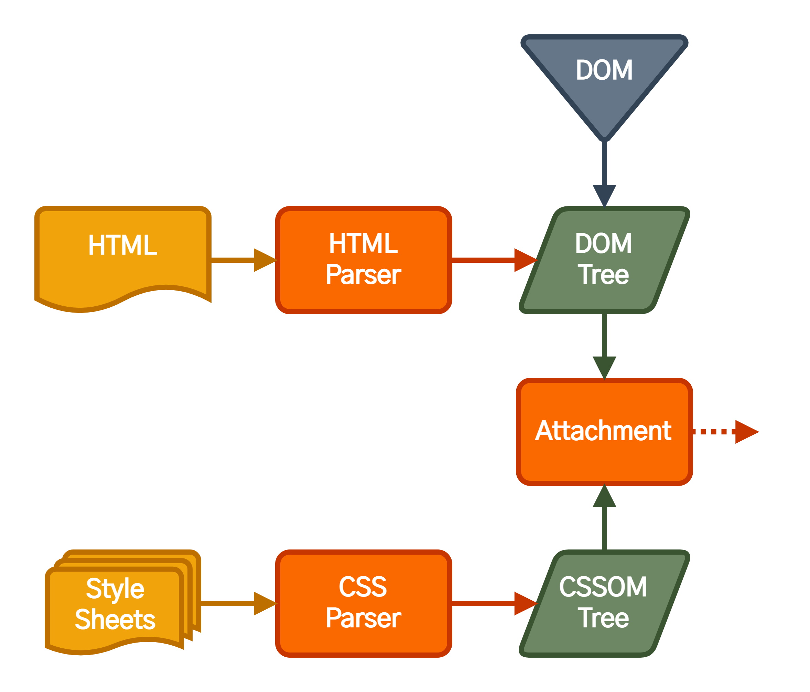
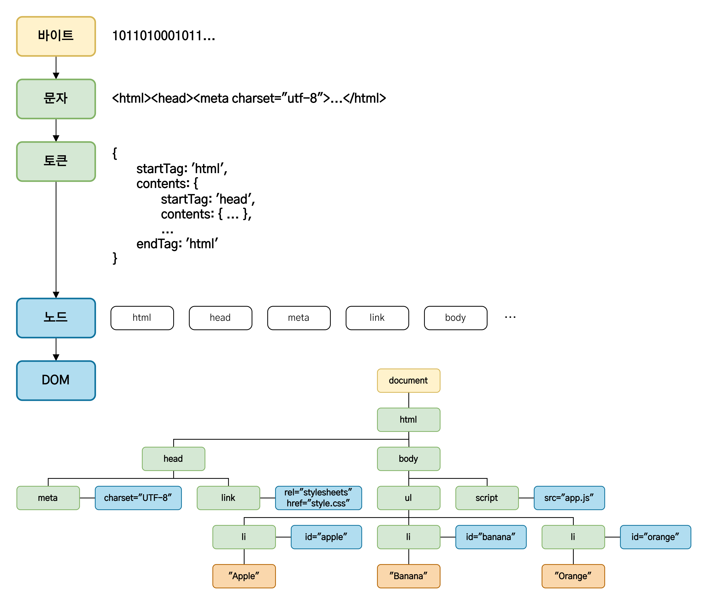
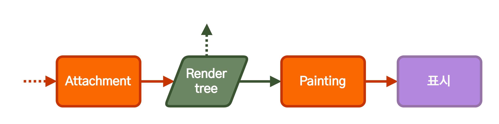

# 브라우저의 작동 원리

1. [브라우저란?](#브라우저란)
2. [브라우저의 주요 기능](#브라우저의-주요-기능)
3. [브라우저의 기본 구조](#브라우저의-기본-구조)
4. [렌더링 엔진](#렌더링-엔진)
5. [렌더링 엔진의 동작 과정](#렌더링-엔진의-동작-과정)
   1. [DOM(Document Object Model), CSSOM(CSS Object Model) 생성(Parsing)](#domdocument-object-model-cssomcss-object-model-생성parsing)
      1. [HTML 파싱과 DOM 생성 과정](#html-파싱과-dom-생성-과정)
      2. [CSS 파싱과 CSSOM 생성 과정](#css-파싱과-cssom-생성-과정)
      3. [자바스크립트 파싱 과정](#자바스크립트-파싱-과정)
   2. [렌더 트리 구축(Attachement)](#렌더-트리-구축)
   3. [렌더 트리 배치(Layout or Reflow)](#렌더-트리-배치)
   4. [렌더 트리 그리기(Paint)](#렌더-트리-그리기)
      1. [그리기 순서](#그리기-순서)
      2. [동적 변경](#동적-변경)
6. [Reflow와 Repaint](#reflow와-repaint)
   1. [Repaint](#repaint)
   2. [Reflow](#reflow)

## 브라우저란?

브라우저는 현 시점에서 가장 많이 사용되는 소프트웨어들 중 하나이다.

브라우저의 정확한 명칭은 '웹 브라우저'로, '인터넷 브라우저' 혹은 '웹 탐색기'라고 불리기도 한다. 브라우저는 웹 서버에서 이동하며 쌍방향으로 통신하고 HTML 문서나 파일을 출력하는 그래픽 사용자 인터페이스 기반의 응용 소프트웨어이다. 브라우저는 대표적인 HTTP 사용자 에이전트의 하나이기도 하다.

주요 웹 브라우저로는 모질라 파이어폭스, 구글 크롬, 마이크로소프트 인터넷 익스플로러/엣지, 오페라 등이 있다.

## 브라우저의 주요 기능

브라우저의 주요 기능은 **사용자가 선택한 자원을 서버에 요청하고 브라우저에 표시하는 것**이다. 자원은 보통 HTML 문서지만 PDF나 이미지 또는 다른 형태일 수 있다. 자원의 주소는 **URI**(Uniform Resource Identifier)에 의해 정해진다.

브라우저들은 웹 표준화 기구인 W3C(World Wide Web Consortium)에서 정한 HTML, CSS 명세에 따라 HTML 파일을 해석해서 화면에 표시한다. 최근엔 거의 대부분의 브라우저가 이 명세를 따르므로, 과거와는 달리 호환성 문제를 겪을 일이 드물다.

## 브라우저의 기본 구조

- **사용자 인터페이스** : 주소 표시줄, 이전/다음 버튼, 북마크 메뉴 등 요청한 페이지를 보여주는 창을 제외한 나머지 모든 부분이다.
- **브라우저 엔진** : 사용자 인터페이스와 렌더링 엔진 사이의 동작을 제어한다.
- **렌더링 엔진** : 요청한 콘텐츠를 표시한다. HTML을 요청하고 HTML과 CSS를 파싱하여 화면에 표시하는 것이 렌더링 엔진을 통해 이뤄진다.
- **통신** : HTTP 요청과 같은 네트워크 호출에 사용된다. 이것은 플랫폼 독립적인 인터페이스이고 플랫폼 하부에서 실행된다.
- **UI 백엔드** : 콤보 박스와 창 같은 기본적인 장치를 그린다. 플랫폼에서 명시하지 않은 일반적인 인터페이스로서, OS 사용자 인터페이스 체계를 사용한다.
- **JS 엔진** : 자바스크립트 코드를 해석하고 실행한다.
- **자료 저장소** : 자료를 저장하는 계층이다. 쿠키를 저장하는 것과 같이 모든 종류의 자원을 하드 디스크에 저장할 필요가 있는데, 이 때 사용되는 웹 데이터베이스이다.


## 렌더링 엔진

> **렌더링 엔진**은 요청 받은 내용을 브라우저 화면에 표시하는 일을 담당한다.

렌더링 엔진은 HTML 및 XML 문서와 이미지를 표시할 수 있다. 물론 플러그인이나 브라우저 확장 기능을 이용해 PDF와 같은 다른 유형도 표시할 수 있다.

|     브라우저      |         렌더링 엔진         |
| :---------------: | :-------------------------: |
| 인터넷 익스플로러 |           Trident           |
|       엣지        |     ~~EdgeHTML~~, Blink     |
|       크롬        | Webkit, Blink(버전 28 이후) |
|      사파리       |           Webkit            |
|    파이어폭스     |            Gecko            |

## 렌더링 엔진의 동작 과정

렌더링 엔진은 통신으로부터 요청한 문서의 내용을 얻는 것으로 시작하는데, 문서의 내용은 보통 `8KB` 단위로 전송된다. 렌더링 엔진의 기본적인 동작 과정은 다음과 같다.


### DOM(Document Object Model), CSSOM(CSS Object Model) 생성(Parsing)



- HTML을 파싱하여 DOM 노드를 만들고, 생성된 DOM 노드들을 병합하여 **DOM 트리**를 만든다.
- CSS를 파싱하여 **CSSOM 트리**를 만든다.

브라우저는 렌더링 할 문서를 HTML과 CSS로 나누어 읽게 된다. 이 시점의 HTML과 CSS는 단순한 텍스트이므로, 각각 연산과 관리가 가능하도록 `HTML Parser`와 `CSS Parser`를 사용하여 관리가 가능한 `Object Model`를 생성한다.

일련의 과정들은 점진적으로 진행된다. 렌더링 엔진은 좀 더 나은 사용자 경험을 위해 가능하면 빠르게 내용을 표시하는데, 모든 HTML을 파싱할 때까지 기다리지 않고 배치와 그리기 과정을 시작한다. 네트워크로부터 나머지 내용이 전송되기를 기다리는 동시에 받은 내용의 일부를 먼저 화면에 표시하는 것이다.

#### HTML 파싱과 DOM 생성 과정



1. 서버는 브라우저로부터 받은 HTML 파일을 읽어들인 후, 메모리에 저장하고 그 메모리에 저장된 바이트(1011010001011...)를 응답한다.
2. 브라우저는 응답받은 바이트 형태의 문서를 meta 태그의 charset 어트리뷰트에 지정된 인코딩 방식(UTF-8)에 따라 문자열로 반환한다.
3. 문자열로 반환된 HTML 문서를 문법적 의미를 갖는 코드의 최소 단위인 토큰(Token)으로 분해한다.
4. 토큰들의 내용에 따라 객체로 변환하여 각 노드들을 생성한다.(문서 노드, 요소 노드, 어트리뷰트 노드, 텍스트 노드)
5. HTML은 요소 간의 부모-자식 관계인 중첩 관계를 갖는데, 이를 반영하여 모든 노드들을 트리 구조로 구성하여 DOM을 생성한다.

#### CSS 파싱과 CSSOM 생성 과정

렌더링 엔진은 HTML 문서를 한 줄씩 순차적으로 파싱하며 DOM을 생성한다. 그러다가 CSS를 로드하는 link 태그 혹은 style 태그를 만나면 DOM 생성을 중지한 후 CSS 파싱의 결과물인 CSSOM을 생성하는 과정을 진행한다.

```html
<!DOCTYPE html>
<html>
  <head>
    <meta charset="UTF-8" />
    //이 위치까지 해석한 후,
    <link ref="stylesheet" href="style.css" />
    //link 태그를 만나면 DOM 생성을 중지하고 CSS 파일을 서버에 요청한 후 응답받아 CSS 파싱을 시작한다.
  </head>
</html>
```

CSS 파싱 과정은 바이트 -> 문자 -> 토큰 -> 노드 -> CSSOM 생성 순으로 HTML의 파싱 과정과 동일하다.


#### 자바스크립트 파싱 과정

렌더링 엔진은 HTML 문서를 한 줄씩 순차적으로 파싱하다가 자바스크립트 파일을 로드하는 script 태그를 만나면 DOM 생성을 일시 중단한다.

script 태그의 scr에 정의된 자바스크립트 파일을 서버에 요청하여 응답받으면, 자바스크립트 코드를 파싱하기 위해 자바스크립트 엔진에게 제어권을 넘긴다. 자바스크립트 파싱이 끝나면 렌더링 엔진으로 다시 제어권을 넘긴 후 DOM 생성을 이어나간다.

만약 생성되지 않은 DMO을 조작한다면 에러가 발생할 수 있다. 따라서 body 요소 아래에 자바스크립트를 위치시키거나 DOM 생성이 완료된 시점에 자바스크립트가 실행되도록 한다.

1. 자바스크립트 코드를 토큰나이저가 어휘 분석하여 문법적 의미를 갖는 코드의 최소 단위인 토큰들로 분해하는데, 이것을 토큰나이징이라 한다.
2. 파서가 토큰들을 구문 분석하여 AST(Abstract Syntax Tree: 추상 구문 트리)로 파싱한다.
3. 바이트 코드 생성기가 AST를 바이트 코드로 변환한다.
4. 인터프리터에 의해 바이트 코드를 실행한다.

### 렌더 트리 구축(Attachement)


CSSOM 트리와 DOM 트리를 결합하여, 표시해야 할 순서로 내용을 그려낼 수 있도록 하기 위해 **렌더 트리**를 형성한다. 이 과정을 **Attachement**라고 한다. 렌더 트리는 화면에 표시되는 각 노드의 위치를 계산하는 레이아웃에 사용되고 픽셀을 화면에 그리는 페인트 과정에도 사용된다.


렌더 트리를 생성하려면 브라우저는 대략 3가지 작업을 수행해야 한다.

- DOM 트리의 루트부터 각 노드들을 모두 탐색한다.
  - 이 때 화면에 표시되지 않는 일부 노드들(script, meta 태그 등)은 렌더 트리에서 제외된다.
  - 또한 CSS 속성 중 `display: none`과 같이 화면에서 숨겨지는 속성도 렌더 트리에 반영되지 않는다.
- 화면에 표시되는 각 노드에 대해 적절하게 일치하는 CSSOM 규칙을 찾아 적용한다.
- 화면에 표시되는 노드를 콘텐츠 및 계산된 스타일과 함께 렌더 트리로 생성한다.

### 렌더 트리 배치(Layout or Reflow)


렌더 트리가 생성되고, 기기의 뷰포트 내에서 렌더 트리의 노드가 정확한 위치와 크기를 계산한다. 이때 모든 상대적인 값이 픽셀값으로 변환된다. CSS에 상대적인 값인 `%`, `rem`, `vh`으로 할당된 값들은 절대적인 값인 `px` 단위로 변환된다. 이 과정을 배치(**Layout**) 또는 **Reflow**라고 한다.

### 렌더 트리 그리기(Paint)



렌더 트리의 각 노드를 화면에 실제 픽셀로 나타낼 때 **Painting** 메서드가 호출된다. Painting 과정 후 브라우저 화면에 UI가 나타나게 된다.

#### 그리기 순서

실제로 요소가 stacking context에 쌓이는 순서는 다음과 같다. 스택은 뒤에서 앞으로 그려지기 때문에 이 순서는 그리기에 영향을 미친다. 블록 렌더러가 쌓이는 순서는 다음과 같다.

1. 배경 색
2. 배경 이미지
3. 테두리
4. 자식
5. 아웃라인

페인트 단계에서 메인 스레드는 페인트 기록(paint record)을 생성하기 위해 레이아웃 트리를 순회한다. 페인트 기록은 '배경 먼저, 다음은 텍스트, 그리고 직사각형'과 같이 페인팅 과정을 기록한 것이다. JavaScript로 `<canvas>` 요소에 그림을 그려봤다면 이 과정이 익숙할 것이다.

#### 동적 변경

브라우저는 변경에 대해 가능한 한 최소한의 동작으로 반응하려고 노력한다. 예를 들어 `div` 요소 한 개의 색깔이 바뀌면 해당 요소의 리페인팅만 발생한다. 요소의 위치가 바뀌면 요소와 자식 그리고 형제의 리페인팅과 재배치가 발생한다. DOM 노드를 추가하면 노드의 리페인팅과 재배치가 발생한다. `html` 요소의 글꼴 크기를 변경하는 것과 같은 큰 병경은 캐시를 무효화하고 트리 전체의 배치(Layout)와 리페인팅이 발생한다.

## Reflow와 Repaint

렌더링 과정을 모두 마친 후 최종적으로 페이지가 그려진다. 하지만 특정 액션이나 이벤트에 따라 HTML 요소의 크기나 위치 등의 레이아웃 수치가 변하면 해당 요소의 영향을 받는 자식 노드나 부모 노드들을 포함하여 Layout(Reflow) 과정을 다시 수행하게 된다.

이럴 경우 각 요소들의 크기와 위치를 다시 계산하게 되는데 이 과정을 Reflow, 그리고 Reflow 된 렌더 트리를 다시 화면에 그려주는 과정을 Repaint라고 한다.

- Reapint(Redraw)는 화면에 변화가 있을 때 화면을 그리는 과정.
- Reflow(Layout)는 뷰포트 내에서 렌더 트리의 노드의 정확한 위치와 크기를 계산하는 과정.
- Repaint가 발생하는 경우는 화면이 변경되는 모든 경우.
- Reflow가 발생하는 경우는 화면의 구조가 바뀌었을 경우.

> 브라우저가 렌더링을 빠르고 효율적으로 수행하도록 하기 위해서는 Reflow 과정을 최소화시킬 필요가 있다. Reflow의 발생은 Repaint 수행을 유발하기 때문에 렌더링 최적화에 악영향을 끼친다. 따라서 Reflow를 최소화할 방법을 궁리하면서 프론트엔드 개발을 진행한다면 웹 브라우저의 렌더링을 최적화하는데 도움이 될 것이다.

### Repaint

화면의 구조가 변경되었을 때에는 Reflow 과정을 거쳐 화면 구조를 다시 계산한 후 Repaint 과정을 통해 화면을 다시 그린다. 즉, 화면의 구조가 변경되었을 때에는 Reflow와 Repaint 모두 발생한다.

화면의 구조가 변경되지 않는 화면 변화의 경우 Repaint만 발생한다. 예를 들면 `opacity`, `background-color`, `visibility`, `outline` 등의 스타일 변경 시에는 Repaint만 동작한다.

### Reflow

상술한 바와 같이 렌더 트리와 각 요소들의 크기와 위치를 다시 계산해주는 과정을 **Reflow**라고 한다. Reflow가 일어나는 대표적인 경우는 다음과 같다.

- DOM 노드의 추가, 제거
- DOM 노드의 위치 변경
- DOM 노드의 크기 변경(margin, padding, border, width, height 등)
- CSS3 애니메이션과 트랜지션
- 폰트 변경, 텍스트 내용 변경
- 이미지 크기 변경
- offset, scrollTop, scrollLeft와 같은 계산된 스타일 정보 요청
- 페이지 초기 렌더링
- 윈도우 리사이징

이외에도 화면의 구조가 변경되었다면 Reflow가 발생한다고 이해하면 된다.

## 참고 문서

- [웹 브라우저](https://ko.wikipedia.org/wiki/%EC%9B%B9_%EB%B8%8C%EB%9D%BC%EC%9A%B0%EC%A0%80)
- [브라우저는 어떻게 동작하는가?](https://d2.naver.com/helloworld/59361)
- [최신 브라우저의 내부 살펴보기 3 - 렌더러 프로세스의 내부 동작](https://d2.naver.com/helloworld/5237120)
- [[Browser] 브라우저 렌더링](https://beomy.github.io/tech/browser/browser-rendering/)
- [[Browser] Reflow와 Repaint](https://beomy.github.io/tech/browser/reflow-repaint/)
- [브라우저 렌더링과 최적화](https://chanyeong.com/blog/post/43)
- [웹 브라우저의 동작원리를 알아보자](https://velog.io/@thyoondev/%EC%9B%B9-%EB%B8%8C%EB%9D%BC%EC%9A%B0%EC%A0%80%EC%9D%98-%EB%8F%99%EC%9E%91%EC%9B%90%EB%A6%AC%EB%A5%BC-%EC%95%8C%EC%95%84%EB%B3%B4%EC%9E%90)
- [브라우저(Browser)의 작동원리](https://woong-jae.com/web/210821-how-does-browser-work)
