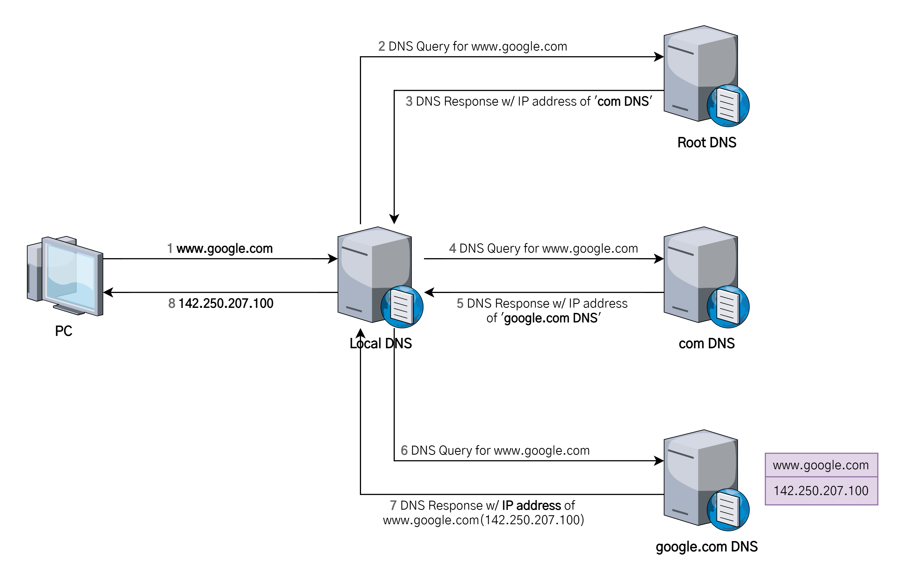

# DNS의 작동 원리

1. [DNS란?](#dns란)
2. [DNS의 작동 원리](#dns의-작동-원리)
3. [참고 자료](#참고-자료)

## DNS란?

DNS의 사전적 정의를 위키백과에서는 다음과 같이 설명하고 있다.

> 도메인 네임 시스템(Domain Name System, DNS)은 호스트의 도메인 이름을 호스트의 네트워크 주소로 바꾸거나 그 반대의 변환을 수행할 수 있도록 하기 위해 개발되었다.

사용자는 인터넷을 이용하여 검색이나 웹 서핑, 이메일 등을 사용할 때 도메인 이름(Domain Name)을 웹 브라우저의 주소창에 입력하고 웹 사이트에 접속한다. 예를 들어, 구글에 접속할 때 구글 서버는 숫자로 구성된 IP 주소로 통신하지만, 우리는 기억하기 쉬운 도메인 이름인 `google.com`을 사용한다.

이 때 **사용자가 입력한 도메인 이름(`www.google.com`)을 숫자인 IP 주소로 변환하는 과정이 필요한데, 이것을 담당하는 시스템이 바로 DNS**이다.

## DNS의 작동 원리

1. 웹 브라우저에 www.google.com을 입력하면 먼저 Local DNS에게 "www.google.com"이라는 host name에 대한 IP 주소를 질의하고, Local DNS에 없다면 다른 DNS name 서버 정보를 받는다. (**Root DNS** 정보를 전달 받음)
   - **Root DNS**(루트 네임서버)는 인터넷의 도메인 네임 시스템의 루트 존이다. 루트 존의 레코드 요청에 직접 응답하고 적절한 최상위 도메인에 대해 권한이 있는 네임 서버 목록을 반환함으로써 다른 요청에 응답한다. 전세계에 961개의 루트 DNS가 운영되고 있다.
2. Root DNS 서버에 "www.google.com"를 질의한다.
3. Root DNS 서버로부터 "com 도메인"을 관리하는 **TLD(Top-Level Domain)** 이름 서버 정보를 전달받는다.
   - TLD는 .com을 관리하는 서버를 칭한다.
4. TLD에 "www.google.com"을 질의한다.
5. TLD에서 "google.com"을 관리하는 DNS 정보를 전달한다.
6. "google.com" 도메인을 관리하는 DNS 서버에 "www.google.com" 호스트 네임에 대한 IP 주소를 질의한다.
7. Local DNS 서버에게 "www.google.com에 대한 IP 주소는 142.250.207.100이다."라고 응답한다.
8. Local DNS는 www.google.com에 대한 IP 주소를 캐싱하고 IP 주소 정보를 전달한다.

## 참고 자료

- [DNS와 작동원리](https://velog.io/@goban/DNS%EC%99%80-%EC%9E%91%EB%8F%99%EC%9B%90%EB%A6%AC)
- [DNS (Domain Name System) 개념 및 동작 원리](https://ja-gamma.tistory.com/entry/DNS%EA%B0%9C%EB%85%90%EB%8F%99%EC%9E%91%EC%9B%90%EB%A6%AC)
