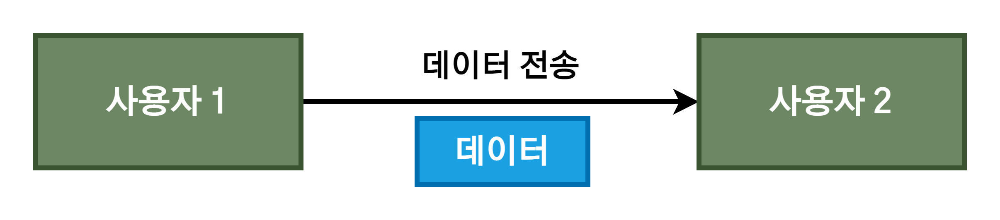
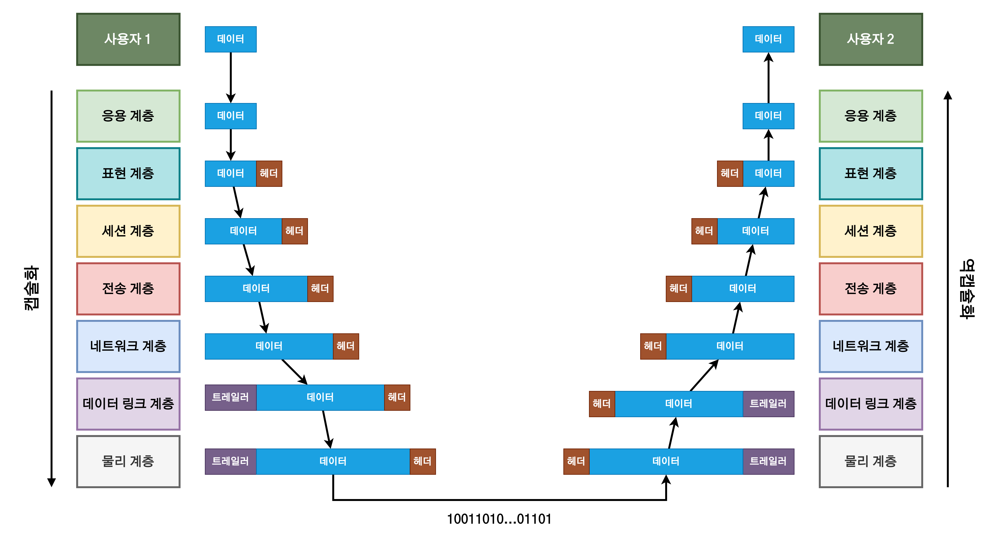

# OSI 7계층과 TCP/IP 4계층

1. [OSI 7계층](#osi-7계층)
2. [TCP/IP 4계층](#tcpip-4계층)
3. [OSI 7계층 vs TCP/IP 4계층](#osi-7계층-vs-tcpip-4계층)
   1. [공통점](#공통점)
   2. [차이점](#차이점)
4. [캡슐화(Encapsulation)와 역캡슐화(Decapsulation)](#캡슐화encapsulation와-역캡슐화decapsulation)
5. [참고 자료](#참고-자료)

## OSI 7계층

- OSI 모델은 국제표준화기구(ISO)에서 개발된 **네트워크 통신을 표준화한 모델**로, 통신 시스템을 7단계로 나누어 설명한 것이다.
- OSI는 네트워크 통신을 체계적으로 다루는 ISO 표준 개방시스템 상호연결(OSI) 모델이다. 이 모델은 1984년에 정의되었다.
- 개방시스템(Open System)이란 기반구조와 관계없이 시스템간의 통신을 제공하는 프로토콜의 집합이다.
- 계층구조를 가짐으로써 각 구간별로 데이터의 움직임을 파악할 수 있고, 트러블슈팅이 용이해지며 각기 다른 벤더사와의 호환성도 해결할 수 있다.

## TCP/IP 4계층

- TCP/IP는 현재의 인터넷에서 컴퓨터들이 서로 정보를 주고받는데 쓰이는 통신 규약(프로토콜)의 모음이다.
- 1960년대 말 미국방성의 연구에서 시작되어 1980년대 초 프로토콜 모델이 공개되었다.
- 하드웨어, 운영체제, 접속매체에 관계없이 동작할 수 있는 개방성을 가진다.

> **TCP/IP 4계층? 5계층?**
>
> TCP/IP 4계층에서 시작한 네트워크 표준이 꾸준히 갱신되면서 하위 레이어가 다시 세분화되었다. TCP/IP 4계층의 네트워크 인터페이스 계층을 데이터 링크 계층과 물리 계층으로 나누어져서 TCP/IP 5계층 모델이 되었다.

## OSI 7계층 vs TCP/IP 4계층

### 공통점

- OSI 7계층과 TCP/IP 4계층 모델 모두 **계층형**이라는 공통점이 있으며 **각 계층은 하위 계층의 기능을 이용**하고, **상위 계층에게 기능을 제공**한다.
  - 대표적인 예로, H**TTP는 TCP와 IP를 이용해서 작동**한다.
- 일반적으로 **상위 계층의 프로토콜은 소프트웨어**로, **하위 계층의 프로토콜은 하드웨어**로 구현된다.
  - 물리 계층의 통신은 케이블을 통한 전기 신호로 이루어진다.

### 차이점

- TCP/IP 프로토콜이 OSI 모델보다 먼저 개발되었다. 그러므로 TCP/IP 프로토콜의 계층은 OSI 모델의 계층과 정확하게 일치하지 않는다.
  - 세션(Session)과 표현(Presentaion) 2개의 계층이 TCP/IP 프로토콜 그룹에는 존재하지 않는다.
- TCP/IP는 인터넷 개발 이후 계속 표준화되어 신뢰성이 우수한 반면, OSI 7계층 모델은 표준이 되기는 하지만 실질적인 구현 예시가 드물고, 실무에 적용하기 복잡하여 실질적으로 사용되지 않고 있다.
- **OSI 7계층은 장비 개발과 통신 자체를 어떻게 표준으로 잡을지 참조하는 용도**로 쓰이는 반면에 **실질적인 통신 자체는 TCP/IP 프로토콜을 사용**한다.

## 캡슐화(Encapsulation)와 역캡슐화(Decapsulation)

- 캡술화 : **통신 프로토콜의 특성을 포함한 정보를 헤더(Header)에 포함시켜서 하위 계층에 전송하는 것**을 말한다.
- 역캡슐화 : 통신 상대측(수신측)에서 이러한 헤더를 **역순으로 제거하면서 원래의 데이터를 얻는 과정**을 말한다.

예시를 들자면, **사용자는 최상위 계층인 응용 계층**에서 인터넷 접속(HTTP), 메일 전송(SMTP), 파일 전송(FTP), 원격 로그인(Telnet) 등의 작업을 수행한다.

각 사용자 입장에서 보면 데이터가 그냥 전송되는 것처럼 보인다. 하지만 이 과정을 OSI 7계층 관접의 캡슐화/역캡슐화 과정까지 바라보면 다음과 같다.

사용자가 전송하고자 하는 데이터는 각 프로토콜의 정보를 **헤더에 포함시켜서 하위 계층에 전달**하고(**캡슐화**), 이것은 최종적으로 물리 계층에서 Binary 데이터로 변환되어 전송된다.

상대측에서는 이러한 헤더를 **역순으로 하나씩 제거하면서 상위 계층으로 데이터를 전달**하고(**역캡슐화**), 최종적으로 원본 데이터를 수신하게 된다.

## 참고 자료

- [OSI 7 Layer 과 TCP/IP 4 Layer(TCP/IP Protocol suite) 비교](https://goitgo.tistory.com/25)
- [프로토콜이란? OSI 7계층, TCP/IP 4계층이란?](https://doozi0316.tistory.com/entry/%ED%94%84%EB%A1%9C%ED%86%A0%EC%BD%9C%EC%9D%B4%EB%9E%80-OSI-7%EA%B3%84%EC%B8%B5-TCPIP-4%EA%B3%84%EC%B8%B5%EC%9D%B4%EB%9E%80)
