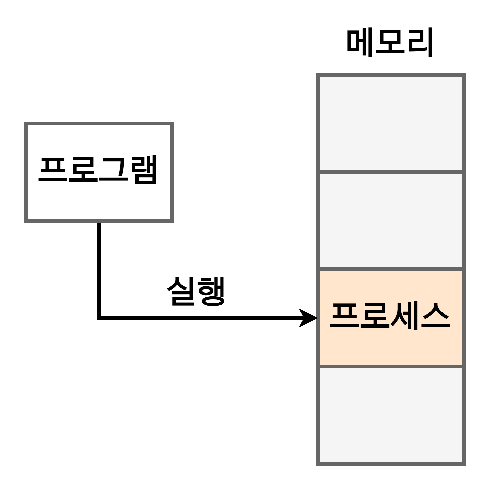

# 프로세스(Process)와 스레드(Thread)의 차이

1. [프로세스와 스레드의 정의](#프로세스와-스레드의-정의)
2. [프로그램 -> 프로세스 -> 스레드](#프로그램-->-프로세스-->-스레드)
   1. [프로그램 -> 프로세스](#프로그램-→-프로세스)
3. [참고 자료](#참고-자료)

## 프로세스와 스레드의 정의

프로세스와 스레드의 정의는 아래와 같다.

> - **프로세스** : 운영체제로부터 자원을 할당받은 **작업**의 단위.
> - **스레드** : 프로세스가 할당받은 자원을 이용하는 **실행 흐름**의 단위.

얼핏봐서는 구분하기 어려운 정의지만, 중요한 설명은 충분히 포함되어 있는 문장이다. 우선 프로세스의 정의에서 **작업**이라는 단어와 스레드의 정의에서 **실행 흐름**이라는 단어를 기억하자.

## 프로그램 -> 프로세스 -> 스레드

### 프로그램 -> 프로세스

프로세스와 스레드에 대해 알아보기 전에 프로그램에 대해 짚어본다. 흔히 프로그램이라는 단어를 듣고 써왔지만 프로그램의 정의를 말해보라 하면 쉽게 대답하기 어렵다. 프로그램의 정의는 다음과 같다.

> 프로그램은 **파일이 저장 장치에 저장되어 있지만 메모리에는 적재되지 않은 정적인 상태**를 말한다.

이를 풀어서 설명하면 아래와 같다.

1. **메모리에 적재되지 않은**  
   아직 운영체제가 프로그램에게 독립적인 메모리 공간을 할당해주지 않았다는 뜻이다. 모든 프로그램은 운영체제가 실행되기 위한 메모리 공간을 할당해줘야 실행될 수 있다.
2. **정적인 상태**  
   정적(靜的)이라는 단어 그대로, 움직이지 않는 상태를 의미한다. 한 마디로 아직 실행되지 않고 가만히 있다는 뜻이다.

정리하자면 프로그램은 '아직 실행되지 않은 실행 파일 그 자체'를 의미하는 말이다. Windows의 `*.exe` 파일이나 MacOS의 `*.dmg` 파일 등이 대표적이다. 쉽게 말해서 **코드 덩어리**라고 할 수 있다.

실행 파일(프로그램)에게 의미를 부여하기 위해 프로그램을 실행하면 먼저 해당 파일이 컴퓨터 메모리에 올라간다. 이 상태를 **동적(動的) 상태**라고 하며, 이 상태의 프로그램을 **프로세스**라고 한다. 위키피디아에서는 프로세스에 대해 **실행되고 있는 컴퓨터 프로그램**이라고 정의를 내린 바 있고, 스케줄링 단계에서의 '작업'과 동일한 단어라고 봐도 무방하다고 보고 있다. 실제로 프로세스라는 단어는 작업 중인 프로그램을 의미하는 단어이기 때문이다.

지금까지의 내용을 요약하면 아래와 같다.

> 프로그램의 코드 덩어리 파일이며, 이를 실행한 것이 프로세스이다.

## 참고 자료

[프로세스와 스레드의 차이](https://velog.io/@raejoonee/%ED%94%84%EB%A1%9C%EC%84%B8%EC%8A%A4%EC%99%80-%EC%8A%A4%EB%A0%88%EB%93%9C%EC%9D%98-%EC%B0%A8%EC%9D%B4)
