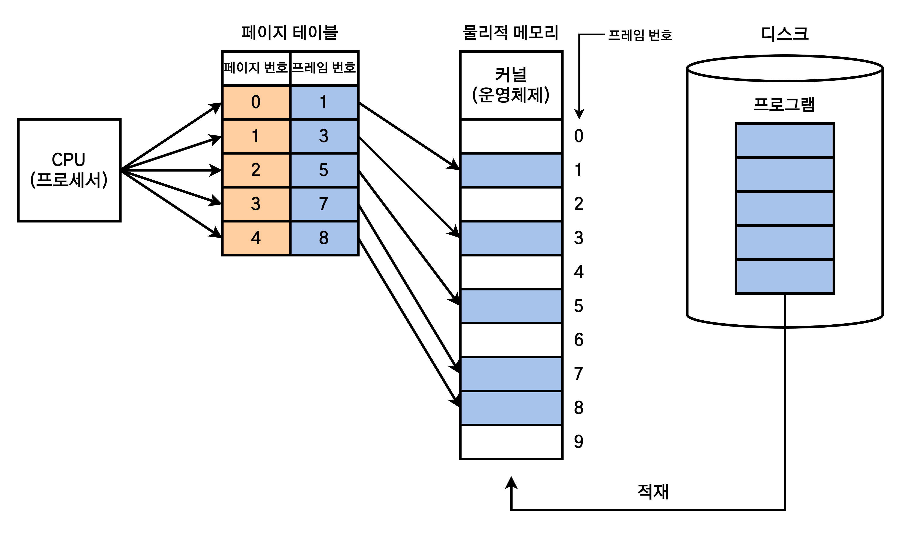

# 페이징

1. [페이징이란?](#페이징이란)
2. [메모리 단편화(Memory Fragmentation)](#메모리-단편화memory-fragmentation)
4. [참고 자료](#참고-자료)

## 페이징이란?

> 프로세스를 일정한 크기의 작은 단위인 페이지(Page)로 나누어 물리적 메모리의 서로 다른 위치에 저장하는 메모리 관리 기법.

페이징 기법은 프로세스를 동일한 크기의 페이지로 나눈 후 물리적 메모리의 각 공간에 저장하는 방법으로, 메모리 단편화 문제 중 내부 단편화 문제를 해결하기 위해 등장했다.

여기서 프로세스를 나눈 조각을 페이지(Page)라 하고, 메모리를 나눈 조각을 프레임(Frame)이라 한다. 즉, 프로세스는 페이지의 집합이고, 메모리는 프레임의 집합이다.

프로세스를 정상적으로 사용하려면 MMU의 재배치 레지스터 여러 개를 사용해 각 페이지를 물리 주소로 변경(주소 바인딩)해야 한다. 이같은 다수의 재배치 레지스터를 <b>페이지 테이블(Page Table)</b>이라 한다.

## 메모리 단편화(Memory Fragmentation)

페이징 기법을 사용하면 프로세스의 논리적 주소 공간과 물리적 메모리가 같은 크기의 페이지 단위로 나누어지기 때문에 외부 단편화는 해결할 수 있으나, 내부 단편화 문제가 발생할 수 있다는 문제가 있다.

페이징 기법에서는 프로세스 크기가 페이지 크기의 배수가 아닐 경우, 마지막 페이지에서 낭비되는 공간이 발생하게 된다. 이를 <b>내부 단편화(Internal Fragment)</b>라고 한다.

## 참고 자료

- [[운영체제(OS)] 13. 페이징](https://velog.io/@codemcd/%EC%9A%B4%EC%98%81%EC%B2%B4%EC%A0%9COS-13.-%ED%8E%98%EC%9D%B4%EC%A7%95)
