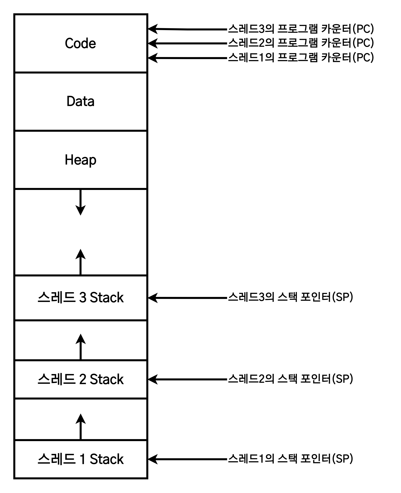
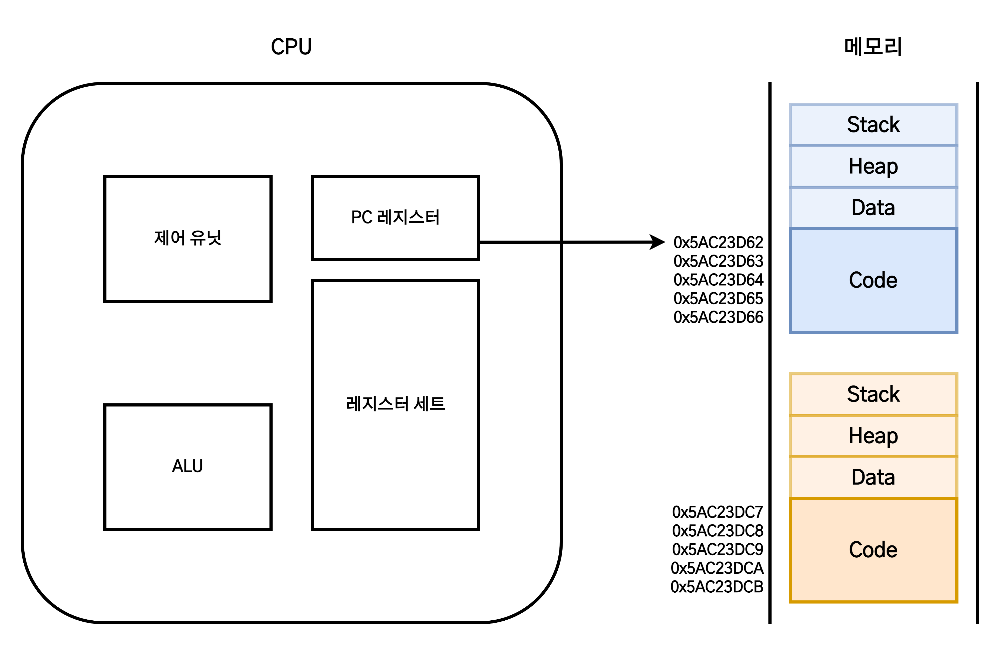
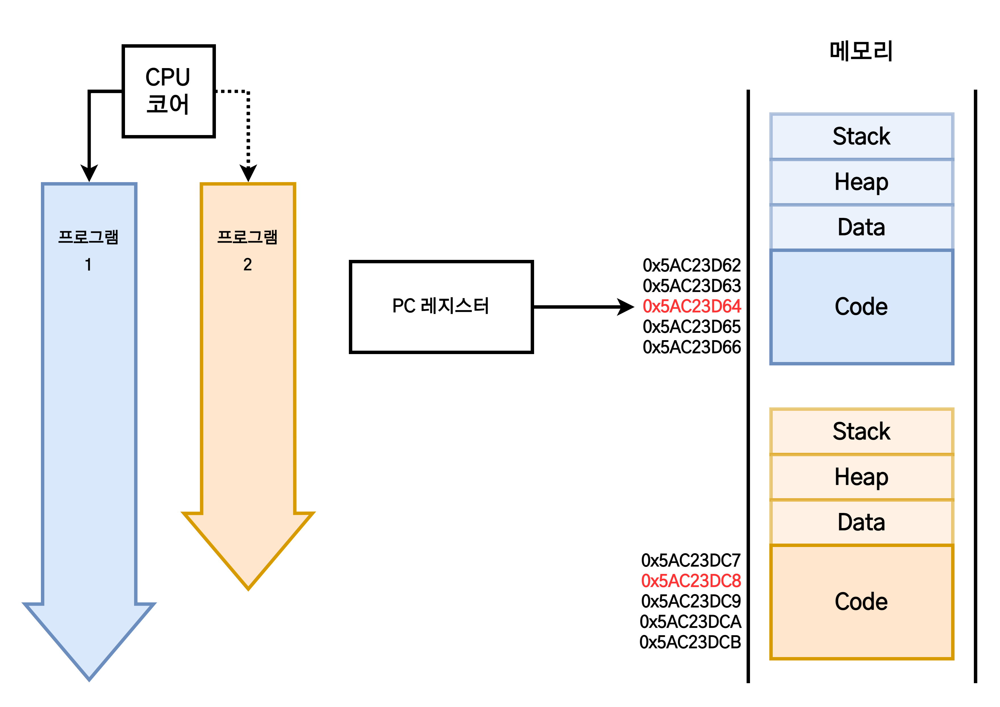

# 프로세스와 스레드

1. [프로세스](#프로세스)
   1. [구조](#구조)
      1. [PCB(Process Control Block)](#pcbprocess-control-block)
2. [스레드](#스레드)
   1. [구조](#구조-1)
3. [동시성과 병렬성](#동시성과-병렬성)
4. [멀티 프로세스와 멀티 스레드](#멀티-프로세스와-멀티-스레드)
   1. [멀티 프로세스](#멀티-프로세스)
      1. [프로세스 간 통신](#프로세스-간-통신)
   2. [멀티 스레드](#멀티-스레드)
   3. [멀티 프로세스 vs 멀티 스레드](#멀티-프로세스-vs-멀티-스레드)
   4. [컨텍스트 스위칭(Context Switching)](#컨텍스트-스위칭context-switching)
5. [참고 자료](#참고-자료)

## 프로세스

> **실행 파일(프로그램)이 저장장치로부터 메모리에 적재되어 CPU를 할당받은 작업 단위.**

프로세스(Process)는 디스크의 프로그램이 **메모리에 적재**되어 **CPU에 의해 실행**된 것을 말한다. 이 때 운영체제로부터 시스템 자원을 할당받는데, 크게 다음과 같다.

- 할당받는 시스템 자원
  - CPU 시간
  - 운영을 위한 주소 공간
  - Code, Data, Stack, Heap의 구조로 된 독립된 메모리 영역

### 구조

프로세스에 할당되는 메모리 영역은 다음의 네 가지 영역으로 구성되어 있다.

- **Code(Text) 영역**  
  컴파일 후 기계어로 변역된 **프로그램의 코드가 저장**되는 메모리 영역.
- **Data 영역**  
  프로그램의 **전역 변수와 static 변수가 저장**되는 메모리 영역.
- **Heap 영역**  
  **동적으로 할당(malloc)/해제(free)** 되는 메모리 영역.
- **Stack 영역**  
  함수 호출 시 생성되는 **지역 변수, 매개 변수**가 저장되는 **임시 메모리 영역**

각 프로세스는 별도의 메모리 영역을 **독립적으로 할당**받는다. 메모리에 다수의 프로세스가 적재되어도 각 프로세스들은 타 프로세서의 영역에 접근할 수 없으며, 접근하려면 IPC 통신이 필요하다.

CPU는 PC(Program Counter) 레지스터가 가리키는 메모리 주소값에서 명령어를 읽어들여 연산을 수행한다.

- **레지스터(Register)**  
  레지스터는 CPU가 프로세스를 처리하는 데 필요한 정보를 일시적으로 저장하는 기억장치다. 주요 특수 레지스터는 다음과 같다.
  - **PC(Program Counter) 레지스터**
    - **다음에 실행될 코드(명령어, instruction)의 주소값**을 저장한다.
    - 메모리에 적재된 프로세스 **Code 영역**의 명령어 중 다음번 연산에서 읽어야 하는 명령어의 주소값을 PC 레지스터가 순차적으로 가리키고, 해당 명령어를 읽어와서 CPU가 연산을 수행하게 되면 프로세스가 실행된다.
  - **SP(Stack Pointer) 레지스터**
    - 코드의 함수가 실행될 때, 스택 프레임의 최상단 주소를 가리키는 레지스터다.

#### PCB(Process Control Block)

> 운영체제가 프로세스를 제어하기 위한 정보(컨텍스트)를 저장하는 장소로, 프로세스의 상태 정보를 저장하는 자료구조.

PCB에는 프로세스의 중요한 정보(컨텍스트)가 포함되어 있다.

- **컨텍스트(Context)**
  - 컨텍스트는 **프로세스의 현재 수행 상태에 대한 총체적인 정보**를 의미한다.
  - 시분할 시스템에서는 한 프로세스가 아주 짧은 시간동안 CPU를 점유하며 일부 명령을 수행한 후 타 프로세스에게 점유를 넘긴다.
  - 추후 다시 CPU 점유를 받았을 때 작업을 이어서 진행하기 위해 **이전에 어디까지 명령을 수행하고, 레지스터에는 어떤 값이 저장되어 있는지**에 대한 정보가 필요한데, 이 정보를 **컨텍스트**(Context)라고 부른다.

운영체제는 프로세스 관리를 위해서 프로세스 생성과 동시에 고유한 PCB를 생성하며, 일반 사용자가 접근할 수 없도록 **커널 내부의 보호된 메모리 영역**에 저장한다.

PCB에 저장되는 정보들은 다음과 같다.

|                 정보                 |                                                                설명                                                                |
| :----------------------------------: | :--------------------------------------------------------------------------------------------------------------------------------: |
|    프로세스 상태(Process Status)     |                생성(new), 준비(ready), 실행(running), 대기(waiting), 종료(terminated) 등 프로세스의 각 상태를 의미                 |
|    프로세스 번호(Process Number)     |                                                프로세스를 고유하게 구분하는 식별 ID                                                |
| 프로그램 카운터(PC, Program Counter) |                                         해당 프로세스가 실행할 다음 명령어의 주소를 가리킴                                         |
|          레지스터(Register)          |                                      컴퓨터 유형에 따라 각기 다른 여러 유형의 레지스터 정보들                                      |
|      메모리 제한(Memory Limits)      | 운영체제에서 사용하는 메모리 관리 시스템 정보들. 베이스 레지스터, 리미트 레지스터, 페이지 테이블 또는 세그먼트 테이블 등이 포함됨. |
|                 ...                  |                                                                                                                                    |

프로세스들이 PCB와 함께 메모리에 적재된 모습은 다음과 같다.

> **참고**  
> **프로세스 상태**는 크게 **실행**(running), **준비**(ready), **대기**(봉쇄, wait, sleep, bloacked)의 세가지 상태로 구분된다.
>
> |    구분    |                                  설명                                  |
> | :--------: | :--------------------------------------------------------------------: |
> |    실행    |         프로세스가 CPU를 **점유**하고 **명령을 수행중**인 상태         |
> |    준비    | CPU를 할당받기만 하면 **즉시** 명령을 수행할 수 있도록 **준비된 상태** |
> | 대기(봉쇄) |  CPU를 할당받더라도 **명령을 수행할 수 없는 상태** (I/O 작업 대기 등)  |

프로세스는 CPU를 할당받아 작업을 처리하다가 프로세스 전환이 발생하면 진행하던 작업을 저장한 후 CPU를 반환해야 한다. 이때 작업의 진행 상황을 모두 PCB에 저장한다. 그리고 다시 CPU를 할당받게 되면 PCB에 저장되었던 내용을 불러와 종료되었던 시점부터 작업을 다시 수행한다.

## 스레드

> 하나의 프로세스 내에서 실행되는 동작(기능, Function)의 단위로, 다른 스레드와 프로세스의 자원과 공간을 공유하면서 사용.

스레드(Thread)는 프로세스 안에서 **함수를 독립적으로 호출함으로써 독립적으로 기능을 수행**하며, 프로세스 내의 주소 공간이나 자원을 타 스레드와 공유할 수 있다.

### 구조

스레드는 Code, Data, Heap 영역은 타 스레드와 공유하고 **Stack 영역은 독립적으로 할당**받는다. PC 레지스터 역시 스레드마다 독립적으로 할당된다.

> **스택을 스레드마다 독립적으로 할당하는 이유**
>
> - 스택은 함수 호출시 전달되는 인자, 복귀 주소값 및 함수 내에서 선언하는 변수 등을 저장하기 위해 사용되는 메모리 공간이다.
> - **스택 메모리 공간이 독립적이라는 것은 독립적인 함수 호출이 가능함을 의미**한다. 이는 독립적인 실행 단위가 추가된다는 것이다. 따라서 스레드의 정의에 따라 독립적인 실행 단위를 추가하기 위한 최소 조건으로 독립된 Stack을 할당한다.

> **PC 레지스터를 스레드마다 독립적으로 할당하는 이유**
>
> - PC 레지스터의 주소값은 스레드가 명령어를 어디까지 수행했는지를 나타낸다.
> - 스레드도 프로세스와 마찬가지로 스케쥴러에 의해 CPU를 할당받고 반환하기를 반복하는데, 때문에 명령어가 연속적으로 수행되지 못하므로 작업을 어디까지 수행했는지 기억할 필요가 있다. 따라서 PC 레지스터를 독립적으로 할당한다.

## 동시성과 병렬성

여러 작업을 같은 시점에 함께 수행할때 작업을 동시에 실행한다고 말한다. 여기서 '동시'란 **동시성(concurrency)과 병렬성(parallelism)** 두 가지로 분류된다.

- **동시성(concurrency)**  
  CPU 코어가 **1개**일 때, 여러 프로세스를 짧은 시간동안 **번갈아가며 연산**하는 것을 의미한다.(시분할 시스템, Time sharing system)
- **병렬성(parallelism)**  
  CPU 코어가 **여러개**일 때, 각각의 코어가 각각의 프로세스를 연산함으로써 프로세스가 **동시에 실행되는 것**을 의미한다.

|                    동시성                     |                  병렬성                   |
| :-------------------------------------------: | :---------------------------------------: |
|                   싱글 코어                   |                 멀티 코어                 |
| **겉으로는** 동시에 실행되는 것처럼 보이는 것 | **실제로** 동시에 여러 작업이 처리되는 것 |
|                  논리적 개념                  |                물리적 개념                |

## 멀티 프로세스와 멀티 스레드

### 멀티 프로세스

> 다수의 프로세서를 구성하여 각 프로세스가 하나의 작업을 처리하도록 하는 것.

멀티 프로세스로 구성된 시스템은 PC 레지스터가 현재 작업중인 프로세스의 Code 영역을 가리키는데, 이를 통해 **CPU는 PC 레지스터 가리키는 명령어를 읽고 연산을 수행**한다. 작업 수행 모습을 표현하면 다음과 같다.

멀티 프로세스는 다음과 같은 장단점을 가진다.

- 장점
  - 여러 개의 자식 프로세스 중 하나에 문제가 발생하면 해당 자식 프로세스만 죽고, 그 이상의 다른 영향이 확산되지 않아 **안전**하다.
- 단점
  - Context Switching 오버헤드  
    각 프로세스는 독립된 메모리 영역을 할당받기에 공유 메모리가 없다. 따라서 캐시 메모리 초기화 등 무거운 작업이 진행되고 많은 시간이 소모되는 등의 오버헤드가 발생할 수 있다.
  - 프로세스 간 통신 기법 IPC  
    각 프로세스는 독립된 메모리 영역을 할당받기에 변수나 자료구조를 공유할 수 없다. 따라서 IPC라는 어렵고 복잡한 통신 방법을 사용해야 한다.

#### 프로세스 간 통신

프로세스는 독립적인 주소 공간을 갖기 때문에 다른 프로세스의 주소 공간을 참조할 수 없다. 하지만 경우에 따라 운영체제는 프로세스간 자원 접근 매커니즘인 **프로세스 간 통신(Inter Process Communication, IPC) 기법**을 제공한다.

IPC의 대표적인 모델 두가지는 다음과 같다.

- **공유메모리(Shared Memory)**  
  프로세스들이 주소 공간의 일부를 공유하고, 공유된 메모리 영역에 읽기/쓰기를 통해 통신을 수행하는 방법이다.
  - 첫 공유 메모리 할당을 제외하면 커널의 관여 없이 통신이 가능할 수 있기에 속도가 빠르다는 장점이 있다.
  - 여러 프로세스들이 동시에 메모리에 접근할 때 일관성 문제가 발생할 수 있기 때문에, 동기화 과정이 필요하다는 단점이 있다.
- **메시지 전달(Message Passing)**  
  시스템 콜(System Call)을 통해 구현되며, 커널을 통해 `send(message)`와 `receive(message)`라는 두가지 연산으로 두 프로세스가 통신하는 방법이다.
  - 커널을 통해 통신이 제어되기에 안전하며, 커널이 동기화를 제공해준다는 장점이 있다.
  - 커널을 통해서 데이터를 주고받기 때문에 속도가 느리다는 단점을 가지고 있다.
  - 메시지 전달의 구현 기법으로는 PIPE, FIFO, 메시지 큐, 소켓, 사마포가 있다.

### 멀티 스레드

> 여러 개의 스레드를 구성한 후 각 스레드가 하나의 작업을 처리하도록 하는 것.

프로세스의 작업을 다수의 스레드로 수행하도록 하는 것을 말한다.

윈도우나 리눅스 등 많은 OS들이 멀티 프로세싱을 지원하나, 멀티 스레딩을 기본으로 하고 있다. 웹 서버가 대표적인 멀티 스레드 응용 프로그램 중 하나다.

멀티 스레드에서는 각 스레드마다 PC 레지스터를 가지고 있는데, 각 PC 레지스터는 Context Switch가 일어날 때 코드 주소를 저장하여 다시 작업을 진행할 때 사용한다.

멀티 스레드는 다음과 같은 장단점을 가진다.

- 장점
  - 메모리 공간과 시스템 자원 소모가 적다.
  - 스레드 간 통신시, 전역 변수의 공간 또는 동적으로 할당된 공간인 Heap 영역을 이용해 데이터를 주고 받으므로 통신 방법이 간단하다.
  - Context Switching 시, 캐시 메모리를 배울 필요가 없기에 비용이 적고 더 빠르다.
  - 상술한 이유들로 인해 시스템 처리량이 향상되고 자원 소모가 줄어들며, 자연스럽게 프로그램의 응답 시간이 단축된다.
- 단점
  - 서로 다른 스레드가 Data, Heap 영역 등을 공유하기 때문에 특정 스레드가 다른 스레드에서 사용중인 변수나 자료구조에 접근하여 잘못된 값을 읽거나 수정하는 등의 동기화 문제가 발생한다.
  - 주의 깊은 설계가 필요하며, 디버깅이 까다롭다.

### 멀티 프로세스 vs 멀티 스레드

멀티 스레드는 멀티 프로세스보다 **적은 메모리 공간을 차지**하고 **Context Switching이 빠르다**는 장점이 있지만, 장애로 인해 특정 스레드가 종료되면 전체 스레드가 종료될 위험과 동기화 문제를 가지고 있다.

반면, 멀티 프로세스는 하나의 프로세스가 죽더라도 다른 프로세스에 영향을 끼치지 않아 **안정적**이라는 장점이 있지만, 멀티 스레드보다 **많은 메모리 공간과 CPU 시간을 차지**한다는 단점이 존재한다.

이 두가지 방법은 **동시에 여러 작업을 수행한다는 점에서 유사**하지만, 적용하려는 시스템에 따라 적합성이 다르므로 대상 시스템에 특징을 고려해서 적합한 방식을 적용해야 한다.

#### 멀티 프로세스 대신 멀티 프로세스를 사용하는 이유

- 프로그램을 여러 개 실행하는 것보다는 하나의 프로그램에서 여러 작업을 동시에 해결하는 것이 더 효율적이기 때문이다.
- **프로세서를 생성하여 자원을 할당하는 시스템 콜(System Call)이 줄어들어 자원을 효율적으로 관리할 수 있다.**
- Context Switching 시, 캐시를 비울 필요 없이 Stack 영역만 초기화하면 되기에 비용이 적고 더 빠르다.
- 스레드는 Stack 영역을 제외한 프로세스 내의 모든 메모리를 공유하기에 데이터 전달이 간단하므로, 프로세스가 IPC를 사용하는 것에 비해 비용이 적고 더빠르다.

### 컨텍스트 스위칭(Context Switching)

> 한 프로세스에서 다른 프로세스로 **CPU의 제어권을 넘겨주는 것**

CPU는 한번에 하나의 프로세스만 처리할 수 있다.

다수의 프로세스를 처리해야 할 때 현재 진행중인 작업(프로세스, 스레드)의 상태를 PCB에 저장하고 다음에 진행할 작업의 PCB를 읽어 적용하는 과정을 말한다.

과정은 다음과 같다.

1. 현재 실행중인 작업의 PCB 정보를 저장한다.
2. 다음에 실행할 작업의 PCB 정보를 읽고 레지스터에 적재한다.
3. 적재된 작업의 작전 연산을 이어서 수행한다.

Context Switching을 통해 멀티 프로세딩, 멀티 스레딩을 수행할 수 있으나, 많은 비용이 필요하다.

- 캐시 초기화
- 메모리 매핑 초기화
- 커널이 반드시 실행되어야 함

프로세스는 스레드보다 더 많은 비용이 소모된다. 스레드는 Stack 영역 외의 모든 메모리를 공유하기에 Stack 영역만 초기화하면 되는 반면 프로세스는 그렇지 않기 때문이다.

## 참고 자료

- [프로세스와 스레드](https://velog.io/@shin6403/%ED%94%84%EB%A1%9C%EC%84%B8%EC%8A%A4%EC%99%80-%EC%8A%A4%EB%A0%88%EB%93%9C-%EA%B7%B8%EB%A6%AC%EA%B3%A0-%EC%9E%90%EB%B0%94%EC%8A%A4%ED%81%AC%EB%A6%BD%ED%8A%B8-%EB%8F%99%EC%9E%91%EC%9B%90%EB%A6%AC)
- [[OS] 프로세스 구조와 레지스터 알아보기](https://eunjinii.tistory.com/m/40)
- [[5] 프로세스](https://jobdong7757.tistory.com/134)
- [프로세스 제어 블록 (PCB: Process Control Block) 알아보기](https://yoongrammer.tistory.com/52)
- [컨텍스트 스위칭이란](https://applefarm.tistory.com/105)
- [프로세스와 스레드](https://github.com/WooVictory/Ready-For-Tech-Interview/blob/master/Operating%20System/%ED%94%84%EB%A1%9C%EC%84%B8%EC%8A%A4%EC%99%80%20%EC%8A%A4%EB%A0%88%EB%93%9C.md)
- [멀티 프로세스 vs 멀티 스레드](https://velog.io/@dailyhyun/%EB%A9%80%ED%8B%B0-%ED%94%84%EB%A1%9C%EC%84%B8%EC%8A%A4-vs-%EB%A9%80%ED%8B%B0-%EC%8A%A4%EB%A0%88%EB%93%9C)
- [프로세스 간 통신(IPC, Inter-Process Communication)](https://itpenote.tistory.com/722)
