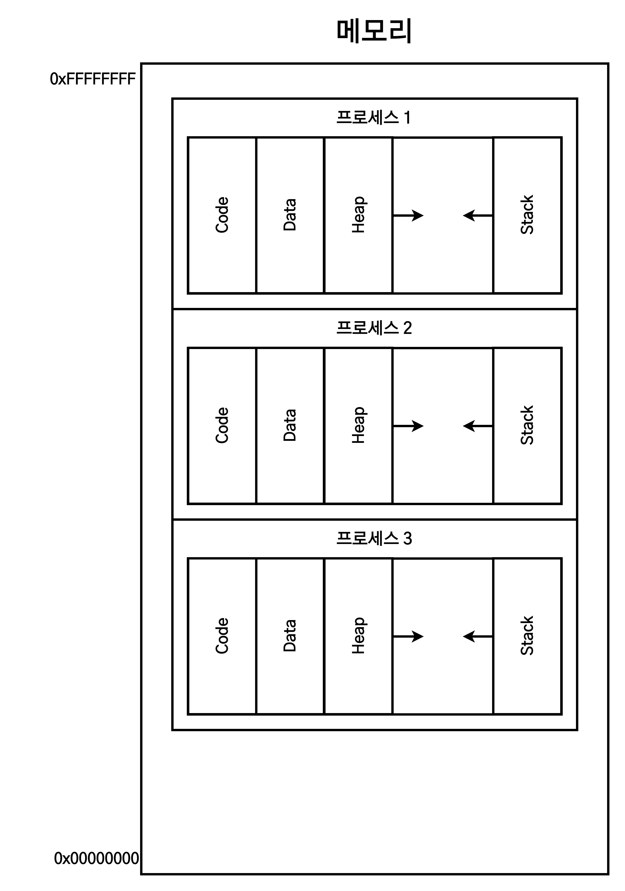
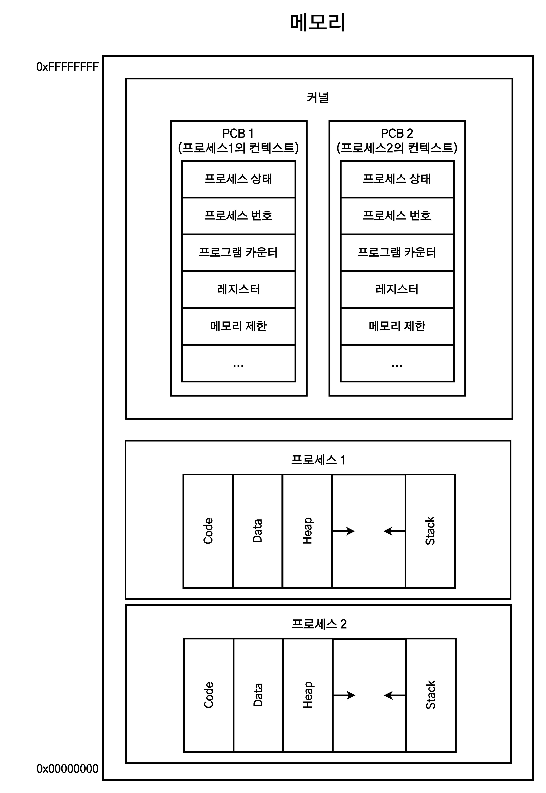
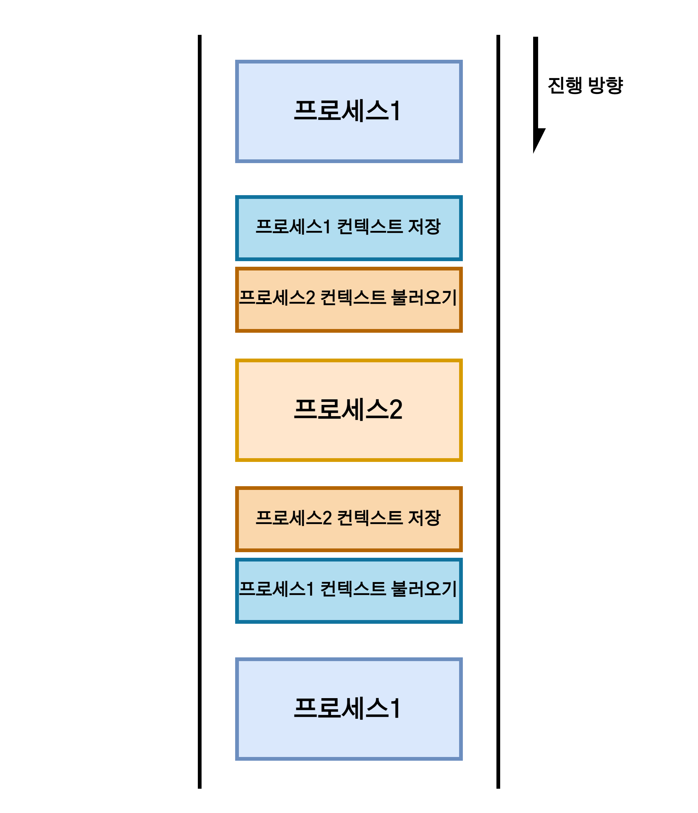

# 프로세스

1. [정의](#정의)
2. [구조](#구조)
3. [레지스터(Register)](#레지스터register)
4. [멀티 프로세스(Multi Process)의 종류](#멀티-프로세스multi-process의-종류)
5. [멀티 프로세스 - 동시성 기준](#멀티-프로세스---동시성-기준)
   1. [메모리 관리](#메모리-관리)
   2. [CPU의 연산과 PC 레지스터](#cpu의-연산과-pc-레지스터)
   3. [컨텍스트(Context)](#컨텍스트context)
   4. [PCB(Process Control Block)](#pcbprocess-control-block)
6. [참고 자료](#참고-자료)

## 정의

> **실행 파일(프로그램)이 메모리에 적재되어 CPU를 할당받아 실행된 것.**

프로세스(Process)란 **실행중인 프로그램**(Program in execution)을 뜻한다. 즉, 실행 파일의 형태로 존재하던 프로그램이 **메모리에 적재**되어 **CPU에 의해 실행**(연산)되는 것을 프로세스라고 일컫는다.

1. 프로그래밍 언어로 작성된 코드를 컴파일(Compile)하면 저장장치(하드디스크)에 저장된다. 이 상태를 **프로그램**이라고 한다.
2. CPU는 RAM 메모리에 적재된 것만 읽을 수 있고, 저장장치에 저장된 프로그램은 읽을 수 없다.
3. 따라서 프로그램을 실행시키려면 RAM 메묄에 적재해야 한다. 메모리 적재 후 CPU를 할당받으면 **프로세스**가 된다.

## 구조

프로그램이 CPU에서 실행되기 위해선 **해당 내용이 메모리에 적재된 상태**여야 한다. 메모리는 **CPU가 직접 접근할 수 있는 컴퓨터 내부의 기억장치**이다.

프로세스에 할당되는 메모리 공간은 다음의 네 가지 영역으로 구성되어 있고, **각 프로세스마다 독립적으로 할당**받는다.

- **Code(Text) 영역**  
  컴파일 후 기계어로 변역된 **프로그램의 코드가 저장**되는 메모리 영역.
- **Data 영역**  
  프로그램의 **전역 변수와 static 변수가 저장**되는 메모리 영역.
- **Heap 영역**  
  **동적으로 할당(malloc)/해제(free)** 되는 메모리 영역.
- **Stack 영역**  
  함수 호출 시 생성되는 **지역 변수, 매개 변수**가 저장되는 **임시 메모리 영역**

## 레지스터(Register)

레지스터(Register)는 CPU가 프로세스를 처리하는 데 필요한 정보를 일시적으로 저장하는 기억장치다. 주요 특수 레지스터는 다음과 같다.

- **PC(Program Counter) 레지스터**  
  **다음에 실행될 코드(명령어, instruction)의 주소값**을 저장한다.
  - 메모리에 적재된 프로세스 **Code 영역**의 명령어 중 다음번 연산에서 읽어야 하는 명령어의 주소값을 PC 레지스터가 순차적으로 가리키고, 해당 명령어를 읽어와서 CPU가 연산을 수행하게 되면 프로세스가 실행된다.
- **SP(Stack Pointer) 레지스터**  
  코드의 함수가 실행될 때, 스택 프레임의 최상단 주소를 가리키는 레지스터다.

## 멀티 프로세스(Multi Process)의 종류

> 2개 이상의 프로세스가 동시에 실행되는 것.

멀티 프로세스(Multi Process)는 말 그대로 다수의 프로세스가 동시에 실행되는 것이다. 여기서 '동시'란 **동시성(concurrency)과 병렬성(parallelism)** 두 가지를 의미한다.

- **동시성(concurrency)**  
  CPU 코어가 **1개**일 때, 여러 프로세스를 짧은 시간동안 **번갈아가며 연산**하는 것을 의미한다.(시분할 시스템, Time sharing system)
- **병렬성(parallelism)**  
  CPU 코어가 **여러개**일 때, 각각의 코어가 각각의 프로세스를 연산함으로써 프로세스가 **동시에 실행되는 것**을 의미한다.

|                  동시성                  |                병렬성                |
| :--------------------------------------: | :----------------------------------: |
|                싱글 코어                 |              멀티 코어               |
| **겉으로는** 동시에 실행되는 것으로 보임 | **실제로** 동시에 여러 작업이 처리됨 |

## 멀티 프로세스 - 동시성 기준

2개 이상의 프로세스가 동시에 실행될 때, **프로세스들은 CPU와 메모리를 공유**하게 된다. 메모리의 경우 여러 프로세스들이 각자의 메모리 영역을 차지하며 **동시에 적재**된다.

반면 **하나의 CPU는 매순간 하나의 프로세스만 연산**할 수 있다. 단지 CPU의 처리속도가 매우 빠르기에 아주 짧은 시간(수 ms)동안 **다수의 프로세스들이 CPU에서 번갈아 실행**되어 **사용자 입장에서는 여러 프로그램이 동시에 실행되는 것처럼 보인다.**

이처럼 CPU의 작업시간을 여러 프로세스들이 조금씩 나누어 쓰는 시스템을 **시분할 시스템**(Time sharing system)이라 한다.

### 메모리 관리

메모리에 다수의 프로세스가 적재되면 각 프로세스들이 타 프로세서의 영역을 침범하지 않고 **자신의 메모리 영역에만 접근**할 수 있도록 운영체제의 관리를 받게 된다.

### CPU의 연산과 PC 레지스터

CPU는 PC(Program Counter) 레지스터가 가리키는 주소값에서 명령어를 읽어 연산을 수행한다. [레지스터(Register)](#레지스터register) 항목 참조.

멀티 프로세스 시스템에서는 PC 레지스터가 현재 작업중인 프로세스의 코드 영역을 가리킨다. 즉, **CPU는 PC 레지스터가 가리키는 곳에 따라 프로세스를 변경하며 명령어를 읽고 연산을 수행한다.**

### 컨텍스트(Context)

> 컨텍스트(Context)는 **프로세스의 현재 수행 상태에 대한 총체적인 정보**를 의미한다. **PCB**(Process Control Blcok)에 저장된다.

시분할 시스템에서는 한 프로세스가 아주 짧은 시간동안 CPU를 점유하며 일부 명령을 수행한 후 타 프로세스에게 점유를 넘긴다. 때문에 추후 다시 CPU 점유를 받았을 때 작업을 이어서 진행하려면 **이전에 어디까지 명령을 수행하고, 레지스터에는 어떤 값이 저장되어 있는지**에 대한 정보가 필요하다. 이 정보를 **컨텍스트**(Context)라고 부른다.

### PCB(Process Control Block)

> 운영체제가 프로세스를 제어하기 위한 정보를 저장하는 장소로, 프로세스의 상태 정보를 저장하는 자료구조.

PCB에는 프로세스의 중요한 정보가 포함되어 있기에 일반 사용자는 접근할 수 없도록 보호된 메모리 영역에 저장된다. 일부 운영체제는 보호 받으면서도 비교적 접근하기 수월한 **커널 스택**에 PCB를 위치시킨다.

PCB는 일반적으로 다음과 같은 정보들을 가지고 있다.

|                 정보                 |                                                                설명                                                                |
| :----------------------------------: | :--------------------------------------------------------------------------------------------------------------------------------: |
|    프로세스 상태(Process Status)     |                생성(new), 준비(ready), 실행(running), 대기(waiting), 종료(terminated) 등 프로세스의 각 상태를 의미                 |
|    프로세스 번호(Process Number)     |                                                프로세스를 고유하게 구분하는 식별 ID                                                |
| 프로그램 카운터(PC, Program Counter) |                                         해당 프로세스가 실행할 다음 명령어의 주소를 가리킴                                         |
|          레지스터(Register)          |                                      컴퓨터 유형에 따라 각기 다른 여러 유형의 레지스터 정보들                                      |
|      메모리 제한(Memory Limits)      | 운영체제에서 사용하는 메모리 관리 시스템 정보들. 베이스 레지스터, 리미트 레지스터, 페이지 테이블 또는 세그먼트 테이블 등이 포함됨. |
|                 ...                  |                                                                                                                                    |

각 프로세스에 대한 PCB 역시 메모리에 적재된다. 그림으로 보면 다음과 같다.

## 컨텍스트 스위치(Context Switch)

> 한 프로세스에서 다른 프로세스로 **CPU의 제어권을 넘겨주는 것**

컨텍스트 스위치가 일어나면 이전 프로세스의 상태를 **PCB에 저장하여 보관**하고 새로운 프로세스의 **PCB를 읽어들여 보관된 상태를 복구**하게 된다.

## 참고 자료

- [프로세스와 스레드](https://velog.io/@shin6403/%ED%94%84%EB%A1%9C%EC%84%B8%EC%8A%A4%EC%99%80-%EC%8A%A4%EB%A0%88%EB%93%9C-%EA%B7%B8%EB%A6%AC%EA%B3%A0-%EC%9E%90%EB%B0%94%EC%8A%A4%ED%81%AC%EB%A6%BD%ED%8A%B8-%EB%8F%99%EC%9E%91%EC%9B%90%EB%A6%AC)
- [[OS] 프로세스 구조와 레지스터 알아보기](https://eunjinii.tistory.com/m/40)
- [[5] 프로세스](https://jobdong7757.tistory.com/134)
- [프로세스 제어 블록 (PCB: Process Control Block) 알아보기](https://yoongrammer.tistory.com/52)
- [컨텍스트 스위칭이란](https://applefarm.tistory.com/105)
