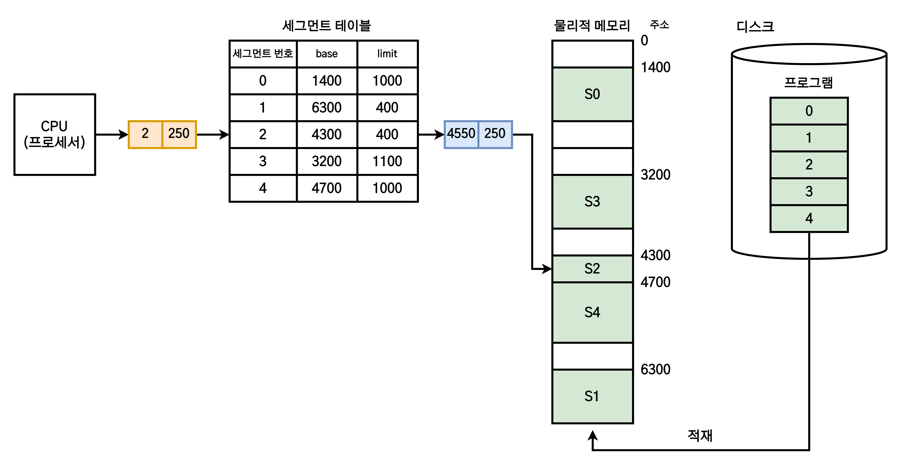

# 세그먼테이션

1. [세그먼테이션이란?](#세그먼테이션이란)
2. [보호와 공유](#보호와-공유)
3. [메모리 단편화(Memory Fragmentation)](#메모리-단편화memory-fragmentation)
4. [페이지 세그먼테이션(Page Segmentation)](#페이지-세그먼테이션page-segmentation)
5. [참고 자료](#참고-자료)

## 세그먼테이션이란?

> 프로세스를 논리적 내용을 기반으로 나누어 물리적 메모리의 서로 다른 위치에 저장하는 메모리 관리 기법.

세그먼테이션(Segmentation) 기법은 프로세스를 <b>논리적 의미 단위(Segment)</b>로 나누어 불연속적인 메모리 공간에 할당하는 기법이다. 일반적으로 프로세스 메모리 영역 중 **Code, Data, Heap, Stack 등의 기능 단위로 세그먼트를 정의**하는 경우가 많다.

페이징 기법과 유사하게 세그먼테이션에서도 프로세스를 정상적으로 사용하려면 각 세그먼트를 물리 주소로 변경(주소 바인딩)해야 한다. 이를 <b>세그먼트 테이블(Segment Table)</b>이라 한다.

세그먼트는 그 크기가 일정치 않기 때문에 논리적 주소가 `(세그먼트 번호, 오프셋)`으로 표현된다. 만약 오프셋 값이 해당 세그먼트의 리미트 값보다 크면 <b>세그먼테이션 부재(Segmentation Fault)</b>가 발생한다.

## 보호와 공유

세그먼테이션에서의 보호와 공유는 페이징보다 효율적이다.

보호에서는 세그먼테이션에 `r`(읽기), `w`(쓰기), `x`(실행) 비트를 테이블에 추가하는데, 세그먼테이션은 논리적으로 나뉘기 때문에 해당 비트의 설정이 매우 간단하고 안전하다. 페이징은 code + data + stack 영역이 있을 때, 이를 일정한 크기로 나누므로 두 가지 이상의 영역이 섞일 수 있다. 이 경우 비트 설정이 매우 까다롭다.

공유에서도 마찬가지다. 페이징에서 code 영역을 나눈다 하더라도 타 영역이 포함될 확률이 매우 높으나, 세그먼테이션은 정확히 code 영역만 나누기 떄문에 효율적으로 공유를 수행할 수 있다.

## 메모리 단편화(Memory Fragmentation)

세그먼테이션 기법에서는 세그먼트의 크기만큼 메모리를 할당하므로 내부 단편화가 발생하지 않는다. 그러나 서로 다른 크기의 세그먼트들이 메모리에 적재/제거되는 과정이 반복되면 **외부 단편화**가 발생할 수 있다.

## 페이지 세그먼테이션(Page Segmentation)

> 세그먼테이션을 기반으로 하여, 세그먼트를 다시 동일 크기의 페이지로 나누어 물리적 메모리에 할당하는 메모리 관리 기법.

세그먼테이션과 페이징 기법을 합친 방법이다. 따라서 두 방법의 장점인 보호와 공유에서의 효율성(세그먼테이션), 외부 단편화 문제 해결(페이징)을 동시에 누릴 수 있다는 이점이 있다. 그러나 이 역시 단점이 존재하는데, 세그먼트와 페이지가 동시에 존재하기에 주소 변환도 두 번 수행해야 한다.

## 참고 자료

- [[운영체제(OS)] 14. 세그먼테이션](https://velog.io/@codemcd/%EC%9A%B4%EC%98%81%EC%B2%B4%EC%A0%9COS-14.-%EC%84%B8%EA%B7%B8%EB%A9%98%ED%85%8C%EC%9D%B4%EC%85%98)
