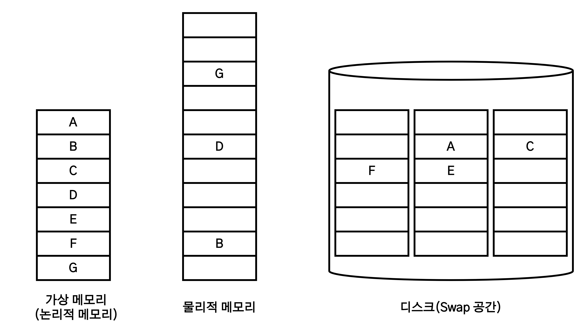
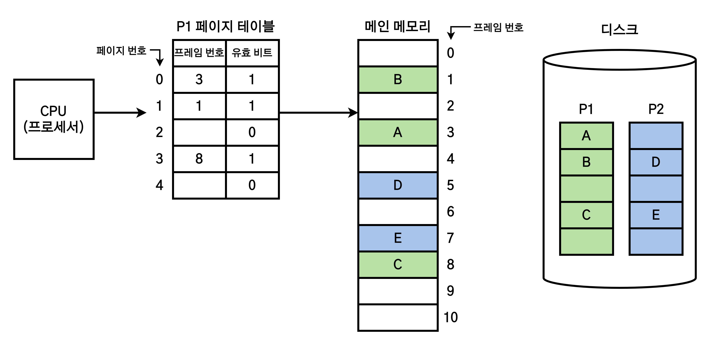
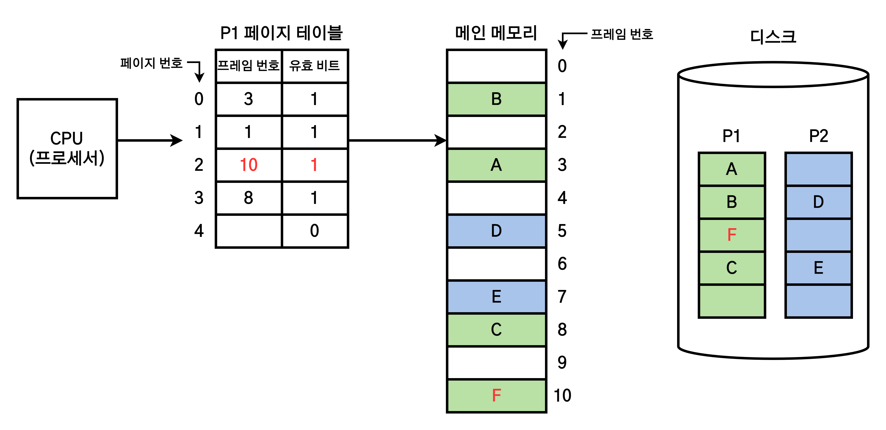
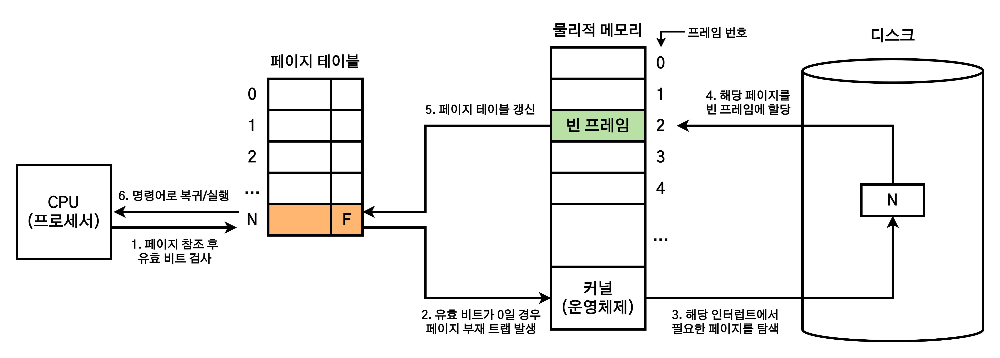

# 가상 메모리

1. [가상 메모리란?](#가상-메모리란)
2. [요구 페이징(Demand Paging)](#요구-페이징demand-paging)
3. [페이지 부재(Page Fault)](#페이지-부재page-fault)
4. [페이지 교체(Page Replacement)](#페이지-교체page-replacement)
5. [참고 자료](#참고-자료)

## 가상 메모리란?

> 물리 메모리보다 큰 프로세스를 실행하기 위해 필요한 부분만 메모리에 적재하는 기법.

가상 메모리(Virtual Memory)는 실제의 물리적 메모리 개념과 개발자 입장의 논리적 메모리 개념을 분리한 것이다. 이를 통해 개발자는 메모리 크기를 고려하지 않고 프로그램 작성에만 집중할 수 있게 된다.

운영체제는 **메모리 관리 기법**을 통해 프로그램의 **논리적 주소 영역에서 필요한 부분만 물리적 메모리에 적재**하고, **직접적으로 필요하지 않은 메모리 공간은 디스크(Swap 영역)에 저장**한다. 그 모습은 다음과 같다.

이렇게 주소가 할당되면, 메모리 관리 장치(Memory Management Unit, MMU)에 의해 가상 주소(논리 주소)가 물리 주소로 변환된다.

## 요구 페이징(Demand Paging)

> CPU가 요청할 때 프로세스의 데이터를 메모리에 올리는 것.

현재 실행에 필요한 주소 공간을 **페이지(Page) 단위**로 메모리에 적재하는 방법을 <b>요구 페이징(Demand Paging)</b>이라 한다. 실행에 필수적인 페이지만을 메모리에 적재하기에 **메모리 사용량이 감소**하고, 프로세스 전체를 메모리에 적재하는 **입출력 오버헤드가 감소**하는 장점이 있다.

요구 페이징의 모습은 다음과 같다.

요구 페이징 기법에서는 기존의 페이지 테이블에 <b>유효/무효 비트(Valid/Invalid Bit)</b>를 추가하여 현재 메모리에 페이지가 존재하는지 여부를 표시한다. 현재 페이지가 메모리에 있다면 1, 없다면 0의 값을 갖는다.

만약 위 그림에서 P1의 3번째(2번) 페이지에 접근하면, 유효 비트의 값이 0이기 때문에 **CPU에 인터럽트 신호를 발생하여 운영체제 내부의 ISR(인터럽트 서비스 루틴)으로 점프**한다. 여기서 디스크 내부의 프로세스 P1에 있는 3번째 페이지를 메모리에 할당하는 작업을 처리한다.

P1의 3번째 페이지를 메모리에 적재하면 다음과 같다.

가상 메모리를 구성하는 방법은 대표적으로 두가지가 존재하지만, **대부분 요구 페이징을 사용**하므로 가상 메모리와 요구 페이징을 동의어로 사용하는 경우가 많다.

## 페이지 부재(Page Fault)

> 특정 페이지에 접근할 때, 해당 페이지가 실제 물리 메모리에 부재하는 상황.

CPU가 접근하려는 페이지가 메모리에 없는 경우(유효 비트가 0인 경우)이다. 이 경우 MMU는 Page Fault Trap을 발생시키고, 다음과 같은 순서로 페이지 부재를 처리한다. (트랩 = 소프트웨어 인터럽트)

1. CPU가 특정 페이지를 참조하면, 해당 페이지가 메모리에 적재되어 있는지 유효 비트를 확인한다.
2. 유효 비트가 0이라면, CPU에 인터럽트 신호(페이지 부재 트랩)를 보내어 운영체제 내부의 해당 ISR로 점프한다.
3. 해당 ISR에서 디스크를 탐색하여 해당 프로세스의 페이지를 찾는다.
4. 해당 페이지를 비어있는 프레임에 할당한다.
5. 페이지 테이블을 갱신한다.
6. 다시 명령어로 돌아간 후 실행한다.

## 페이지 교체(Page Replacement)

요구 페이징은 필요한 페이지만 디스크에서 가져오는데, 만약 물리적 메모리에 공간이 부족하다면 더 이상 페이지를 적재할 수 없게 된다. 이를 해결하려면 이미 메모리에 적재된 페이지 중 하나를 다시 디스크로 보내고(Page-out), 새로운 페이지를 메모리에 적재(Page-in)해야 한다. 이를 <b>페이지 교체(Page Replacement)</b>라고 한다. 그리고 디스크로 Page-out된 페이지를 희생양 페이지(Victim Page)라고 한다.

여기서 어떤 페이지를 교체할 것이냐를 결정하는 알고리즘이 <b>페이지 교체 알고리즘(Replacement Algorithm)</b>이다. 페이지 교체 알고리즘은 **페이지 부재가 최대한 적게 일어나도록** 해야 한다. 따라서 앞으로 **참조될 가능성이 적은 페이지를 선택하여 교체**하는 것이 성능을 향상시키는 방법이다.

| 알고리즘                   | 설명                                                                                    |
| -------------------------- | --------------------------------------------------------------------------------------- |
| FIFO(First In First Out)   | 메모리에 적재된 지 가장 오래된 페이지를 교체한다.                                       |
| 최적 페이지 교체           | 앞으로 가장 오랫동안 사용되지 않을 페이지를 찾아 교체한다. 실제 구현은 어렵다.          |
| LRU(Least Recently Used)   | 가장 오랫동안 사용되지 않은 페이지를 교체한다.                                          |
| LFU(Least Frequently Used) | 참조 횟수가 가장 적은 페이지를 교체한다. 비용 대비 성능이 좋지 않아 자주 쓰이지 않는다. |

## 참고 자료

- [[운영체제(OS)] 15. 가상메모리](https://velog.io/@codemcd/%EC%9A%B4%EC%98%81%EC%B2%B4%EC%A0%9COS-15.-%EA%B0%80%EC%83%81%EB%A9%94%EB%AA%A8%EB%A6%AC)
