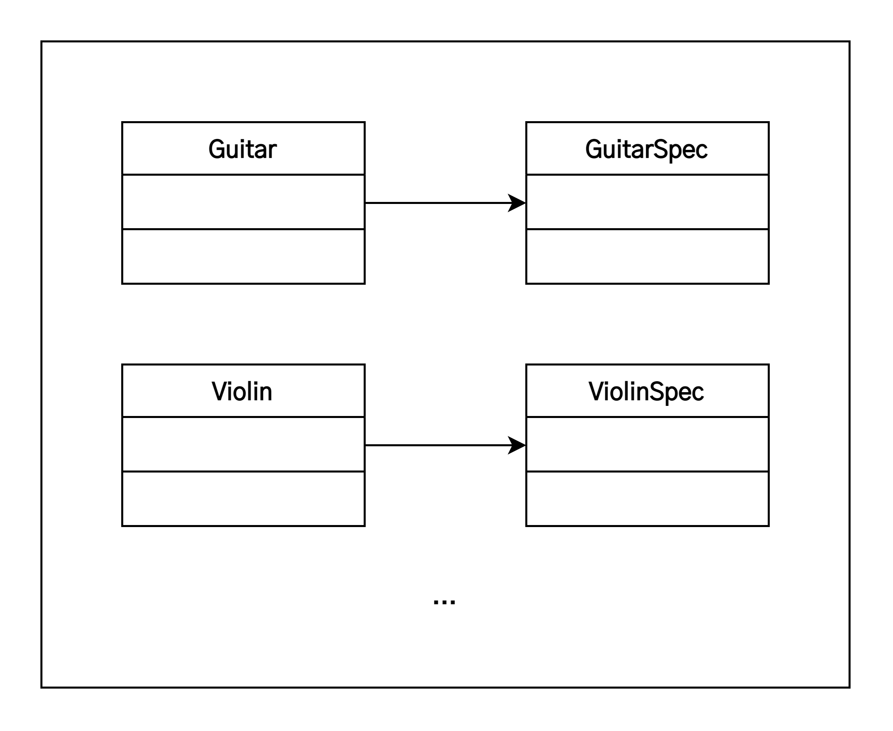
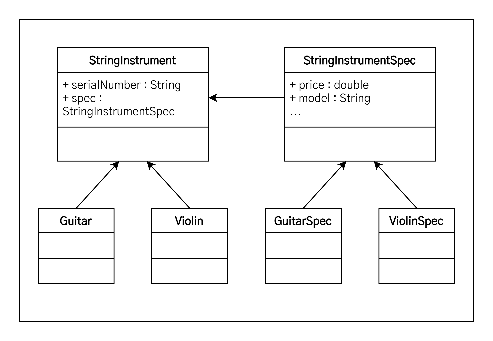

# SOLID

1. [SOLID란?](#solid란)
   1. [간단한 요약](#간단한-요약)
2. [SRP(단일 책임의 원칙, Single Responsibility Principle)](#srp단일-책임의-원칙-single-responsibility-principle)
   1. [정의](#정의)
   2. [적용 방법](#적용-방법)
   3. [적용 사례](#적용-사례)
   4. [적용 이슈](#적용-이슈)
3. [OCP(개방 폐쇄의 원칙, Open Close Principle)](#ocp개방-폐쇄의-원칙-open-close-principle)
   1. [정의](#정의-1)
   2. [적용 방법](#적용-방법-1)
   3. [적용 사례](#적용-사례-1)
   4. [적용 이슈](#적용-이슈-1)
4. [LSP(리스코프 치환의 원칙, The Liskov Subsitution Principle)](#lsp리스코프-치환의-원칙-the-liskov-subsitution-principle)
   1. [정의](#정의-2)
   2. [적용 방법](#적용-방법-2)
   3. [적용 사례](#적용-사례-2)
   4. [적용 이슈](#적용-이슈-2)
5. [ISP(인터페이스 분리의 원칙, Interface Segregation Principle)](#isp인터페이스-분리의-원칙-interface-segregation-principle)
   1. [정의](#정의-3)
   2. [적용 방법](#적용-방법-3)
   3. [적용 사례](#적용-사례-3)
   4. [적용 이슈](#적용-이슈-3)
6. [참고 자료](#참고-자료)

## SOLID란?

> SOLID란 로버트 마틴이 2000년대 초에 명명한 **객체 지향 프로그래밍의 다섯 가지 기본 원칙**을 마이클 페더스가 원칙의 앞 글자를 따서 SOLID라는 이름으로 소개한 것이다.

SOLID는 입증된 객체 지향 프로그래밍 디자인 원리로 이를 사용하면 좀 더 유지보수하기 쉽고, 유연하고, 확장하기 쉬운 소프트웨어를 만들 수 있다. 이 원리들은 그 크기를 대비해 보면 패턴보다는 훨씬 작지만 표준화 작업에서부터 아키텍처 설계에 이르기까지 다양하게 적용되는 원칙이다.

### 간단한 요약

다섯 가지 기본 원칙들을 간단히 요약하면 아래와 같다.

1. **SRP(Single Responsibility Principle)** : 단일 책임의 원칙. 클래스는 한 가지 기능만을 담당해야 한다는 원칙이다. 예를 들어 은행 계좌 프로그램에서 입금/출금에 대해서 입금하는 기능을 단일 책임 원칙에 따르면 메소드로 나뉠것이 아니라 담당하는 클래스, 출금하는 기능을 담당하는 클래스로 나뉘어야 한다는 것이다.
2. **OCP(Open Close Principle)** : 개방 폐쇄의 원칙. 클래스는 확장에는 열려있고, 변경에는 닫혀 있어야 한다는 원칙이다.
3. **LSP(Liskov Substitution Principle)** : 리스코프 치환의 원칙. 서브 타입은 언제나 기반 타입으로 교체할 수 있어야 한다라는 원칙이다. 쉽게 설명하면 부모가 동작하는 기능은 자식도 동일하게 동작해야 한다는 것이다.
4. **ISP(Interface Segregation Principle)** : 인터페이스 분리의 원칙. 자신이 사용하지 않는 인터페이스는 구현하지 말아야 한다는 원칙이다. 바꿔 말하면, 하나의 큰 인터페이스보다는 여러개의 작은 인터페이스를 구현하는 것이 낫다라고도 할 수 있다.
5. **DIP(Dependency Inversion Principle)** : 의존 관계 역전의 원칙. 구조적 디자인에서 발생하던 하위 레벨 모듈의 변경이 상위 레벨 모듈의 변경을 요구하는 위계관계를 끊는 의미의 역전이다. 쉽게 말하면 코드에서는 인터페이스에서 구현하는 클래스로 그 의존 관계가 흐르지만 실행시에는 역전된다 정도로 생각하면 된다.

## SRP(단일 책임의 원칙, Single Responsibility Principle)

> There should never be more than one reason for a class to change.  
> **하나의 객체는 반드시 하나의 동작만의 책임을 갖는다.**

### 정의

**작성된 클래스는 하나의 기능만 가지며 클래스가 제공하는 모든 서비스는 그 하나의 책임(변화의 축, axis of change)을 수행하는 데 집중되어 있어야 한다**는 원칙이다.

이는 어떤 변화에 의해 클래스를 변경하는 이유는 오직 하나뿐이어야 함을 의미한다. SRP 원리는 적용하면 무엇보다도 책임 영역이 확실해지기 때문에 한 책임의 변경에서 다른 책임의 변경으로의 연쇄작용에서 자유로울 수 있다. 뿐만 아니라 책임을 적절히 분배함으로써 코드의 가독성 향상, 유리보수 용이라는 이점까지 누릴 수 있으며 객체지향 원리의 대전제 격인 OCP 원리뿐 아니라 다른 원리들을 적용하는 기초가 된다.

이 원리는 다른 원리들에 비해서 개념이 비교적 단순하지만, 이 원리를 적용해서 직접 클래스를 설계하기가 그리 쉽지만은 않다. 왜냐하면, 실무의 프로세스는 매우 복잡 다양하고 변경 또한 빈번하기 때문에 경험이 많지 않거나 도메인에 대한 업무 이해가 부족하면 나도 모르게 SRP 원리에서 멀어져 버리게 된다. 따라서 평소에 많은 연습('책임'이란 단어를 상기하는)과 경험이 필요한 원칙이다.

### 적용 방법

리팩토링(『Refactoring: Improving the Design of Exising Code』 - Martin Fowler)에서 소개하는 대부분의 위험 상황에 대한 해결 방법은 직/간접적으로 SRP 원리와 관련이 있으며, 이는 항상 코드를 최상으로 유지한다는 리팩토링의 근본 정신도 항상 객체들의 책임을 최상의 상태로 분배한다는 것에서 비롯되기 때문이다.

- **여러 원인에 의한 변경(Divergent change)**  
  `Extract Class`를 통해 혼재된 각 책임을 각각의 개별 클로스로 분할하여 클래스 당 하나의 책임만을 맡도록 하는 것이다. 여기서 관건은 책임만 분리하는 것이 아니라 분리된 두 클래스간의 관계의 복잡도를 줄이도록 설계하는 것이다. 만약 `Extract Class`된 각각의 클래스들이 유사하고 비슷한 책임을 중복해서 갖고 있다면 `Extract Superclass`를 사용할 수 있다. 이것은 Extract된 각각의 클래스들의 공유되는 요소를 부모 클래스로 정의하여 부모 클래스에게 위임하는 기법이다. 따라서 각각의 `Extract Class`들의 유사한 책임들은 부모에게 명백히 위임하고 다른 책임들은 각자에게 정의할 수 있다.
- **산탄총 수술(Shotgun surgery)**  
  `Move Field`와 `Move Method`를 통해 책임을 기존의 어떤 클래스로 모으거나, 이럴만한 클래스가 없다면 새로운 클래스를 만들어 해결할 수 있다. 즉, 산발적으로 여러 곳에 분포된 책임들을 한 곳에 모으면서 설계를 깨끗하게 한다. 즉, 응집성을 높이는 작업이다.

### 적용 사례

아래 그림의 간단한 클래스를 살펴보자. 변화가 예상되는 부분이 있는가? 천천히 살펴보자.

<center></center>

```java
class Guitar {
   private String serialNumber;
   private double price;
   private Maker maker;
   private Type type;
   private String model;
   private Wood topWood;
   private Wood backWood;
   private int stringNum;

   public Guitar(String serialNumber, double price, Maker maker, Type type, String model, Wood backWood, Wood topWood, int stringNum) {
      this.serialNumber = serialNumber;
      this.price = price;
      this.maker = maker;
      this.type = type;
      this.model = model;
      this.backWood = backWood;
      this.topWood = topWood;
      this.stringNum = stringNum;
   }

   ...
}
```

위 그림에서 보는 바와 같이 `serialNumber`는 변화 요소라 할 수 없고 단지 고유 정보라고 할 수 있다. 동종의 다른 클래스와 구분되는 정보라고 할 수 있겠다. 그리고 `price`와 `Maker`, `Type`, `model`, `backWood`, `stringNum` 등은 모두 특성 정보군으로 변경이 발생할 수 있는 부분이라 할 수 있고, 이 부분은 변화 요소로 예상된다. 따라서 특정 정보군에 변화가 발생하면 항상 해당 클래스를 수정해야 하는 부담이 발생하게 됨으로 이 부분이 SRP 적용의 대상이 된다.

<center></center>

```java
class Guitar {
   private String serialNumber;
   private GuitarSpec spec;

   public Guitar(String serialNumber, GuitarSpec spec) {
      this.serialNumber = serialNumber;
      this.spec = spec;
   }

   ...
}

class GuitarSpec {
   private double price;
   private Maker maker;
   private Type type;
   private String model;
   private Wood topWood;
   private Wood backWood;
   private int stringNum;

   public Guitar(double price, Maker maker, Type type, String model, Wood backWood, Wood topWood, int stringNum) {
      this.price = price;
      this.maker = maker;
      this.type = type;
      this.model = model;
      this.backWood = backWood;
      this.topWood = topWood;
      this.stringNum = stringNum;
   }

   ...
}
```

위 그림의 다이어그램을 보면 변화가 예상되는 특성 정보군을 분리한 것을 확인할 수 있다. 따라서 특성 정보에 변경이 일어나면 `GuitarSpec` 클래스만 변경하면 된다. 훨씬 보기에도 좋아졌고 무엇보다도 변화에 의해 변경되는 부분을 한 곳에서 관리할 수 있게 되었다.

### 적용 이슈

클래스는 자신의 이름을 나타내는 일을 해야 한다. 올바른 클래스 이름은 해당 클래스의 책임을 나타낼 수 있는 게 가장 좋은 방법이다.

각 클래스는 하나의 개념을 나타내야 한다. 사용되지 않는 속성이 결정적 증거이다. 무조건 책임을 분리한다고 SRP가 적용되는 건 아니다. 각 개체간의 응집력이 있다면 병합이 순 작용의 수단이 되고, 결합력이 있다면 분리가 순 작용의 수단이 된다.

## OCP(개방 폐쇄의 원칙, Open Close Principle)

> You should be able to extend a classes behavior, without modifying it.  
> **객체의 확장은 개방적으로, 객체의 수정은 폐쇄적으로 대해야 한다.**

### 정의

버틀란트 메이어(Bertrand Meyer) 박사가 1998년 『객체지향 소프트웨어 설계』라는 책에서 정의한 내용으로, **소프트웨어의 구성요소(컴포넌트, 클래스, 모듈, 함수)는 확장에는 열려있고, 변경에는 닫혀있어야 한다**는 원리이다.

이것은 변경을 위한 비용은 가능한 줄이고 확장을 위한 비용은 가능한 극대화해야 한다는 의미로, 요구사항의 변경이나 추가사항이 발생하더라도, 기존 구성요소는 수정이 일어나지 않아야 하며, 기존 구성요소를 쉽게 확장해서 재사용할 수 있어야 한다는 뜻이다.

로버트 C. 마틴은 OCP는 관리가능하고 재사용 가능한 코드를 만드는 기반이며, OCP를 가능케 하는 중요 메커니즘은 추상화와 다형성이라고 설명하고 있다. OCP는 객체지향의 장점을 극대화하는 아주 중요한 원리라 할 수 있다.

### 적용 방법

1. 변경(확장)될 것과 변하지 않을 것을 엄격히 구분한다.
2. 이 두 모듈이 만나는 지점에 인터페이스를 정의한다.
3. 구현에 의존하기보다 정의한 인터페이스에 의존하도록 코드를 작성한다.

### 적용 사례

위에서도 보았던 간단한 클래스 다이어그램이다.

<center></center>

별 문제가 없어 보인다. SRP 원리를 적용하여 `Guitar`에서 변경이 예쌍되는 부분을 뽑아 `GuitarSpec`이라는 새로운 클래스를 만들어 변화요소들을 하나로 모았다. 변화를 국소화 시킨것이다.

하지만 여기에서도 변경이 발생할 수 있다. 예를 들어 아래와 같이 `Guitar` 외에 바이올린이나 첼로, 비올라, 만돌린과 같은 다른 악기들도 다루어야 한다면 어떻게 될까? 그 해결책으로 만일 아래 그림과 같이 일일이 매번 새로운 악기들과 요소들을 만들어 간다면 어떻게 될까? 우리는 항상 변화를 염두해 두고 있어야 한다.

<center></center>

```java
//기타
class Guitar {
   private String serialNumber;
   private GuitarSpec spec;

   public Guitar(String serialNumber, GuitarSpec spec) {
      this.serialNumber = serialNumber;
      this.spec = spec;
   }
}

class GuitarSpec {
   ...
}

//바이올린
class Violin {
   private String serialNumber;
   private ViolinSpec spec;

   public Violon(String serialNumber, ViolinSpec spec) {
      this.serialNumber = serialNumber;
      this.spec = spec;
   }
}

class ViolinSpec {
   ...
}

//이외의 여러 악기들
...
```

변화를 막을 수 있는 사람은 아무도 없다. 다만 변화에 적절히 대응할 뿐이다. 위와 같이 변화에 몸을 맡겨버린다면 엄청난 재앙이 두고두고 여러 개발자들을 괴롭힐 것이다. 그러면 앞서 설명한 OCP 원리를 이용하여 위와 같은 변화에 대응해 보도록 하자.

먼저, `Guitar`와 추가 될 다른 악기들을 추상화하는 작업이 필요하다. 여기서는 추가될 악기들의 공통 속성을 모두 담을 수 있는 `StringInstrument`라는 인터페이스를 생성하겠다. 앞으로는 `StringInstrumnet`가 이들을 대표하게 될 것이다. 아래 그림은 OCP 원리가 적용된 다이어그램과 소스를 나타낸다.

<center></center>

```java
//기타
class Guitar extends StringInstrument {
   private String serialNumber;
   private GuitarSpec spec;

   public Guitar(String serialNumber, GuitarSpec spec) {
      this.serialNumber = serialNumber;
      this.spec = spec;
   }
}

class GuitarSpec extends StringInstrumentSpec {
   ...
}

//바이올린
class Violin extends StringInstrument {
   private String serialNumber;
   private ViolinSpec spec;

   public Violon(String serialNumber, ViolinSpec spec) {
      this.serialNumber = serialNumber;
      this.spec = spec;
   }
}

class ViolinSpec extends StringInstrumentSpec {
   ...
}

//이외의 여러 악기들
...
```

새로운 악기가 추가되면서 변경이 발생하는 부분을 추상화하여 분리하였음을 확인할 수 있다. 이렇게 해서 코드의 수정을 최소화하여 결합도는 줄이고 응집도는 높이는 효과를 볼 수 있다.

### 적용 이슈

확장되는 것과 변경되지 않는 모듈을 분리하는 과정에서 크기 조절에 실패하면 오히려 관계가 더 복잡해질 수 있다. 설계자의 좋은 자질 중 하나는 이런 크기 조절과 같은 갈등 상황을 잘 포착하여 (아깝지만) 비장한 결단을 내릴 줄 아는 능력에 있다.

인터페이스는 가능하면 변경되어서는 안된다. 따라서 인터페이스를 정의할 때 여러 경우의 수에 대한 고려와 예측이 필요하다. 물론 과도한 예측은 불필요한 작업을 만들고, 보통 이 불필요한 작업의 양은 상당히 크기 마련이다. 따라서 설계자는 적절한 수준의 예측 능력이 필요한데, 설계자에게 필요한 또 하나의 자질을 예지력이다.

인터페이스 설계에서 적당한 추상화 레벨을 선택해야 한다. 우리는 추상화라는 개념에 '구체적이지 않은' 정도의 의미로 약간 느슨한 개념을 갖고 있다. 그래디 부치(Grady Booch)에 의하면 '추상화란 다른 모든 종류의 객체로부터 식별될 수 있는 객체의 본질적인 특징'이라고 정의하고 있다. 즉, 이 '행위'에 대한 본질적인 정의를 통해 인터페이스를 식별해야 한다.

## LSP(리스코프 치환의 원칙, The Liskov Subsitution Principle)

> Functions that use pointers or references to base classes must be able to use objects of derived classes without knowing it.  
> **부모 객체와 이를 상속한 자식 객체가 있을 때 부모 객체를 호출하는 동작에서 자식 객체가 부모 객체를 완전히 대체할 수 있다.**

### 정의

이 원칙은 5가지 원칙 중에서 쉽게 이해하기 어려운 원칙 중 하나로 LSP라는 이름에서는 도저히 원칙에 대한 내용을 도출할 수 없다. LSP를 한마디로 말하자면, "서브 타입은 언제나 기반 타입으로 교체할 수 있어야 한다."라고 할 수 있다. 즉, 서브 타입은 언제나 기반 타입과 호환될 수 있어야 한다. 달리 말하면 서브 타입은 기반 타입이 약속한 규약(`public` 인터페이스, 물론 메소드가 던지는 예외까지 포함된다.)을 지켜야 한다.

상속은 구현 상속(`extends` 관계)이든 인터페이스 상속(`implements` 관계)이든 궁극적으로는 다형성을 통한 확장성 획득을 목표로 한다. LSP 원리도 역시 서브 클래스가 확장에 대한 인터페이스를 준수해야 함을 의미한다. 다형성과 확장성을 극대화하려면 하위 클래스를 사용하는 것보다는 상위 클래스(인터페이스)를 사용하는 것이 더 좋다.

일반적으로 선언은 기반 클래스로, 구현은 구체 클래스로 대입하는 방법을 사용한다. 생성 시점에서 구체 클래스를 노출시키기 꺼려질 경우 생성 부분을 `Abstract Factory` 등의 패턴을 사용하여 유연성을 높일 수 있다. 상속을 통한 재사용은 기반 클래스와 서브 클래스 사이에 IS-A 관계가 있을 경우로만 제한되어야 한다. 그 외의 경우에는 합성(composition)을 이용한 재사용을 해야 한다.

상속은 다형성과 따로 생각할 수 없다. 그리고 다형성으로 인한 확장 효과를 얻기 위해서는 서브 클래스가 기반 클래스와 클라이언트 간의 규약(인터페이스)를 어겨서는 안된다. 결국 이 구조는 다형성을 통한 확장의 원리인 OCP를 제공하게 된다. 따라서 **LSP는 OCP를 구성하는 구조가 된다.**

객체지향 설계 원리는 이렇게 서로가 서로를 이용하기도 하고 포함하기도 하는 특징이 있다. LSP는 규약을 준수하는 상속 구조를 제공한다. LSP를 바탕으로 OCP는 확장하는 부분에 다형성을 제공해 변화에 열려있는 프로그램을 만들 수 있도록 한다.

### 적용 방법

1. 만약 두 객체가 동일한 작업을 한다면 둘을 하나의 클래스로 표현하고 이들을 구분할 수 있는 필드를 둔다.
2. 공통된 연산을 제공하지만, 상세 내용이 약간씩 다르다면 공통의 인터페이스를 만들고 이를 구현한다.(인터페이스 상속)
3. 공통된 연산이 없다면 완전히 별개인 2개의 클래스를 만든다.
4. 만약 두 객체가 현재 담당하는 작업에서 추가로 수행해야 할 작업이 있다면 구현 상속을 사용한다.

> 구현 상속이란?  
> 객체의 구체적인 동작(data)만 재사용할 수 있고 인터페이스는 물려받지 않는 상속으로, 멤버 함수를 호출할 수는 있지만 스스로 멤버 함수를 갖지는 않는 상속이다. 즉, 함수는 물려받지 않고 코드만 물려받는 상속을 구현 상속이라 한다.
>
> |      기법       | private 상속, 포함 | public 상속 | 순수 가상 함수 |
> | :-------------: | :----------------: | :---------: | :------------: |
> | 인터페이스 상속 |         X          |      O      |       O        |
> |    구현 상속    |         O          |      O      |       X        |
>
> - 참고 자료 - [구현상속, 인터페이스상속](https://skmagic.tistory.com/131)

### 적용 사례

대표적으로 컬렉션 프레임워크를 예로 들 수 있다.

```java
void f() {
   LinkedList list = new LinkedList();
   //···
   modify(list)
}

void modify(LinkedList list) {
   list.add(···);
   doSomethingWith(list);
}
```

`List`만 사용할 것이라고 이 코드도 문제는 없다. 하지만 만약 속도 개선을 위해 `HashSet`을 사용해야 하는 경우가 발생한다면 `LinkedList`를 다시 `HashSet`으로 어떻게 바꿔야 할까? `LinkedList`와 `HashSet`는 모두 `Collection` 인터페이스를 상속하고 있으므로 다음과 같이 작성하는 것이 바람직하다.

```java
void f() {
   Collection collection = new Collection();
   //···
   modify(collection)
}

void modify(Collection collection) {
   collection.add(···);
   doSomethingWith(collection);
}
```

이제 컬렉션 생성 부분만 고치면 마음대로 어떤 컬렉션 구현 클래스든 사용할 수 있다.

이 프로그램에서 LSP와 OCP 모두를 찾아볼 수 있는데, 우선 컬렉션 프레임워크가 LSP를 준수하지 않았다면 `Collection` 인터페이스를 통해 수행하는 범용 작업이 제대로 수행될 수 없다. 하지만 모두 LSP를 준수하기 때문에 이들을 제외한 모든 `Collection` 연산에서는 `modify()` 메소드가 잘 동작하게 된다. 그리고 이를 통해 `modify()`는 변화에 닫혀 있으면서, 컬렉션의 변경과 확장에는 열려 있는 구조(OCP)가 된다.

물론 `Collection`이 지원하지 않는 연산을 사용한다면 계층 구조를 한 단계 더 내려가야 한다. 그렇다 하더라도 `ArrayList`, `LinkedList`, `Vector` 대신 이들이 구현하고 있는 `List`를 사용하는 것이 현명한 방법이다.

### 적용 이슈

1. 혼동될 여지가 없고 트레이드-오프를 고려해 선택된 것이라면 그대로 둔다.
2. 다형성을 위한 상속 관계가 필요 없다면 Replace with Delegation을 한다. 상속은 깨지기 쉬운 기반 클래스 등을 지니고 있으므로 IS-A 관계가 성립되지 않는다. LSP를 지키기 어렵다면 상속 대신 합성(composition)을 사용하는 것이 좋다.
3. 상속 구조가 필요하다면 Extract Subclass, Push Down Feild, Push Down Method 등의 리팩토링 기법을 이용하여 LSP를 준수하는 상속 계층 구조를 구성한다.
4. IS-A 관계가 성립한다고 프로그램에서까지 그런것은 아니다. 관계 맺음은 이들의 역할과 서로간에 공유하는 연산의 유무, 그리고 연산이 어떻게 다른지를 종합적으로 검토해야 한다.
5. Design by Contract("서브 클래스에서는 기반 클래스의 사전 조건과 같거나 더 약한 수준에서 사전 조건을 대체할 수 있고, 기반 클래스의 사후 조건과 같거나 더 강한 수준에서 사후 조건을 대체할 수 있다.") 적용 : 기반 클래스를 서브 클래스로 치환 가능하게하려면 받아들이는 선조건에서 서브 클래스의 제약사항이 기반 클래스의 제약사항보다 느슨하거나 같아야 한다. 만약 제약조건이 더 강하다면 기반 클래스에서 실행되던 것이 서브 클래스의 강조건으로 인해 실행되지 않을수도 있기 때문이다. 반면 서브 클래스의 후조건은 같거나 더 강해야 하는데, 약하다면 기반 클래스의 후조건이 통과시키지 않는 상태를 통과시킬수도 있기 때문이다.

## ISP(인터페이스 분리의 원칙, Interface Segregation Principle)

> Client should not be forced to depend upon interfaces that they do not use.  
> 객체는 자신이 호출하지 않는 메소드에 의존하지 않아야 한다.

### 정의

ISP 원리는 한 클래스는 자신이 사용하지 않는 인터페이스는 구현하지 말아야 한다는 원리이다. 즉, 어떤 클래스가 다른 클래스에 종속될 때에는 가능한 최소한의 인터페이스만을 사용해야 한다. ISP를 '**하나의 일반적인 인터페이스보다는, 여러 개의 구체적인 인터페이스가 낫다.**'라고 정의할 수도 있다.

만약 어떤 클래스를 이용하는 클라이언트가 여러 개고 이들이 해당 클래스의 특정 부분집합만을 이용한다면, 이들을 따로 인터페이스로 빼내어 클라이언트가 기대하는 메시지만을 전달할 수 있도록 한다. SRP가 클래스의 단일 책임을 강조한다면 ISP는 인터페이스의 단일 책임을 강조한다. 하지만 ISP는 어떤 클래스 혹은 인터페이스가 여러 책임이나 역할을 갖는 것을 인정한다. 이러한 경우 ISP가 사용되는데, SRP가 클래스 분리를 통해 변화로부터의 적응성을 획득하는 반면 ISP에서는 인터페이스 분리를 통해 같은 목표에 도달한다.

### 적용 방법

1. 클래스 인터페이스를 통한 분리
   - 클래스의 상속을 이용하여 인터페이스를 나눌 수 있다.  
     이와 같은 구조는 클라이언트에게 변화를 주지 않을뿐만 아니라 인터페이스르 분리하는 효과도 갖는다. 하지만 거의 모든 객체지향 언어에서는 상속을 이용한 확장은 상속받는 클래스의 성격을 디자인 시점에서 규정해버린다는 문제가 있다. 따라서 인터페이스를 상속받는 순간 인터페이스에 예속되어 제공하는 서비스의 성격이 제한된다.
2. 객체 인터페이스를 통한 분리
   - 위임(Delegation)을 이용하여 인터페이스를 나눌 수 있다.  
     위임이란, 특정 일의 책임을 다른 클래스나 메소드에게 맡기는 것을 말한다. 만약 다른 클래스의 기능을 사용해야 하지만 그 기능을 변경하기는 싫은 경우, 상속 대신 위임을 사용한다.

### 적용 예시

대표적으로 `Java Swing`의 `JTable`을 예로 들 수 있다.

`JTable` 클래스에는 굉장히 많은 메소드들이 있다. 컬럼을 추가하고 셀 에디터 리스너를 부착하는 등 여러 역할이 하나의 클래스 안에 혼재되어 있지만, `JTable`의 입장에서 본다면 모두 제공해야 하는 역할이다.

`JTable`은 ISP가 제안하는 방식으로 모든 인터페이스 분리를 통해 특정 역할만을 이용할 수 있도록 해준다. 즉, `Accessible`, `CellEditorListener`, `ListSelectionListener`, `Scrollable`, `TableColumnModelListener`, `TableModelListener` 등 여러 인터페이스 구현을 통해 서비스를 제공한다.

`JTable`은 자신을 이용하여 테이블을 만드는 객체, 즉 모든 서비스를 필요로 하는 객체에게는 기능 전부를 노출하지만, 이벤트 처리와 관련해서는 여러 리스너 인터페이스를 통해 해당 기능만 노출한다.

```java
import javax.swing.event.*;
import javax.swing.table.TableModel;

public class SimpleTableDemo ... implements TableModelListener {
   ...
   public SimpleTableDemo() {
      ...
      table.getModel().addTableModelListener(this);
      ...
   }

   //인터페이스를 통해 노출할 기능을 구현
   public void tableChanged(TableModelEvent e) {
      int row = e.getFirstRow();
      int column = e.getColumn();
      TableModel model = (TableModel) e.getSource();
      String columnName = model.getColumnName(column);
      Object data = model.getValueAt(row, column);

      //data를 활용한 작업 수행
      ...
   }
   ...
}
```

### 적용 이슈

1. 기구현된 클라이언트의 변경을 유발해서는 안된다.
2. 두 개 이상의 인터페이스가 공유하는 부분의 재사용성을 극대화한다.
3. 서로 다른 성격의 인터페이스를 명백히 분리한다.

## 참고 자료

- [객체지향 개발 5대 원리: SOLID](https://www.nextree.co.kr/p6960/)
- [2018년 하반기 'ㅈ' 기업 개발자 면접 후기](https://gurumee92.tistory.com/95)
- [[Java] 객체지향 설계 5원칙 - SOLID란 무엇일까?](https://devlog-wjdrbs96.tistory.com/380)
- [객체지향 5원칙 : SOLID](https://jaeyeong951.medium.com/%EA%B0%9D%EC%B2%B4%EC%A7%80%ED%96%A5-5%EC%9B%90%EC%B9%99-solid-ac7d4d660f4d)
- [𝝅번째 알파카의 개발 낙서장](https://blog.itcode.dev/posts?category=CS)
