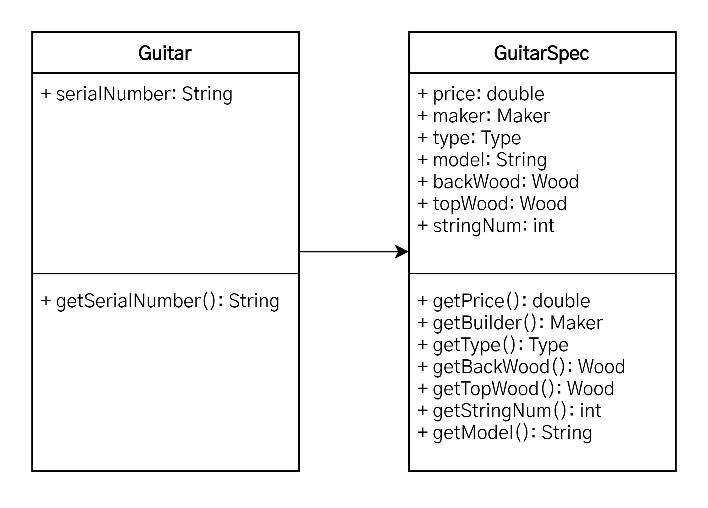

cen# SOLID

1. [SOLID란?](#solid란)
2. [SRP(단일 책임의 원칙, Single Responsibility Principle)](#srp단일-책임의-원칙-single-responsibility-principle)
   1. [정의](#정의)
   2. [적용 방법](#적용-방법)
   3. [적용 사례](#적용-사례)
   4. [적용 이슈](#적용-이슈)
3. [참고 자료](#참고-자료)

## SOLID란?

> SOLID란 로버트 마틴이 2000년대 초에 명명한 **객체 지향 프로그래밍의 다섯 가지 기본 원칙**을 마이클 페더스가 원칙의 앞 글자를 따서 SOLID라는 이름으로 소개한 것이다.

SOLID는 입증된 객체 지향 프로그래밍 디자인 원리로 이를 사용하면 좀 더 유지보수하기 쉽고, 유연하고, 확장하기 쉬운 소프트웨어를 만들 수 있다. 이 원리들은 그 크기를 대비해 보면 패턴보다는 훨씬 작지만 표준화 작업에서부터 아키텍처 설계에 이르기까지 다양하게 적용되는 원칙이다.

## SRP(단일 책임의 원칙, Single Responsibility Principle)

> There should never be more than one reason for a class to change.

### 정의

**작성된 클래스는 하나의 기능만 가지며 클래스가 제공하는 모든 서비스는 그 하나의 책임(변화의 축, axis of change)을 수행하는 데 집중되어 있어야 한다**는 원칙이다.

이는 어떤 변화에 의해 클래스를 변경하는 이유는 오직 하나뿐이어야 함을 의미한다. SRP 원리는 적용하면 무엇보다도 책임 영역이 확실해지기 때문에 한 책임의 변경에서 다른 책임의 변경으로의 연쇄작용에서 자유로울 수 있다. 뿐만 아니라 책임을 적절히 분배함으로써 코드의 가독성 향상, 유리보수 용이라는 이점까지 누릴 수 있으며 객체지향 원리의 대전제 격인 OCP 원리뿐 아니라 다른 원리들을 적용하는 기초가 된다.

이 원리는 다른 원리들에 비해서 개념이 비교적 단순하지만, 이 원리를 적용해서 직접 클래스를 설계하기가 그리 쉽지만은 않다. 왜냐하면, 실무의 프로세스는 매우 복잡 다양하고 변경 또한 빈번하기 때문에 경험이 많지 않거나 도메인에 대한 업무 이해가 부족하면 나도 모르게 SRP 원리에서 멀어져 버리게 된다. 따라서 평소에 많은 연습('책임'이란 단어를 상기하는)과 경험이 필요한 원칙이다.

### 적용 방법

리팩토링(Refactoring: Improving the Design of Exising Code - Martin Fowler)에서 소개하는 대부분의 위험 상황에 대한 해결 방법은 직/간접적으로 SRP 원리와 관련이 있으며, 이는 항상 코드를 최상으로 유지한다는 리팩토링의 근본 정신도 항상 객체들의 책임을 최상의 상태로 분배한다는 것에서 비롯되기 때문이다.

- **여러 원인에 의한 변경(Divergent change)**  
  `Extract Class`를 통해 혼재된 각 책임을 각각의 개별 클로스로 분할하여 클래스 당 하나의 책임만을 맡도록 하는 것이다. 여기서 관건은 책임만 분리하는 것이 아니라 분리된 두 클래스간의 관계의 복잡도를 줄이도록 설계하는 것이다. 만약 `Extract Class`된 각각의 클래스들이 유사하고 비슷한 책임을 중복해서 갖고 있다면 `Extract Superclass`를 사용할 수 있다. 이것은 Extract된 각각의 클래스들의 공유되는 요소를 부모 클래스로 정의하여 부모 클래스에게 위임하는 기법이다. 따라서 각각의 `Extract Class`들의 유사한 책임들은 부모에게 명백히 위임하고 다른 책임들은 각자에게 정의할 수 있다.
- **산탄총 수술(Shotgun surgery)**  
  `Move Field`와 `Move Method`를 통해 책임을 기존의 어떤 클래스로 모으거나, 이럴만한 클래스가 없다면 새로운 클래스를 만들어 해결할 수 있다. 즉, 산발적으로 여러 곳에 분포된 책임들을 한 곳에 모으면서 설계를 깨끗하게 한다. 즉, 응집성을 높이는 작업이다.

### 적용 사례

아래 그림의 간단한 클래스를 살펴보자. 변화가 예상되는 부분이 있는가? 천천히 살펴보자.

<center></center>

```java
class Guitar {
   private String serialNumber;
   private double price;
   private Maker maker;
   private Type type;
   private String model;
   private Wood topWood;
   private Wood backWood;
   private int stringNum;

   public Guitar(String serialNumber, double price, Maker maker, Type type, String model, Wood backWood, Wood topWood, int stringNum) {
      this.serialNumber = serialNumber;
      this.price = price;
      this.maker = maker;
      this.type = type;
      this.model = model;
      this.backWood = backWood;
      this.topWood = topWood;
      this.stringNum = stringNum;
   }

   ...
}
```

위 그림에서 보는 바와 같이 `serialNumber`는 변화 요소라 할 수 없고 단지 고유 정보라고 할 수 있다. 동종의 다른 클래스와 구분되는 정보라고 할 수 있겠다. 그리고 `price`와 `Maker`, `Type`, `model`, `backWood`, `stringNum` 등은 모두 특성 정보군으로 변경이 발생할 수 있는 부분이라 할 수 있고, 이 부분은 변화 요소로 예상된다. 따라서 특정 정보군에 변화가 발생하면 항상 해당 클래스를 수정해야 하는 부담이 발생하게 됨으로 이 부분이 SRP 적용의 대상이 된다.

<center></center>

```java
class Guitar {
   private String serialNumber;
   private GuitarSpec spec;

   public Guitar(String serialNumber, GuitarSpec spec) {
      this.serialNumber = serialNumber;
      this.spec = spec;
   }

   ...
}

class GuitarSpec {
   private double price;
   private Maker maker;
   private Type type;
   private String model;
   private Wood topWood;
   private Wood backWood;
   private int stringNum;

   public Guitar(double price, Maker maker, Type type, String model, Wood backWood, Wood topWood, int stringNum) {
      this.price = price;
      this.maker = maker;
      this.type = type;
      this.model = model;
      this.backWood = backWood;
      this.topWood = topWood;
      this.stringNum = stringNum;
   }
}
```

위 그림의 다이어그램을 보면 변화가 예상되는 특성 정보군을 분리한 것을 확인할 수 있다. 따라서 특성 정보에 변경이 일어나면 `GuitarSpec` 클래스만 변경하면 된다. 훨씬 보기에도 좋아졌고 무엇보다도 변화에 의해 변경되는 부분을 한 곳에서 관리할 수 있게 되었다.

### 적용 이슈

클래스는 자신의 이름을 나타내는 일을 해야 한다. 올바른 클래스 이름은 해당 클래스의 책임을 나타낼 수 있는 게 가장 좋은 방법이다.

각 클래스는 하나의 개념을 나타내야 한다. 사용되지 않는 속성이 결정적 증거이다. 무조건 책임을 분리한다고 SRP가 적용되는 건 아니다. 각 개체간의 응집력이 있다면 병합이 순 작용의 수단이 되고, 결합력이 있다면 분리가 순 작용의 수단이 된다.

## 참고 자료

- [객체지향 개발 5대 원리: SOLID](https://www.nextree.co.kr/p6960/)
- [2018년 하반기 'ㅈ' 기업 개발자 면접 후기](https://gurumee92.tistory.com/95)
- [[Java] 객체지향 설계 5원칙 - SOLID란 무엇일까?](https://devlog-wjdrbs96.tistory.com/380)
- [객체지향 5원칙 : SOLID](https://jaeyeong951.medium.com/%EA%B0%9D%EC%B2%B4%EC%A7%80%ED%96%A5-5%EC%9B%90%EC%B9%99-solid-ac7d4d660f4d)
